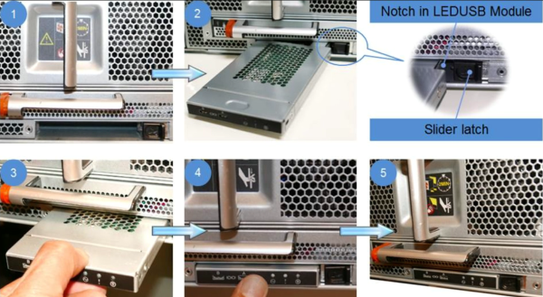

= 將故障零件歸還給NetApp
:allow-uri-read: 

您可以更換LED USB模組、而不中斷服務。

FAS9000或AFF FASA700 LED USB模組可連線至主控台連接埠和系統狀態。更換此模組不需要工具。

.步驟
. 移除舊的LED USB模組：
+
image::../media/led_3.png[取下 LED USB 模組]

+
.. 卸下擋板後、將LED USB模組定位在機箱正面左下側。
.. 滑入栓鎖以部分退出模組。
.. 將模組從支架中拉出、以將其從中間背板上拔下。請勿將插槽留白。

. 安裝新的LED USB模組：
+

+
.. 將模組對準支架、使模組角落的槽口靠近機箱上的滑桿栓鎖。托架可防止您將模組上下反轉安裝。
.. 將模組推入支架、直到與機箱齊面完全就位。
+
當模組牢固且連接至中間板時、會發出卡響。

== 將故障零件歸還給NetApp

如套件隨附的RMA指示所述、將故障零件退回NetApp。如 https://mysupport.netapp.com/site/info/rma["零件退貨與更換"]需詳細資訊、請參閱頁面。
