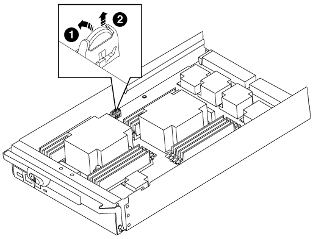

= 步驟1：關閉受損的控制器
:allow-uri-read: 

您可以更換控制器模組中的即時時鐘（RTc）電池、讓系統的服務和應用程式繼續運作、而這些服務和應用程式必須仰賴精確的時間同步。

* 您可以將此程序用於ONTAP 系統支援的所有版本的功能
* 系統中的所有其他元件都必須正常運作；否則、您必須聯絡技術支援部門。

== 步驟1：關閉受損的控制器

根據儲存系統硬體組態的不同、您可以使用不同的程序來關閉或接管受損的控制器。

[role="tabbed-block"]
====
.選項1：大多數組態
--
若要關閉受損的控制器、您必須判斷控制器的狀態、並在必要時接管控制器、以便健全的控制器繼續從受損的控制器儲存設備提供資料。

.關於這項工作
* 如果您有 SAN 系統，則必須檢查故障控制器 SCSI 刀鋒的事件訊息  `cluster kernel-service show`。 `cluster kernel-service show`命令（從 priv 進階模式）會顯示節點名稱、link:https://docs.netapp.com/us-en/ontap/system-admin/display-nodes-cluster-task.html["仲裁狀態"]該節點的可用度狀態、以及該節點的作業狀態。
+
每個SCSI刀鋒處理序都應與叢集中的其他節點處於仲裁狀態。任何問題都必須先解決、才能繼續進行更換。

* 如果叢集有兩個以上的節點、則叢集必須處於仲裁狀態。如果叢集未達到法定人數、或健全的控制器顯示為「假」、表示符合資格和健全狀況、則您必須在關閉受損的控制器之前修正問題；請參閱 link:https://docs.netapp.com/us-en/ontap/system-admin/synchronize-node-cluster-task.html?q=Quorum["將節點與叢集同步"^]。

.步驟
. 如果啟用了「支援」功能、請叫用下列消息來禁止自動建立個案AutoSupport AutoSupport ：
+
`system node autosupport invoke -node * -type all -message MAINT=<# of hours>h`

+
下列AutoSupport 資訊不顯示自動建立案例兩小時：

+
`cluster1:> system node autosupport invoke -node * -type all -message MAINT=2h`

. 停用健康控制器主控台的自動恢復：
+
`storage failover modify -node local -auto-giveback false`

+

NOTE: 當您看到_是否要停用自動恢復？_時、請輸入「y」。

. 將受損的控制器移至載入器提示：
+
[cols="1,2"]
|===
| 如果受損的控制器正在顯示... | 然後... 

 a| 
載入程式提示
 a| 
前往下一步。

 a| 
正在等待恢復...
 a| 
按Ctrl-C、然後在出現提示時回應「y」。

 a| 
系統提示或密碼提示
 a| 
從健全的控制器接管或停止受損的控制器：

`storage failover takeover -ofnode _impaired_node_name_ -halt _true_`

--halt true_ 參數會帶您進入 Loader 提示字元。

|===

--
.選項2：控制器位於雙節點MetroCluster 的不二
--
若要關閉受損的控制器、您必須判斷控制器的狀態、並在必要時切換控制器、使健全的控制器繼續從受損的控制器儲存設備提供資料。

.關於這項工作
* 您必須在本程序結束時保持電源供應器開啟、才能為健全的控制器提供電力。

.步驟
. 檢查MetroCluster 「不正常」狀態、判斷受損的控制器是否已自動切換至「正常」控制器MetroCluster ：「不正常」
. 視是否發生自動切換而定、請根據下表繼續進行：
+
[cols="1,2"]
|===
| 如果控制器受損... | 然後... 

 a| 
已自動切換
 a| 
繼續下一步。

 a| 
尚未自動切換
 a| 
從健全的控制器執行計畫性的切換作業MetroCluster ：「『交換切換’」

 a| 
尚未自動切換、您嘗試使用MetroCluster 「還原切換」命令進行切換、切換遭到否決
 a| 
請檢閱否決訊息、如有可能、請解決此問題、然後再試一次。如果您無法解決問題、請聯絡技術支援部門。

|===
. 從MetroCluster 存續的叢集執行「f恢復 階段Aggregate」命令、以重新同步資料集合體。
+
[listing]
----
controller_A_1::> metrocluster heal -phase aggregates
[Job 130] Job succeeded: Heal Aggregates is successful.
----
+
如果治療被否決、您可以選擇MetroCluster 使用「-overre-etoes」參數重新發出「還原」命令。如果您使用此選用參數、系統將會置換任何軟質否決、以防止修復作業。

. 使用MetroCluster flexoperationshow命令確認作業已完成。
+
[listing]
----
controller_A_1::> metrocluster operation show
    Operation: heal-aggregates
      State: successful
Start Time: 7/25/2016 18:45:55
   End Time: 7/25/2016 18:45:56
     Errors: -
----
. 使用「shorage Aggregate show」命令來檢查集合體的狀態。
+
[listing]
----
controller_A_1::> storage aggregate show
Aggregate     Size Available Used% State   #Vols  Nodes            RAID Status
--------- -------- --------- ----- ------- ------ ---------------- ------------
...
aggr_b2    227.1GB   227.1GB    0% online       0 mcc1-a2          raid_dp, mirrored, normal...
----
. 使用「MetroCluster f恢復 階段根集合體」命令來修復根集合體。
+
[listing]
----
mcc1A::> metrocluster heal -phase root-aggregates
[Job 137] Job succeeded: Heal Root Aggregates is successful
----
+
如果修復被否決、您可以選擇使用MetroCluster -overrover-etoes參數重新發出「還原」命令。如果您使用此選用參數、系統將會置換任何軟質否決、以防止修復作業。

. 在MetroCluster 目的地叢集上使用「停止作業show」命令、確認修復作業已完成：
+
[listing]
----

mcc1A::> metrocluster operation show
  Operation: heal-root-aggregates
      State: successful
 Start Time: 7/29/2016 20:54:41
   End Time: 7/29/2016 20:54:42
     Errors: -
----
. 在受損的控制器模組上、拔下電源供應器。

--
====

== 步驟2：移除控制器模組

若要存取控制器內部的元件、您必須先從系統中移除控制器模組、然後移除控制器模組上的護蓋。

.步驟
. 如果您尚未接地、請正確接地。
. 從受損的控制器模組拔下纜線、並追蹤纜線的連接位置。
. 將CAM把手上的橘色按鈕向下推、直到解鎖為止。
+
image::../media/drw_9000_remove_pcm.png[卸下控制器模組]

+
[cols="1,3"]
|===

 a| 
image:../media/icon_round_1.png["編號 1"]
 a| 
CAM握把釋放鈕

 a| 
image:../media/icon_round_2.png["編號 2"]
 a| 
CAM握把

|===
. 旋轉CAM握把、使其完全脫離機箱的控制器模組、然後將控制器模組滑出機箱。
+
將控制器模組滑出機箱時、請確定您支援控制器模組的底部。

. 將控制器模組蓋面朝上放置在穩固的平面上、按下機箱蓋上的藍色按鈕、將機箱蓋滑到控制器模組的背面、然後向上轉動機箱蓋、將其從控制器模組中取出。
+
image::../media/drw_9000_pcm_open.png[開啟或關閉控制器模組]

+
[cols="1,3"]
|===

 a| 
image:../media/icon_round_1.png["編號 1"]
 a| 
控制器模組護蓋鎖定按鈕

|===

== 步驟3：更換RTC電池

若要更換RTC電池、您必須在控制器模組中找到故障電池、將其從電池座中取出、然後將替換電池裝入電池座中。

.步驟
. 如果您尚未接地、請正確接地。
. 找到RTC電池。
+

+
[cols="1,3"]
|===

 a| 
image:../media/icon_round_1.png["編號 1"]
 a| 
實時時鐘電池

 a| 
image:../media/icon_round_2.png["編號 2"]
 a| 
RTC電池外殼

|===
. 將電池從電池座中輕推、將電池從電池座中轉開、然後將其從電池座中取出。
+

NOTE: 從電池座取出電池時、請注意電池的極性。電池標有加號、必須正確放置在電池座中。支架附近的加號表示電池的放置方式。

. 從防靜電包裝袋中取出替換電池。
. 在控制器模組中找到空的電池座。
. 記下RTC電池的極性、然後以一定角度向下推電池、將其插入電池座。
. 目視檢查電池、確定電池已完全裝入電池座、且極性正確。
. 重新安裝控制器模組護蓋。

== 步驟4：重新安裝控制器模組、並設定時間/日期

更換控制器模組中的元件之後、您必須在系統機箱中重新安裝控制器模組、重設控制器上的時間和日期、然後將其開機。

.步驟
. 如果您尚未這麼做、請關閉通風管或控制器模組護蓋。
. 將控制器模組的一端與機箱的開口對齊、然後將控制器模組輕推至系統的一半。
+
在指示之前、請勿將控制器模組完全插入機箱。

. 視需要重新安裝系統。
+
如果您移除媒體轉換器（QSFP或SFP）、請記得在使用光纖纜線時重新安裝。

. 如果電源供應器已拔下、請將其插回、然後重新安裝電源線固定器。
. 完成控制器模組的重新安裝：
+
.. 將CAM握把置於開啟位置時、將控制器模組穩固推入、直到它與中間背板接觸並完全就位、然後將CAM握把關閉至鎖定位置。
+

NOTE: 將控制器模組滑入機箱時、請勿過度施力、以免損壞連接器。

.. 如果您尚未重新安裝纜線管理裝置、請重新安裝。
.. 使用掛勾和迴圈固定帶將纜線綁定至纜線管理裝置。
.. 重新連接電源供應器和電源的電源線、然後開啟電源以開始開機程序。
.. 在載入程式提示下停止控制器。

. 重設控制器上的時間和日期：
+
.. 使用「show date」命令檢查健全節點上的日期和時間。
.. 在目標節點的載入器提示下、檢查時間和日期。
.. 如有必要、請使用「設置日期mm/dd/ymm/西元年」命令來修改日期。
.. 如有必要、請使用「Set Time hh：mm：sss」命令、以GMT0設定時間。
.. 確認目標節點上的日期和時間。

. 在載入程式提示下、輸入「bye」重新初始化PCIe卡和其他元件、然後讓節點重新開機。
. 將儲存設備交回：「儲存容錯移轉還原-ofnode_disapped_node_name_」、使節點恢復正常運作
. 如果停用自動還原、請重新啟用：「儲存容錯移轉修改節點本機-自動恢復true」

== 步驟5：在雙節點MetroCluster 的不二組態中切換回集合體

完成雙節點MetroCluster 的故障恢復組態中的FRU更換之後、您就可以執行MetroCluster 還原還原作業。這會將組態恢復至正常運作狀態、使先前受損站台上的同步來源儲存虛擬機器（SVM）現在處於作用中狀態、並從本機磁碟集區提供資料。

此工作僅適用於雙節點MetroCluster 的不完整組態。

.步驟
. 驗證所有節點是否都處於「啟用」狀態：MetroCluster 「顯示節點」
+
[listing]
----
cluster_B::>  metrocluster node show

DR                           Configuration  DR
Group Cluster Node           State          Mirroring Mode
----- ------- -------------- -------------- --------- --------------------
1     cluster_A
              controller_A_1 configured     enabled   heal roots completed
      cluster_B
              controller_B_1 configured     enabled   waiting for switchback recovery
2 entries were displayed.
----
. 確認所有SVM上的重新同步已完成：MetroCluster 「Svserver show」
. 驗證修復作業所執行的任何自動LIF移轉是否已成功完成：「MetroCluster 還原檢查LIF show」
. 從存續叢集中的任何節點使用「MetroCluster 還原」命令執行切換。
. 確認切換作業已完成：MetroCluster 「不顯示」
+
當叢集處於「等待切換」狀態時、切換回復作業仍在執行中：

+
[listing]
----
cluster_B::> metrocluster show
Cluster              Configuration State    Mode
--------------------	------------------- 	---------
 Local: cluster_B configured       	switchover
Remote: cluster_A configured       	waiting-for-switchback
----
+
當叢集處於「正常」狀態時、即可完成切換作業：

+
[listing]
----
cluster_B::> metrocluster show
Cluster              Configuration State    Mode
--------------------	------------------- 	---------
 Local: cluster_B configured      		normal
Remote: cluster_A configured      		normal
----
+
如果切換需要很長時間才能完成、您可以使用「MetroCluster show config-repl複 寫res同步 狀態show」命令來檢查進行中的基準狀態。

. 重新建立任何SnapMirror或SnapVault 不完整的組態。

== 步驟6：將故障零件歸還給NetApp

如套件隨附的RMA指示所述、將故障零件退回NetApp。如 https://mysupport.netapp.com/site/info/rma["零件退貨與更換"]需詳細資訊、請參閱頁面。
