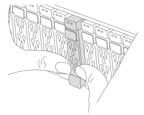

= 步驟1：關閉受損的控制器
:allow-uri-read: 

若要更換NVDIMM電池、您必須取出控制器模組、取出電池、更換電池、然後重新安裝控制器模組。

系統中的所有其他元件都必須正常運作；否則、您必須聯絡技術支援部門。

== 步驟1：關閉受損的控制器

若要關閉受損的控制器、您必須判斷控制器的狀態、並在必要時接管控制器、以便健全的控制器繼續從受損的控制器儲存設備提供資料。

.關於這項工作
* 如果您有 SAN 系統，則必須檢查故障控制器 SCSI 刀鋒的事件訊息  `cluster kernel-service show`。 `cluster kernel-service show`命令（從 priv 進階模式）會顯示節點名稱、link:https://docs.netapp.com/us-en/ontap/system-admin/display-nodes-cluster-task.html["仲裁狀態"]該節點的可用度狀態、以及該節點的作業狀態。
+
每個SCSI刀鋒處理序都應與叢集中的其他節點處於仲裁狀態。任何問題都必須先解決、才能繼續進行更換。

* 如果叢集有兩個以上的節點、則叢集必須處於仲裁狀態。如果叢集未達到法定人數、或健全的控制器顯示為「假」、表示符合資格和健全狀況、則您必須在關閉受損的控制器之前修正問題；請參閱 link:https://docs.netapp.com/us-en/ontap/system-admin/synchronize-node-cluster-task.html?q=Quorum["將節點與叢集同步"^]。

.步驟
. 如果啟用了「支援」功能、請叫用下列消息來禁止自動建立個案AutoSupport AutoSupport ：
+
`system node autosupport invoke -node * -type all -message MAINT=<# of hours>h`

+
下列AutoSupport 資訊不顯示自動建立案例兩小時：

+
`cluster1:> system node autosupport invoke -node * -type all -message MAINT=2h`

. 停用自動交還：
+
.. 從健康控制器的控制台輸入以下命令：
+
`storage failover modify -node _impaired_node_name_ -auto-giveback false`

.. 進入 `y`當您看到提示「您是否要停用自動回饋？」時

. 將受損的控制器移至載入器提示：
+
[cols="1,2"]
|===
| 如果受損的控制器正在顯示... | 然後... 

 a| 
載入程式提示
 a| 
前往下一步。

 a| 
正在等待恢復...
 a| 
按Ctrl-C、然後在出現提示時回應「y」。

 a| 
系統提示或密碼提示
 a| 
從健全的控制器接管或停止受損的控制器：

`storage failover takeover -ofnode _impaired_node_name_ -halt _true_`

--halt true_ 參數會帶您進入 Loader 提示字元。

|===

== 步驟2：移除控制器模組

更換控制器模組或更換控制器模組內部的元件時、您必須從機箱中移除控制器模組。

. 如果您尚未接地、請正確接地。
. 請用拇指推動每個磁碟機，直到您感覺到正向停止為止，以確保機箱中的所有磁碟機都穩固地安裝在中間背板上。
+

. 從來源拔下控制器模組電源供應器。
. 釋放電源線固定器、然後從電源供應器拔下纜線。
. 解開將纜線綁定至纜線管理裝置的掛勾和迴圈帶、然後從控制器模組拔下系統纜線、SFP和QSFP模組（如有需要）、並追蹤纜線的連接位置。解開將纜線綁定至纜線管理裝置的掛勾和迴圈帶、然後從控制器模組拔下系統纜線、並追蹤纜線的連接位置。
+
將纜線留在纜線管理裝置中、以便在重新安裝纜線管理裝置時、整理好纜線。

. 從控制器模組中取出纜線管理裝置、然後將其放在一旁。
. 向下按兩個鎖定栓、然後同時向下轉動兩個鎖條。
+
控制器模組會稍微移出機箱。

+
image::../media/drw_a800_pcm_remove.png[釋放控制器模組]

+
[cols="1,4"]
|===

 a| 
image:../media/icon_round_1.png["編號 1"]
 a| 
鎖定鎖定

 a| 
image:../media/icon_round_2.png["編號 2"]
 a| 
鎖定銷

|===
. 將控制器模組滑出機箱。
+
將控制器模組滑出機箱時、請確定您支援控制器模組的底部。

. 將控制器模組放在安全的地方。

== 步驟3：更換NVDIMM電池

若要更換NVDIMM電池、您必須從控制器模組中取出故障電池、然後將替換電池裝入控制器模組。

. 打開通風管蓋、並將NVDIMM電池放入擴充卡中。
+
image::../media/drw_a800_nvdimm_battery_replace.png[更換 NVDIMM 電池]

+
[cols="1,4"]
|===

 a| 
image:../media/icon_round_1.png["編號 1"]
 a| 
通風管提升板

 a| 
image:../media/icon_round_2.png["編號 2"]
 a| 
NVDIMM電池插塞

 a| 
image:../media/icon_round_3.png["編號 3"]
 a| 
NVDIMM電池套件

|===

*注意：*當您停止系統時、NVDIMM電池控制板LED會在將內容降解至快閃記憶體時閃爍。完成轉出後、LED會關閉。

. 找到電池插塞、並將電池插塞正面的固定夾壓下、以從插槽釋放插塞、然後從插槽拔下電池纜線。
. 抓住電池、將電池從通風管和控制器模組中取出、然後放在一旁。
. 從包裝中取出替換電池。
. 在NVDIMM通風管中安裝替換的電池套件：
+
.. 將電池套件插入插槽、然後穩固地向下按電池套件、以確保其鎖定到位。
.. 將電池插頭插入擴充卡插槽、並確定插塞鎖定到位。

. 關閉NVDIMM通風管。
+
確定插頭已鎖入插槽。

== 步驟4：重新安裝控制器模組並啟動系統

在控制器模組中更換FRU之後、您必須重新安裝控制器模組、然後重新啟動。

. 將控制器模組的一端與機箱的開口對齊、然後將控制器模組輕推至系統的一半。
+

NOTE: 在指示之前、請勿將控制器模組完全插入機箱。

. 視需要重新安裝系統。
+
如果您移除媒體轉換器（QSFP或SFP）、請記得在使用光纖纜線時重新安裝。

. 完成控制器模組的重新安裝：
+
.. 將控制器模組穩固地推入機箱、直到它與中間板完全接入。
+
控制器模組完全就位時、鎖定鎖條會上升。

+

NOTE: 將控制器模組滑入機箱時、請勿過度施力、以免損壞連接器。

.. 向上轉動鎖定栓、將其傾斜、使其從鎖定銷中取出、然後將其放低至鎖定位置。
.. 將電源線插入電源供應器，重新安裝電源線鎖環，然後將電源供應器連接至電源。
+
控制器模組會在電源恢復後立即開始開機。準備好中斷開機程序。

.. 如果您尚未重新安裝纜線管理裝置、請重新安裝。

== 步驟5：將故障零件歸還給NetApp

如套件隨附的RMA指示所述、將故障零件退回NetApp。如 https://mysupport.netapp.com/site/info/rma["零件退貨與更換"]需詳細資訊、請參閱頁面。
