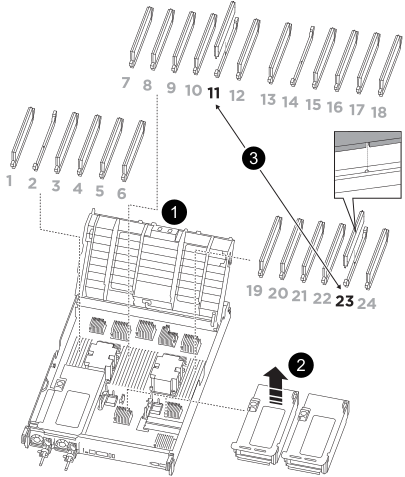

= 
:allow-uri-read: 

.步驟
. 解鎖對應立管上的鎖定閂鎖，即可存取 NVDIMM，然後移除立管。
+

+
[cols="1,4"]
|===

 a| 
image:../media/icon_round_1.png["編號 1"]
 a| 
通風管蓋

 a| 
image:../media/icon_round_2.png["編號 2"]
 a| 
擴充卡2

 a| 
image:../media/icon_round_3.png["編號 3"]
 a| 
插槽 11 和 23 中的 NVDIMM

|===
. 請注意NVDIMM在插槽中的方向、以便將NVDIMM以適當的方向插入替換控制器模組。
. 將NVDIMM從插槽中退出、方法是緩慢地將NVDIMM兩側的兩個NVDIMM彈出彈片分開、然後將NVDIMM從插槽中滑出並放在一邊。
+

NOTE: 小心拿住NVDIMM的邊緣、避免對NVDIMM電路板上的元件施加壓力。

. 從防靜電包裝袋中取出更換的NVDIMM、拿住NVDIMM的邊角、然後將其對準插槽。
+
NVDIMM插針的槽口應與插槽的卡舌對齊。

. 找到要安裝NVDIMM的插槽。
. 將NVDIMM正面插入插槽。
+
NVDIMM可緊密裝入插槽、但應能輕鬆放入。如果沒有、請重新將NVDIMM與插槽對齊、然後重新插入。

+

NOTE: 目視檢查NVDIMM、確認其已平均對齊並完全插入插槽。

. 小心但穩固地推入NVDIMM頂端邊緣、直到彈出彈片卡入NVDIMM末端的槽口。
. 重新安裝從控制器模組中卸下的所有擴充卡。
. 關閉通風管。

