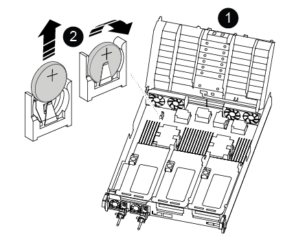

= 
:allow-uri-read: 

更換 RTC 電池的步驟因控制器是原版還是 VER2 型號而異。請使用下面的選項卡選擇適合您控制器型號的說明。

.關於這項工作
在第一代控制器上，電池位於 Riser 2（中間的 Riser）下方；在 VER2 控制器上，電池位於 DIMM 附近。

[role="tabbed-block"]
====
.原始控制器
--
.步驟
. 從控制器模組中移除 PCIe 提升板 2 （中間提升板）：
+
.. 移除PCIe卡中的任何SFP或QSFP模組。
.. 向上轉動提升板左側的提升板鎖定栓、並朝風扇模組方向轉動。
+
提升板會從控制器模組稍微向上提升。

.. 向上提起提升板、將其移向風扇、使提升板上的金屬片邊緣脫離控制器模組邊緣、將提升板從控制器模組中提出、然後將其放置在穩固的平面上。
+
image::../media/drw_a800_riser_2_3_remove.png[卸下提升板 2]

+
[cols="1,4"]
|===

 a| 
image:../media/icon_round_1.png["編號 1"]
 a| 
通風管

 a| 
image:../media/icon_round_2.png["編號 2"]
 a| 
擴充卡2（中間擴充卡）鎖定栓

|===

. 在提升板2下找到RTC電池。
+
image::../media/drw_a800_rtc_battery_replace.png[移除並更換 RTC 電池]

+
[cols="1,4"]
|===

 a| 
image:../media/icon_round_1.png["編號 1"]
 a| 
通風管

 a| 
image:../media/icon_round_2.png["編號 2"]
 a| 
擴充卡2

 a| 
image:../media/icon_round_3.png["編號 3"]
 a| 
RTC電池與外殼

|===
. 將電池從電池座中輕推、將電池從電池座中轉開、然後將其從電池座中取出。
+

NOTE: 從電池座取出電池時、請注意電池的極性。電池標有加號、必須正確放置在電池座中。支架附近的加號表示電池的放置方式。

. 從防靜電包裝袋中取出替換電池。
. 記下RTC電池的極性、然後以一定角度向下推電池、將其插入電池座。
. 目視檢查電池、確定電池已完全裝入電池座、且極性正確。
. 將擴充卡安裝至控制器模組：
+
.. 將擴充卡的邊緣對齊控制器模組的底部金屬板。
.. 沿控制器模組的插腳引導擴充卡、然後將擴充卡降低至控制器模組。
.. 向下轉動鎖定栓、然後將其卡入鎖定位置。
+
鎖定時、鎖定栓會與擴充卡的頂端齊平、而擴充卡則會正面置於控制器模組中。

.. 重新插入從PCIe卡中移除的任何SFP模組。

--
.Ver2 控制器
--
.步驟
. 找到 DIMM 附近的 RTC 電池。
+

+
[cols="1,4"]
|===

 a| 
image:../media/icon_round_1.png["編號 1"]
 a| 
通風管

 a| 
image:../media/icon_round_2.png["編號 2"]
 a| 
RTC電池與外殼

|===
. 將電池從電池座中輕推、將電池從電池座中轉開、然後將其從電池座中取出。
+

NOTE: 從電池座取出電池時、請注意電池的極性。電池標有加號、必須正確放置在電池座中。支架附近的加號表示電池的放置方式。

. 從防靜電包裝袋中取出替換電池。
. 記下RTC電池的極性、然後以一定角度向下推電池、將其插入電池座。
. 目視檢查電池、確定電池已完全裝入電池座、且極性正確。

--
====