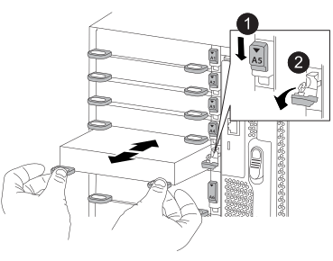

= 
:allow-uri-read: 

如果儲存系統有空插槽，請將新的 I/O 模組安裝到其中一個可用插槽中。如果所有插槽都已佔用，請移除現有的 I/O 模組以騰出空間，然後安裝新的 I/O 模組。

.開始之前
* 請檢查 https://hwu.netapp.com/["NetApp Hardware Universe"^] 確保新的I/O模組與您的系統和ONTAP 執行中的版本相容。
* 如果有多個插槽可用、請檢查中的插槽優先順序 https://hwu.netapp.com/["NetApp Hardware Universe"^] 並使用適用於您I/O模組的最佳工具。
* 若要不中斷營運地新增I/O模組、您必須接管目標控制器、移除目標插槽的插槽遮罩、或移除現有的I/O模組、新增或更換I/O模組、然後歸還目標控制器。
* 確定所有其他元件都正常運作。

[role="tabbed-block"]
====
.將 I/O 模組新增至空插槽
--
您可以在具有可用空插槽的儲存系統中新增 I/O 模組。

.步驟
. 如果您尚未接地、請正確接地。
. 移除目標插槽遮罩：
+
.. 按下有字母和編號的CAM栓鎖。
.. 向下旋轉CAM栓鎖、直到其處於開啟位置。
.. 卸下封蓋。

. 安裝I/O模組：
+
.. 將I/O模組與插槽邊緣對齊。
.. 將I/O模組滑入插槽、直到有字母和編號的I/O CAM栓開始與I/O CAM銷接合為止。
.. 將I/O CAM栓鎖推到底、將模組鎖定到位。

. 如果更換的I/O模組是NIC、請將模組纜線連接至資料交換器。
+

NOTE: 請確定所有未使用的I/O插槽均已安裝空白、以避免可能的散熱問題。

. 從載入程式提示字元_by_重新啟動控制器
+

NOTE: 這會重新初始化PCIe卡和其他元件、然後重新啟動節點。

. 從合作夥伴控制器中退回控制器。將容錯移轉還原為-ofnode_node_name'
. 如果停用自動恢復功能、請啟用：「儲存容錯移轉修改節點本機-自動恢復true」
. 如果您使用插槽3和/或7進行網路連線、請使用「儲存連接埠修改節點_」-_-port ______-mode network」命令來轉換插槽以供網路使用。
. 對控制器B重複這些步驟
. 如果您安裝了儲存 I/O 模組、請依照中所述link:../ns224/hot-add-shelf-overview.html["熱新增工作流程"]、安裝 NS224 機櫃並連接纜線。

--
.將 I/O 模組新增至完全填入的系統
--
您可以移除現有的 I/O 模組，並在其所在位置安裝新的 I/O 模組，將 I/O 模組新增至完全安裝的系統。

.關於這項工作
請確定您瞭解下列案例，以便將新的 I/O 模組新增至完全填入的系統：

[cols="1,2"]
|===
| 案例 | 需要採取行動 

 a| 
NIC 對 NIC （相同數量的連接埠）
 a| 
當控制器模組關閉時、LIF會自動移轉。

 a| 
NIC 對 NIC （不同的連接埠數量）
 a| 
將選取的生命由永久重新指派至不同的主連接埠。如需詳細資訊、請參閱 https://docs.netapp.com/ontap-9/topic/com.netapp.doc.onc-sm-help-960/GUID-208BB0B8-3F84-466D-9F4F-6E1542A2BE7D.html["移轉LIF"^] 。

 a| 
NIC 至儲存 I/O 模組
 a| 
使用System Manager將lifs永久移轉至不同的主連接埠、如所述 https://docs.netapp.com/ontap-9/topic/com.netapp.doc.onc-sm-help-960/GUID-208BB0B8-3F84-466D-9F4F-6E1542A2BE7D.html["移轉LIF"^]。

|===
.步驟
. 如果您尚未接地、請正確接地。
. 拔下目標I/O模組上的任何纜線。
. 從機箱中移除目標I/O模組：
+
.. 按下有字母和編號的CAM栓鎖。
+
CAM栓鎖會從機箱移出。

.. 向下轉動CAM栓鎖、直到其處於水平位置。
+
I/O模組從機箱鬆脫、並從I/O插槽移出約1/2英吋。

.. 拉動模組面兩側的拉片、將I/O模組從機箱中移除。
+
請務必追蹤I/O模組所在的插槽。

+
.動畫-移除或更換I/O模組
video::3a5b1f6e-15ec-40b4-bb2a-adf9016af7b6[panopto]
+

+
[cols="10,90"]
|===

 a| 
image::../media/icon_round_1.png[編號 1]
 a| 
I/O CAM栓鎖有編號和編號

 a| 
image:../media/icon_round_2.png["編號 2"]
 a| 
I/O CAM栓鎖完全解除鎖定

|===

. 將I/O模組安裝至目標插槽：
+
.. 將I/O模組與插槽邊緣對齊。
.. 將I/O模組滑入插槽、直到有字母和編號的I/O CAM栓開始與I/O CAM銷接合為止。
.. 將I/O CAM栓鎖推到底、將模組鎖定到位。

. 重複執行移除和安裝步驟、以更換控制器A的其他模組
. 如果更換的I/O模組是NIC、請將模組或模組纜線連接至資料交換器。
. 從載入程式提示重新啟動控制器：
+
.. 檢查控制器上的 BMC 版本： `system service-processor show`
.. 如有需要、請更新 BMC 韌體： `system service-processor image update`
.. 重新啟動節點： `bye`
+

NOTE: 這會重新初始化PCIe卡和其他元件、然後重新啟動節點。

+

NOTE: 如果您在重新開機期間遇到問題、請參閱 https://mysupport.netapp.com/site/bugs-online/product/ONTAP/BURT/1494308["Burt 1494308 - 在 I/O 模組更換期間、可能會觸發環境關機"]

. 從合作夥伴控制器中退回控制器。將容錯移轉還原為-ofnode_node_name'
. 如果停用自動恢復功能、請啟用：「儲存容錯移轉修改節點本機-自動恢復true」
. 如果您新增：
+
[cols="1,2"]
|===
| 如果I/O模組是... | 然後... 

 a| 
插槽3或7中的NIC模組、
 a| 
對於每個連接埠、使用「儲存連接埠修改節點*_<節點名稱>_-port *_<連接埠名稱>_-mode network」命令。

 a| 
儲存模組
 a| 
按照中所述，安裝和連接 NS224 機櫃 link:../ns224/hot-add-shelf-overview.html["熱新增工作流程"]。

|===
. 對控制器B重複這些步驟

--
====