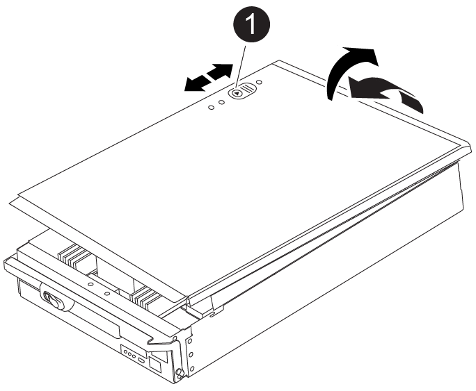

= 步驟1：移除控制器模組
:allow-uri-read: 

若要更換控制器模組硬體、您必須移除受損的控制器、將FRU元件移至更換的控制器模組、在機箱中安裝更換的控制器模組、然後將系統開機至維護模式。

以下動畫顯示將元件從受損控制器移至更換控制器的整個程序。

.動畫-將元件移至更換的控制器
video::30337552-b10f-4146-9bdb-adf2000df5bd[panopto]

== 步驟1：移除控制器模組

若要存取控制器內部的元件、您必須先從系統中移除控制器模組、然後移除控制器模組上的護蓋。

. 如果您尚未接地、請正確接地。
. 從受損的控制器模組拔下纜線、並追蹤纜線的連接位置。
. 將CAM把手上的Terra cotta按鈕向下推、直到解鎖為止。
+
.動畫-移除控制器
video::256721fd-4c2e-40b3-841a-adf2000df5fa[panopto]
+
image::../media/drw_a900_remove_PCM.png[釋放控制器]

+
[cols="1,4"]
|===

 a| 
image:../media/icon_round_1.png["編號 1"]
 a| 
CAM握把釋放鈕

 a| 
image:../media/icon_round_2.png["編號 2"]
 a| 
CAM握把

|===
. 旋轉CAM握把、使其完全脫離機箱的控制器模組、然後將控制器模組滑出機箱。
+
將控制器模組滑出機箱時、請確定您支援控制器模組的底部。

. 將控制器模組蓋面朝上放置在穩固的平面上、按下機箱蓋上的藍色按鈕、將機箱蓋滑到控制器模組的背面、然後向上轉動機箱蓋、將其從控制器模組中取出。
+

[cols="1,4"]
|===

 a| 
image:../media/icon_round_1.png["編號 1"]
 a| 
控制器模組護蓋鎖定按鈕

|===

== 步驟2：移動開機媒體

您必須找到開機媒體、並依照指示將其從舊控制器中移除、然後將其插入新的控制器。

. 使用下列圖例或控制器模組上的FRU對應圖、找到開機媒體：
+
image::../media/drw_a900_remove_boot_dev.png[移除開機媒體]

+
[cols="1,4"]
|===

 a| 
image:../media/icon_round_1.png["編號 1"]
 a| 
新聞稿索引標籤

 a| 
image:../media/icon_round_2.png["編號 2"]
 a| 
開機媒體

|===
. 按下開機媒體外殼上的藍色按鈕、將開機媒體從外殼中釋放、然後將其從開機媒體插槽中輕拉出。
+

NOTE: 請勿直接扭轉或拉起開機媒體、否則可能會損壞插槽或開機媒體。

. 將開機媒體移至新的控制器模組、將開機媒體邊緣對齊插槽外殼、然後將其輕推入插槽。
. 檢查開機媒體、確定其完全正確地插入插槽中。
+
如有必要、請取出開機媒體並將其重新插入插槽。

. 按下開機媒體、以啟用開機媒體外殼上的鎖定按鈕。

== 步驟3：移動系統DIMM

若要移動DIMM、請從舊的控制器找到並將其移至更換的控制器、然後依照特定的步驟順序進行。

NOTE: Ver2 控制器的 DIMM 插槽較少。DIMM 插槽編號並未減少支援的 DIMM 數量或變更。將 DIMM 移至新的控制器模組時、請將 DIMM 安裝至與受損控制器模組相同的插槽編號 / 位置。  請參閱 Ver2 控制器模組上的 FRU 對應圖、瞭解 DIMM 插槽位置。

. 如果您尚未接地、請正確接地。
. 找到控制器模組上的DIMM。
. 請注意插槽中的DIMM方向、以便您以適當的方向將DIMM插入更換的控制器模組。
. 緩慢地將DIMM兩側的兩個DIMM彈出彈片分開、然後將DIMM從插槽中滑出、藉此將DIMM從插槽中退出。
+

IMPORTANT: 小心拿住DIMM的邊緣、避免對DIMM電路板上的元件施加壓力。

+
image::../media/drw_a900_replace_PCM_dimms.png[可移動 DIMM]

+
[cols="1,4"]
|===

 a| 
image:../media/icon_round_1.png["編號 1"]
 a| 
DIMM推出式彈片

 a| 
image:../media/icon_round_2.png["編號 2"]
 a| 
DIMM

|===
. 找到要安裝DIMM的插槽。
. 確定連接器上的DIMM彈出彈片處於開啟位置、然後將DIMM正面插入插槽。
+
DIMM可緊密插入插槽、但應該很容易就能裝入。如果沒有、請重新將DIMM與插槽對齊、然後重新插入。

+

IMPORTANT: 目視檢查DIMM、確認其對齊並完全插入插槽。

. 將DIMM正面插入插槽。
+
DIMM可緊密插入插槽、但應該很容易就能裝入。如果沒有、請重新將DIMM與插槽對齊、然後重新插入。

+

IMPORTANT: 目視檢查DIMM、確認其對齊並完全插入插槽。

. 在DIMM頂端邊緣小心地推入、但穩固地推入、直到彈出彈出彈片卡入DIMM兩端的槽口。
. 對其餘的DIMM重複這些步驟。

== 步驟4：安裝控制器

將元件安裝到更換的控制器模組之後、您必須將更換的控制器模組安裝到系統機箱中、然後啟動作業系統。

對於同一機箱中有兩個控制器模組的HA配對、安裝控制器模組的順序特別重要、因為當您將控制器模組完全裝入機箱時、它會嘗試重新開機。

NOTE: 系統可能會在開機時更新系統韌體。請勿中止此程序。此程序要求您中斷開機程序、這通常可在系統提示之後隨時進行。不過、如果系統在開機時更新系統韌體、則必須等到更新完成後、才能中斷開機程序。

. 如果您尚未接地、請正確接地。
. 如果您尚未更換控制器模組的護蓋、請將其裝回。
. 將控制器模組的一端與機箱的開口對齊、然後將控制器模組輕推至系統的一半。
+
.動畫-安裝控制器
video::099237f3-d7f2-4749-86e2-adf2000df53c[panopto]
+
image::../media/drw_a900_remove_PCM.png[釋放控制器]

+
[cols="1,4"]
|===

 a| 
image:../media/icon_round_1.png["編號 1"]
 a| 
CAM握把釋放鈕

 a| 
image:../media/icon_round_2.png["編號 2"]
 a| 
CAM握把

|===
+

NOTE: 在指示之前、請勿將控制器模組完全插入機箱。

. 僅連接管理連接埠和主控台連接埠、以便存取系統以執行下列各節中的工作。
+

NOTE: 您將在本程序稍後將其餘纜線連接至控制器模組。

. 完成控制器模組的重新安裝：
+
.. 如果您尚未重新安裝纜線管理裝置、請重新安裝。
.. 將控制器模組穩固地推入機箱、直到它與中間板完全接入。
+

IMPORTANT: 將控制器模組滑入機箱時、請勿過度施力、以免損壞連接器。

+
控制器模組一旦完全插入機箱、就會開始開機。準備好中斷開機程序。

.. 將控制器模組CAM握把旋轉至鎖定位置。
.. 當您看到「Press Ctrl-C for Boot Menu」（按Ctrl-C進入開機功能表）時、請按「Ctrl-C」來中斷開機程序。
.. 選取要開機至載入器的選項。

