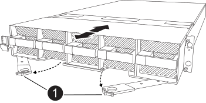

= 步驟 1 ：取下 PSU 和纜線
:allow-uri-read: 

== 步驟 1 ：取下 PSU 和纜線

移除控制器之前，您需要移除兩個電源裝置 (PSU)。

.步驟
. 卸下 PSU：
+
.. 如果您尚未接地、請正確接地。
.. 從 PSU 上拔下電源線。
+
如果您的系統有直流電源、請從 PSU 拔下電源區塊。

.. 透過向上旋轉 PSU 手柄將 PSU 從機殼後部移除，以便可以將 PSU 拉出，按下 PSU 鎖定卡舌，然後將 PSU 從機箱中拉出。
+

CAUTION: PSU很短。從控制器模組中取出時、請務必用兩隻手支撐、以免突然從控制器模組中迴轉而造成傷害。

+
image::../media/drw_a1k_psu_remove_replace_ieops-1378.svg[移除或更換 PSU]

+
[cols="1,4"]
|===

 a| 
image:../media/icon_round_1.png["編號 1"]
 a| 
Terracotta PSU 鎖定標籤

|===
.. 對第二個 PSU 重複這些步驟。

. 拔下纜線：
+
.. 從控制器模組拔下系統纜線，以及任何 SFP 和 QSFP 模組（如有需要），但將其留在纜線管理裝置中，以保持其井然有序。
+

NOTE: 在本程序開始時，纜線應已貼上標籤。

.. 從底盤上卸下電纜管理設備並將其放在一邊。

== 步驟 2：移除 I/O 卡、NVRAM12 和系統管理模組

. 從機箱中移除目標I/O模組：
+
image:../media/drw_a1k_io_remove_replace_ieops-1382.svg["移除 I/O 模組"]

+
[cols="1,4"]
|===

 a| 
image:../media/icon_round_1.png["編號 1"]
 a| 
I/O CAM 閂鎖

|===
+
.. 按下目標模組上的 CAM 按鈕。
.. 將 CAM 栓鎖儘量遠離模組。
.. 將手指勾入凸輪桿開口並將模組從底盤中拉出，從而將模組從底盤中取出。
+
請務必追蹤I/O模組所在的插槽。

.. 將 I/O 模組放在一邊，然後對任何其他 I/O 模組重複這些步驟。

. 移除 NVRAM12 模組：
+
.. 按下鎖定凸輪按鈕。
+
CAM按鈕會從機箱移出。

.. 向下轉動凸輪栓鎖、直到卡入定位為止。
.. 將手指插入 CAM 拉桿開口處、然後將模組拉出機箱、即可從機箱中移除 NVRAM 模組。
+
image::../media/drw_nvram1_remove_only_ieops-2574.svg[取下 NVRAM12 模組和 DIMM]

+
[cols="1,4"]
|===

 a| 
image:../media/icon_round_1.png["編號 1"]
| NVRAM12凸輪鎖 
|===
.. 將 NVRAM 模組放置在穩固的表面上。

. 刪除系統管理模組：
+
.. 按下系統管理模組上的 CAM 按鈕。
.. 將凸輪桿往下轉動至最遠的位置。
.. 將您的手指迴圈到凸輪桿上的孔中、然後將模組直接從系統中拉出。
+
image::../media/drw_a1k_sys-mgmt_remove_ieops-1384.svg[系統管理刪除]

+
[cols="1,4"]
|===

 a| 
image::../media/icon_round_1.png[編號 1]
 a| 
系統管理模組 CAM 栓鎖

|===

== 步驟3：移除控制器模組

. 在裝置正面、將手指勾入鎖定凸輪的孔中、壓緊凸輪桿上的彈片、然後輕輕地同時將兩個鎖條牢牢地朝您的方向旋轉。
+
控制器模組會稍微移出機箱。

+

+
[cols="1,4"]
|===

 a| 
image:../media/icon_round_1.png["編號 1"]
| 鎖定凸輪栓鎖 
|===
. 將控制器模組滑出機箱、然後放在平穩的表面上。
+
將控制器模組滑出機箱時、請確定您支援控制器模組的底部。

== 步驟 4：更換受損底盤

取下受損的機箱，然後安裝替換機箱。

.步驟
. 取下受損的機箱：
+
.. 從機箱安裝點卸下螺絲。
.. 將受損的機殼從系統機櫃或設備機架中的機架導軌上滑出，然後將其放在一邊。

. 安裝替換機箱：
+
.. 透過將機殼引導至系統機櫃或設備機架中的機架導軌上，將替換機殼安裝到設備機架或系統機櫃中。
.. 將機箱完全滑入設備機架或系統機櫃。
.. 使用您從受損機箱中卸下的螺絲、將機箱正面固定至設備機架或系統機櫃。

== 步驟5：安裝底盤組件

安裝替換機箱後，您需要安裝控制器模組，重新連接 I/O 模組和系統管理模組，然後重新安裝並插入 PSU。

.步驟
. 安裝控制器模組：
+
.. 將控制器模組的末端與機殼前方的開口對齊，然後輕輕地將控制器完全推入機箱。
.. 將鎖定閂鎖旋轉至鎖定位置。

. 在機箱後方安裝 I/O 卡：
+
.. 將 I/O 模組的末端與更換機箱中與損壞機箱相同的插槽對齊，然後輕輕地將模組完全推入機箱。
.. 將凸輪閂鎖向上旋轉至鎖定位置。
.. 對任何其他 I/O 模組重複這些步驟。

. 在機箱後方安裝系統管理模組：
+
.. 將系統管理模組的末端與機箱中的開口對齊，然後輕輕地將模組完全推入機箱。
.. 將凸輪閂鎖向上旋轉至鎖定位置。
.. 如果尚未這樣做，請重新安裝電纜管理設備並將電纜重新連接到 I/O 卡和系統管理模組。
+

NOTE: 如果您移除媒體轉換器（ QSFP 或 SFP ），請記得重新安裝。

+
確保電纜按照電纜標籤連接。

. 在機箱後方安裝機殼背面的 NVRAM12 模組：
+
.. 將 NVRAM12 模組的末端與機箱中的開口對齊，然後輕輕地將模組完全推入機箱。
.. 將凸輪閂鎖向上旋轉至鎖定位置。

. 安裝 PSU：
+
.. 用雙手支撐 PSU 的邊緣並將其與機殼的開口對齊。
.. 輕輕地將 PSU 推入機箱，直到鎖定卡榫卡入到位。
+
電源供應器只能與內部連接器正確接合、並以一種方式鎖定到位。

+

NOTE: 為避免損壞內部連接器、請勿在將PSU滑入系統時過度施力。

. 將 PSU 電源線重新連接到兩個 PSU，並使用電源線固定器將每條電源線固定在 PSU。
+
如果您有直流電源，請在控制器模組完全插入機箱後，將電源區塊重新連接至電源供應器，並使用指旋螺絲將電源線固定至 PSU 。

+
一旦安裝 PSU 並恢復電源，控制器模組就會開始開機。

