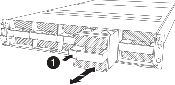

= 
:allow-uri-read: 

若要在不中斷服務的情況下更換風扇模組、您必須執行特定的工作順序。

.步驟
. 如果您尚未接地、請正確接地。
. 用兩隻手抓住擋板兩側的開孔、然後朝自己的方向拉動擋板、直到擋板從機箱框架上的球形接線柱中釋放為止、以卸下擋板（如有必要）。
. 查看主控台錯誤訊息、並查看每個風扇模組上的警示LED、以識別您必須更換的風扇模組。
+
面對控制器模組、風扇模組從左至右編號為 1 至 5 。

+

NOTE: 每個風扇都有一個 LED 。當風扇正常運作時、指示燈會亮起綠色燈、如果沒有、則會亮起琥珀色燈。

. 按下風扇模組上的黑色按鈕、將風扇模組直接從機箱中拉出、並確保您用自己的手來支撐它。
+

IMPORTANT: 風扇模組很短。請務必用手支撐風扇模組的底部、以免突然從機箱中掉落而造成傷害。

+

+
[cols="1,4"]
|===

 a| 
image:../media/legend_icon_01.svg["編號 1 、寬度 = 30px"]
 a| 
黑色釋放按鈕

|===
. 將風扇模組放在一邊。
. 將備用風扇模組的邊緣與機箱的開孔對齊、然後將其滑入機箱、直到卡入定位。
+
插入正式系統時、一旦系統辨識出風扇、琥珀色警示 LED 就會熄滅。

. 將擋板對齊球柱、然後將擋板輕推至球柱上。
. 如套件隨附的RMA指示所述、將故障零件退回NetApp。請參閱 https://mysupport.netapp.com/site/info/rma["產品退貨安培；更換"^] 頁面以取得更多資訊。

