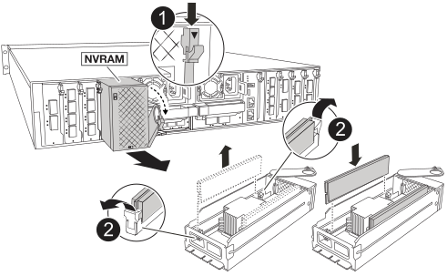

= 步驟1：關閉受損的控制器
:allow-uri-read: 

NVRAM 模組包含 NVRAM12 硬體和現場可更換的 DIMM 。您可以更換故障的NVRAM模組或NVRAM模組內的DIMM。若要更換故障的 NVRAM 模組、您必須從機箱中移除模組、將 DIMM 移至更換模組、然後將更換的 NVRAM 模組安裝至機箱。

系統中的所有其他元件都必須正常運作；否則、您必須聯絡 https://support.netapp.com["NetApp支援"]。

您必須使用從供應商處收到的替換FRU元件來更換故障元件。

== 步驟1：關閉受損的控制器

關閉或接管受損的控制器。

若要關閉受損的控制器、您必須判斷控制器的狀態、並在必要時接管控制器、以便健全的控制器繼續從受損的控制器儲存設備提供資料。

.關於這項工作
* 如果您有 SAN 系統，則必須檢查故障控制器 SCSI 刀鋒的事件訊息  `cluster kernel-service show`。 `cluster kernel-service show`命令（從 priv 進階模式）會顯示節點名稱、link:https://docs.netapp.com/us-en/ontap/system-admin/display-nodes-cluster-task.html["仲裁狀態"]該節點的可用度狀態、以及該節點的作業狀態。
+
每個SCSI刀鋒處理序都應與叢集中的其他節點處於仲裁狀態。任何問題都必須先解決、才能繼續進行更換。

* 如果叢集有兩個以上的節點、則叢集必須處於仲裁狀態。如果叢集未達到法定人數、或健全的控制器顯示為「假」、表示符合資格和健全狀況、則您必須在關閉受損的控制器之前修正問題；請參閱 link:https://docs.netapp.com/us-en/ontap/system-admin/synchronize-node-cluster-task.html?q=Quorum["將節點與叢集同步"^]。

.步驟
. 如果啟用 AutoSupport 、請叫用 AutoSupport 訊息來隱藏自動建立個案： `system node autosupport invoke -node * -type all -message MAINT=<# of hours>h`
+
下列AutoSupport 資訊不顯示自動建立案例兩小時： `cluster1:> system node autosupport invoke -node * -type all -message MAINT=2h`

. 停用健康控制器主控台的自動恢復： `storage failover modify -node local -auto-giveback false`
+

NOTE: 當您看到_是否要停用自動恢復？_時、請輸入「y」。

. 將受損的控制器移至載入器提示：
+
[cols="1,2"]
|===
| 如果受損的控制器正在顯示... | 然後... 

 a| 
載入程式提示
 a| 
前往下一步。

 a| 
正在等待恢復...
 a| 
按Ctrl-C、然後在出現提示時回應「y」。

 a| 
系統提示或密碼提示
 a| 
從正常控制器接管或停止受損的控制器：「torage容錯移轉接管-節點_受損節點_節點名稱_」

當受損的控制器顯示正在等待恢復...時、請按Ctrl-C、然後回應「y」。

|===

== 步驟2：更換NVRAM模組

若要更換 NVRAM 模組、請將其置於機箱的插槽 4/5 中、然後依照特定步驟順序進行。

. 如果您尚未接地、請正確接地。
. 從兩個 PSU 拔下電源線。
. 輕輕拉動托盤兩端的插針、然後向下旋轉托盤、將纜線管理托盤向下旋轉。
. 從機箱中卸下受損的 NVRAM 模組：
+
.. 按下鎖定凸輪按鈕。
.. 向下轉動凸輪栓鎖、直到卡入定位為止。
.. 將手指插入 CAM 拉桿開口處、然後將模組拉出機箱、即可將受損的 NVRAM 模組從機箱中移除。
+

+
[cols="1,4"]
|===

 a| 
image:../media/icon_round_1.png["編號 1"]
| CAM 鎖定按鈕 

 a| 
image:../media/icon_round_2.png["編號 2"]
 a| 
DIMM 鎖定彈片

|===

. 將 NVRAM 模組放置在穩固的表面上。
. 從受損的 NVRAM 模組中逐一移除 DIMM 、然後將其安裝在替換的 NVRAM 模組中。
. 將替換的 NVRAM 模組安裝到機箱中：
+
.. 將模組與插槽 4/5 中機箱開口的邊緣對齊。
.. 將模組一路輕輕滑入插槽、然後將 CAM 栓鎖完全向上旋轉、將模組鎖定到位。

. 可重新連接 PSU 。
. 將纜線管理承載器向上旋轉至關閉位置。

== 步驟3：更換NVRAM DIMM

若要更換 NVRAM 模組中的 NVRAM DIMM 、您必須先移除 NVRAM 模組、然後更換目標 DIMM 。

. 如果您尚未接地、請正確接地。
. 從兩個 PSU 拔下電源線。
. 輕輕拉動托盤兩端的插針、然後向下旋轉托盤、將纜線管理托盤向下旋轉。
. 從機箱中卸下目標 NVRAM 模組。
+

+
[cols="1,4"]
|===

 a| 
image:../media/icon_round_1.png["編號 1"]
| CAM 鎖定按鈕 

 a| 
image:../media/icon_round_2.png["編號 2"]
 a| 
DIMM 鎖定彈片

|===
. 將 NVRAM 模組放置在穩固的表面上。
. 找到 NVRAM 模組內要更換的 DIMM 。
+

NOTE: 請參閱 NVRAM 模組側邊的 FRU 對應標籤、以判斷 DIMM 插槽 1 和 2 的位置。

. 按下 DIMM 鎖定彈片並將 DIMM 從插槽中取出、以卸下 DIMM 。
. 將DIMM對齊插槽、然後將DIMM輕推入插槽、直到鎖定彈片鎖定到位、即可安裝替換DIMM。
. 將 NVRAM 模組安裝至機箱：
+
.. 將模組輕輕滑入插槽、直到凸輪閂鎖開始與 I/O 凸輪銷接合、然後將凸輪閂鎖完全向上旋轉、將模組鎖定到位。

. 可重新連接 PSU 。
. 將纜線管理承載器向上旋轉至關閉位置。

== 步驟 4 ：重新啟動控制器

更換FRU之後、您必須重新啟動控制器模組。

. 若要從載入程式提示字元啟動 ONTAP 、請輸入 _by_ 。

== 步驟 5 ：確認控制器狀態

當您啟動控制器時、必須確認連接到磁碟集區的控制器狀態。

.步驟
. 如果控制器處於維護模式（顯示 `*>` 提示）、請結束維護模式、並前往載入程式提示： _halt _
. 在控制器的載入器提示字元中、啟動控制器、並在系統 ID 不相符而提示覆寫系統 ID 時輸入 _y_ 。
. 等到更換模組的控制器主控台顯示等待恢復 ... 訊息、然後從健全的控制器驗證系統狀態： _ 儲存設備容錯移轉顯示 _
+
在命令輸出中、您應該會看到一則訊息、指出控制器的狀態。

+
[listing]
----

                              Takeover
Node           Partner        Possible State Description
-------------- -------------- -------- -------------------------------------
<nodename>
               <nodename>-   true     Connected to <nodename>-P2-3-178.
               P2-3-178                Waiting for cluster applications to
                                       come online on the local node.
AFF-A90-NBC-P2-3-178
               <nodename>-   true     Connected to <nodename>-P2-3-177,
               P2-3-177                Partial giveback
2 entries were displayed.

----
. 退回控制器：
+
.. 從健全的控制器中、歸還更換過的控制器儲存設備： _storage 容錯移轉恢復恢復 -ofnode_node_name_
+
控制器會重新連接其儲存資源池、並完成開機。

+
如果系統因為系統 ID 不相符而提示您置換系統 ID 、您應該輸入 _y_ 。

+

NOTE: 如果被否決、您可以考慮覆寫否決。

+
如需詳細資訊、請參閱 https://docs.netapp.com/us-en/ontap/high-availability/ha_manual_giveback.html#if-giveback-is-interrupted["手動恢復命令"^] 取代否決的主題。

.. 完成恢復後、確認 HA 配對是否正常、而且可以接管： _storage 容錯移轉 show_

. 驗證是否顯示所有磁碟： `storage disk show`
+
[listing]
----

::> storage disk show
                     Usable           Disk    Container   Container
Disk                   Size Shelf Bay Type    Type        Name
---------------- ---------- ----- --- ------- ----------- ---------
1.0.0                3.49TB     0   0 SSD-NVM aggregate   pod_NVME_SSD_1
1.0.1                3.49TB     0   1 SSD-NVM aggregate   pod_NVME_SSD_1
1.0.2                3.49TB     0   2 SSD-NVM aggregate   pod_NVME_SSD_1
1.0.3                3.49TB     0   3 SSD-NVM aggregate   pod_NVME_SSD_1
1.0.4                3.49TB     0   4 SSD-NVM aggregate   pod_NVME_SSD_1

[...]
48 entries were displayed.

----

== 步驟5：將故障零件歸還給NetApp

如套件隨附的RMA指示所述、將故障零件退回NetApp。如 https://mysupport.netapp.com/site/info/rma["零件退貨與更換"]需詳細資訊、請參閱頁面。
