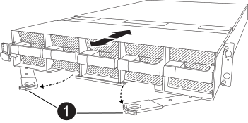
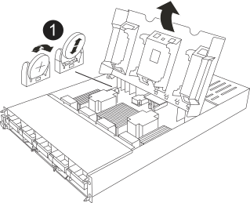

= 步驟1：關閉受損的控制器
:allow-uri-read: 

.開始之前
* 瞭解您可以將此程序用於系統支援的所有 ONTAP 版本。
* 請確定系統中的所有其他元件都正常運作；如果沒有、您必須聯絡技術支援部門。

== 步驟1：關閉受損的控制器

使用下列其中一個選項來關閉或接管受損的控制器。

[role="tabbed-block"]
====
.選項1：大多數系統
--
若要關閉受損的控制器、您必須判斷控制器的狀態、並在必要時接管控制器、以便健全的控制器繼續從受損的控制器儲存設備提供資料。

.關於這項工作
* 如果您有 SAN 系統，則必須檢查故障控制器 SCSI 刀鋒的事件訊息  `cluster kernel-service show`。 `cluster kernel-service show`命令（從 priv 進階模式）會顯示節點名稱、link:https://docs.netapp.com/us-en/ontap/system-admin/display-nodes-cluster-task.html["仲裁狀態"]該節點的可用度狀態、以及該節點的作業狀態。
+
每個SCSI刀鋒處理序都應與叢集中的其他節點處於仲裁狀態。任何問題都必須先解決、才能繼續進行更換。

* 如果叢集有兩個以上的節點、則叢集必須處於仲裁狀態。如果叢集未達到法定人數、或健全的控制器顯示為「假」、表示符合資格和健全狀況、則您必須在關閉受損的控制器之前修正問題；請參閱 link:https://docs.netapp.com/us-en/ontap/system-admin/synchronize-node-cluster-task.html?q=Quorum["將節點與叢集同步"^]。

.步驟
. 如果啟用了「支援」功能、請叫用下列消息來禁止自動建立個案AutoSupport AutoSupport ：
+
`system node autosupport invoke -node * -type all -message MAINT=<# of hours>h`

+
下列AutoSupport 資訊不顯示自動建立案例兩小時：

+
`cluster1:> system node autosupport invoke -node * -type all -message MAINT=2h`

. 停用自動交還：
+
.. 從健康控制器的控制台輸入以下命令：
+
`storage failover modify -node _impaired_node_name_ -auto-giveback false`

.. 進入 `y`當您看到提示「您是否要停用自動回饋？」時

. 將受損的控制器移至載入器提示：
+
[cols="1,2"]
|===
| 如果受損的控制器正在顯示... | 然後... 

 a| 
載入程式提示
 a| 
前往下一步。

 a| 
正在等待恢復...
 a| 
按Ctrl-C、然後在出現提示時回應「y」。

 a| 
系統提示或密碼提示
 a| 
從健全的控制器接管或停止受損的控制器：

`storage failover takeover -ofnode _impaired_node_name_ -halt _true_`

--halt true_ 參數會帶您進入 Loader 提示字元。

|===

--
.選項2：控制器位於MetroCluster 一個不二之處
--
若要關閉受損的控制器、您必須判斷控制器的狀態、並在必要時接管控制器、以便健全的控制器繼續從受損的控制器儲存設備提供資料。

* 如果叢集有兩個以上的節點、則叢集必須處於仲裁狀態。如果叢集未達到法定人數、或健全的控制器顯示為「假」、表示符合資格和健全狀況、則您必須在關閉受損的控制器之前修正問題；請參閱 link:https://docs.netapp.com/us-en/ontap/system-admin/synchronize-node-cluster-task.html?q=Quorum["將節點與叢集同步"^]。
* 您必須確認已設定 MetroCluster 組態狀態，且節點處於啟用和正常狀態：
+
`metrocluster node show`

.步驟
. 如果啟用了「支援」功能、請叫用下列消息來禁止自動建立個案AutoSupport AutoSupport ：
+
`system node autosupport invoke -node * -type all -message MAINT=number_of_hours_downh`

+
下列AutoSupport 資訊不顯示自動建立案例兩小時：

+
`cluster1:*> system node autosupport invoke -node * -type all -message MAINT=2h`

. 停用自動交還：
+
.. 從健康控制器的控制台輸入以下命令：
+
`storage failover modify -node local -auto-giveback false`

.. 進入 `y`當您看到提示「您是否要停用自動回饋？」時

. 將受損的控制器移至載入器提示：
+
[cols="1,2"]
|===
| 如果受損的控制器正在顯示... | 然後... 

 a| 
載入程式提示
 a| 
前往下一節。

 a| 
正在等待恢復...
 a| 
按Ctrl-C、然後在出現提示時回應「y」。

 a| 
系統提示或密碼提示（輸入系統密碼）
 a| 
從健全的控制器接管或停止受損的控制器：

`storage failover takeover -ofnode _impaired_node_name_ -halt _true_`

--halt true_ 參數會帶您進入 Loader 提示字元。

|===

--
====

== 步驟2：移除控制器模組

更換控制器模組或更換控制器模組內的元件時、您必須從機箱中移除控制器模組。

.步驟
. 檢查系統插槽 4/5 中的 NVRAM 狀態 LED 。控制器模組前面板上也有 NVRAM LED 。尋找 NV 圖示：
+
image::../media/drw_a1K-70-90_nvram-led_ieops-1463.svg[NVRAM 注意與狀態 LED 位置圖]

+
[cols="1,4"]
|===

 a| 
image:../media/icon_round_1.png["編號 1"]
 a| 
NVRAM 狀態 LED

 a| 
image:../media/icon_round_2.png["編號 2"]
 a| 
NVRAM 注意 LED

|===
+
** 如果 NV LED 熄滅、請前往下一步。
** 如果 NV LED 閃爍、請等待閃爍停止。如果持續閃爍超過 5 分鐘、請聯絡技術支援部門尋求協助。

. 如果您尚未接地、請正確接地。
. 在裝置正面、將手指勾入鎖定凸輪的孔中、壓緊凸輪桿上的彈片、然後輕輕地同時將兩個鎖條牢牢地朝您的方向旋轉。
+
控制器模組會稍微移出機箱。

+

+
[cols="1,4"]
|===

 a| 
image:../media/icon_round_1.png["編號 1"]
| 鎖定凸輪栓鎖 
|===
. 將控制器模組滑出機箱、然後放在平坦穩定的表面上。
+
將控制器模組滑出機箱時、請務必支撐控制器模組的底部。

== 步驟3：更換RTC電池

取出故障的 RTC 電池、然後安裝替換的 RTC 電池。

.步驟
. 打開控制器頂端的控制器通風管。
+
.. 將手指插入通風管遠端的凹處。
.. 提起通風管、並將其向上旋轉至最遠的位置。

. 找到通風管下方的 RTC 電池。
+

+
[cols="1,4"]
|===

 a| 
image:../media/icon_round_1.png["編號 1"]
| RTC電池與外殼 
|===
. 將電池從電池座中輕推、將電池從電池座中轉開、然後將其從電池座中取出。
+

NOTE: 從電池座取出電池時、請注意電池的極性。電池標有加號、必須正確放置在電池座中。支架附近的加號表示電池的放置方式。

. 從防靜電包裝袋中取出替換電池。
. 記下RTC電池的極性、然後以一定角度向下推電池、將其插入電池座。
. 目視檢查電池、確定電池已完全裝入電池座、且極性正確。

== 步驟4：重新安裝控制器模組

重新安裝控制器模組並將其開機。

.步驟
. 將通風管往下轉動、以確保通風管完全關閉。
+
它必須與控制器模組金屬板齊平。

. 將控制器模組的末端與機箱中的開口對齊、然後將控制器模組滑入機箱、並將控制桿從系統正面旋轉。
. 一旦控制器模組停止滑動、請向內旋轉 CAM 把手、直到卡入風扇下方
+

NOTE: 將控制器模組滑入機箱時、請勿過度施力、以免損壞連接器。

+
一旦控制器模組完全插入機箱中、就會開始開機。

. 將功能受損的控制器恢復正常運作，只需歸還其儲存設備 `storage failover giveback -ofnode _impaired_node_name_`：。
. 如果已停用自動恢復功能、請重新啟用： `storage failover modify -node local -auto-giveback true`。
. 如果啟用 AutoSupport 、則還原 / 恢復自動建立個案： `system node autosupport invoke -node * -type all -message MAINT=END`。

== 步驟 5 ：重設控制器上的時間和日期

NOTE: 更換 RTC 電池、插入控制器並開啟第一次 BIOS 重設的電源後、您會看到下列錯誤訊息：
`RTC date/time error. Reset date/time to default`
`RTC power failure error` 這些訊息會被選取、您可以繼續執行此程序。

.步驟
. 使用 _cluster date show_ 命令檢查健全控制器上的日期和時間。

NOTE: 如果系統停止在開機功能表、請在出現提示時選取選項  `Reboot node` 並回應 _y_ 、然後按下 _Ctrl-C_ 以開機至載入程式

. 在目標控制器的載入程式提示字元下、使用命令檢查時間和日期 `cluster date show` 。
. 如有必要、請使用「設置日期mm/dd/ymm/西元年」命令來修改日期。
. 如有必要、請使用「Set Time hh：mm：sss」命令、以GMT0設定時間。
+
.. 確認目標控制器上的日期和時間。
.. 在載入程式提示下、輸入 _by_ 重新初始化 PCIe 卡和其他元件、並讓控制器重新開機。

== 步驟6：將故障零件歸還給NetApp

如套件隨附的RMA指示所述、將故障零件退回NetApp。如 https://mysupport.netapp.com/site/info/rma["零件退貨與更換"]需詳細資訊、請參閱頁面。
