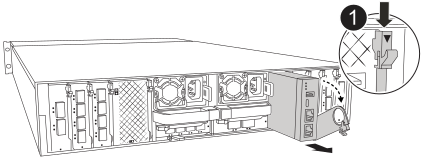
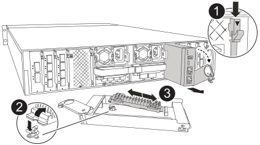

= 步驟1：關閉受損的控制器
:allow-uri-read: 

系統管理模組位於插槽 8 中控制器背面、包含用於系統管理的內建元件、以及用於外部管理的連接埠。目標控制器必須關閉、才能更換損壞的系統管理模組或更換開機媒體。

系統管理模組具有下列主機板內建元件：

* 開機媒體、無需移除控制器模組即可更換開機媒體。
* BMC
* 管理交換器

系統管理模組也包含下列連接埠、可供外部管理：

* RJ45 序列
* USB 序列（ Type-C ）
* USB Type-A （開機恢復）
* e0M RJ45 乙太網路

.開始之前
* 確定所有其他系統元件都正常運作。
* 確保合作夥伴控制器能夠接管受損的控制器。
* 請務必使用您從 NetApp 收到的替換元件來更換故障的元件。

.關於這項工作
本程序使用下列術語：

* 受損的控制器是您要執行維護的控制器。
* 健全的控制器是受損控制器的HA合作夥伴。

== 步驟1：關閉受損的控制器

使用下列其中一個選項來關閉或接管受損的控制器。

[role="tabbed-block"]
====
.選項1：大多數系統
--
若要關閉受損的控制器、您必須判斷控制器的狀態、並在必要時接管控制器、以便健全的控制器繼續從受損的控制器儲存設備提供資料。

.關於這項工作
* 如果您有 SAN 系統，則必須檢查故障控制器 SCSI 刀鋒的事件訊息  `cluster kernel-service show`。 `cluster kernel-service show`命令（從 priv 進階模式）會顯示節點名稱、link:https://docs.netapp.com/us-en/ontap/system-admin/display-nodes-cluster-task.html["仲裁狀態"]該節點的可用度狀態、以及該節點的作業狀態。
+
每個SCSI刀鋒處理序都應與叢集中的其他節點處於仲裁狀態。任何問題都必須先解決、才能繼續進行更換。

* 如果叢集有兩個以上的節點、則叢集必須處於仲裁狀態。如果叢集未達到法定人數、或健全的控制器顯示為「假」、表示符合資格和健全狀況、則您必須在關閉受損的控制器之前修正問題；請參閱 link:https://docs.netapp.com/us-en/ontap/system-admin/synchronize-node-cluster-task.html?q=Quorum["將節點與叢集同步"^]。

.步驟
. 如果啟用了「支援」功能、請叫用下列消息來禁止自動建立個案AutoSupport AutoSupport ：
+
`system node autosupport invoke -node * -type all -message MAINT=<# of hours>h`

+
下列AutoSupport 資訊不顯示自動建立案例兩小時：

+
`cluster1:> system node autosupport invoke -node * -type all -message MAINT=2h`

. 停用健康控制器主控台的自動恢復：
+
`storage failover modify -node local -auto-giveback false`

+

NOTE: 當您看到_是否要停用自動恢復？_時、請輸入「y」。

. 將受損的控制器移至載入器提示：
+
[cols="1,2"]
|===
| 如果受損的控制器正在顯示... | 然後... 

 a| 
載入程式提示
 a| 
前往下一步。

 a| 
正在等待恢復...
 a| 
按Ctrl-C、然後在出現提示時回應「y」。

 a| 
系統提示或密碼提示
 a| 
從健全的控制器接管或停止受損的控制器：

`storage failover takeover -ofnode _impaired_node_name_ -halt _true_`

--halt true_ 參數會帶您進入 Loader 提示字元。

|===

--
.選項2：控制器位於MetroCluster 一個不二之處
--
若要關閉受損的控制器、您必須判斷控制器的狀態、並在必要時接管控制器、以便健全的控制器繼續從受損的控制器儲存設備提供資料。

* 如果叢集有兩個以上的節點、則叢集必須處於仲裁狀態。如果叢集未達到法定人數、或健全的控制器顯示為「假」、表示符合資格和健全狀況、則您必須在關閉受損的控制器之前修正問題；請參閱 link:https://docs.netapp.com/us-en/ontap/system-admin/synchronize-node-cluster-task.html?q=Quorum["將節點與叢集同步"^]。
* 您必須確認已設定 MetroCluster 組態狀態，且節點處於啟用和正常狀態：
+
`metrocluster node show`

.步驟
. 如果啟用了「支援」功能、請叫用下列消息來禁止自動建立個案AutoSupport AutoSupport ：
+
`system node autosupport invoke -node * -type all -message MAINT=number_of_hours_downh`

+
下列AutoSupport 資訊不顯示自動建立案例兩小時：

+
`cluster1:*> system node autosupport invoke -node * -type all -message MAINT=2h`

. 停用健康控制器主控台的自動恢復：
+
`storage failover modify –node local -auto-giveback false`

. 將受損的控制器移至載入器提示：
+
[cols="1,2"]
|===
| 如果受損的控制器正在顯示... | 然後... 

 a| 
載入程式提示
 a| 
前往下一節。

 a| 
正在等待恢復...
 a| 
按Ctrl-C、然後在出現提示時回應「y」。

 a| 
系統提示或密碼提示（輸入系統密碼）
 a| 
從健全的控制器接管或停止受損的控制器：

`storage failover takeover -ofnode _impaired_node_name_ -halt _true_`

--halt true_ 參數會帶您進入 Loader 提示字元。

|===

--
====

== 步驟 2 ：更換損壞的系統管理模組

更換損壞的系統管理模組。

. 移除系統管理模組：
+

NOTE: 繼續之前、請先確定 NVRAM 目標已完成。當 NV 模組上的 LED 熄滅時， NVRAM 就會停止運作。如果 LED 閃爍，請等待閃爍停止。如果持續閃爍超過 5 分鐘、請聯絡技術支援部門尋求協助。

+

+
[cols="1,4"]
|===

 a| 
image::../media/icon_round_1.png[編號 1]
 a| 
系統管理模組 CAM 栓鎖

|===
+
.. 如果您尚未接地、請正確接地。
.. 從 PSU 上拔下電源線，然後將控制器模組從系統前部拉出幾英寸。
.. 拔下連接至系統管理模組的所有纜線。請確定纜線的連接位置標示、以便在重新安裝模組時、將纜線連接至正確的連接埠。
.. 拔下受損控制器的 PSU 電源線。
.. 向下轉動纜線管理承載器、方法是拉動纜線管理承載器內側兩側的按鈕、然後向下旋轉承載器。
.. 按下系統管理模組上的 CAM 按鈕。
.. 將凸輪桿往下轉動至最遠的位置。
.. 將您的手指迴圈到凸輪桿上的孔中、然後將模組直接從系統中拉出。
.. 將系統管理模組放在防靜電墊上、以便存取開機媒體。

. 將開機媒體移至替換的 System Management 模組：
+

+
[cols="1,4"]
|===

 a| 
image::../media/icon_round_1.png[編號 1]
 a| 
系統管理模組 CAM 栓鎖

 a| 
image::../media/icon_round_2.png[編號 2]
 a| 
開機媒體鎖定按鈕

 a| 
image::../media/icon_round_3.png[編號 3]
 a| 
開機媒體

|===
+
.. 按「減損系統管理」模組中的藍色開機媒體鎖定按鈕。
.. 向上旋轉開機媒體、將其滑出插槽。

. 在替換的 System Management 模組中安裝開機媒體：
+
.. 將開機媒體的邊緣對齊插槽外殼、然後將其輕推入插槽。
.. 向下旋轉開機媒體、直到碰到鎖定按鈕為止。
.. 按下藍色鎖定並將開機媒體完全向下旋轉、然後放開藍色鎖定按鈕。

. 將替換系統管理模組安裝至機箱：
+
.. 將替換系統管理模組的邊緣與系統開口對齊、然後將其輕輕推入控制器模組。
.. 將模組輕輕滑入插槽、直到凸輪閂鎖開始與 I/O 凸輪銷接合、然後將凸輪閂鎖完全向上旋轉、將模組鎖定到位。

. 將纜線管理 ARM 向上旋轉至關閉位置。
. 可重新學習系統管理模組。

== 步驟 3 ：重新啟動控制器模組

重新啟動控制器模組。

. 將電源線重新插入 PSU，然後輕輕地重新安裝並鎖定係統前部的控制器模組。
+
系統將開始重新開機、通常會進入載入程式提示。

. 在載入程式提示字元中輸入 _bye 。
. 將功能受損的控制器恢復正常運作，只需歸還其儲存設備 `storage failover giveback -ofnode _impaired_node_name_`：。
. 如果已停用自動恢復功能、請重新啟用： `storage failover modify -node local -auto-giveback true`。
. 如果啟用 AutoSupport 、則還原 / 恢復自動建立個案： `system node autosupport invoke -node * -type all -message MAINT=END`。

== 步驟 4 ：安裝授權並登錄序號

如果受損節點使用的是需要標準（節點鎖定）授權的 ONTAP 功能、則必須為節點安裝新授權。對於具有標準授權的功能、叢集中的每個節點都應該擁有自己的功能金鑰。

.關於這項工作
在您安裝授權金鑰之前、需要標準授權的功能仍可繼續提供給節點使用。不過、如果節點是叢集中唯一擁有該功能授權的節點、則不允許對該功能進行任何組態變更。此外、在節點上使用未獲授權的功能可能會使您不遵守授權合約、因此您應該盡快在節點上安裝替換授權金鑰或金鑰。

.開始之前
授權金鑰必須為28個字元的格式。

您有90天的寬限期可以安裝授權金鑰。寬限期過後、所有舊授權都會失效。安裝有效的授權金鑰之後、您有24小時的時間可以在寬限期結束之前安裝所有金鑰。

NOTE: 如果系統最初運行的是 ONTAP 9 ． 10.1 或更高版本，請使用中介紹的過程link:https://kb.netapp.com/on-prem/ontap/OHW/OHW-KBs/Post_Motherboard_Replacement_Process_to_update_Licensing_on_a_AFF_FAS_system#Internal_Notes["在AFF/FAS系統上更新授權的主機板更換程序"^]。如果您不確定系統的初始 ONTAP 版本、請參閱link:https://hwu.netapp.com["NetApp Hardware Universe"^]以取得更多資訊。

.步驟
. 如果您需要新的授權金鑰、請在上取得替換授權金鑰 https://mysupport.netapp.com/site/global/dashboard["NetApp 支援網站"] 在「軟體授權」下的「我的支援」區段中。
+

NOTE: 系統會自動產生您所需的新授權金鑰、並將其傳送至檔案上的電子郵件地址。如果您在30天內未收到附有授權金鑰的電子郵件、請聯絡技術支援部門。

. 安裝每個授權金鑰：「+系統授權新增-授權碼授權金鑰、授權金鑰...+」
. 視需要移除舊授權：
+
.. 檢查未使用的授權：「授權清理-未使用的-Simulate」
.. 如果清單看起來正確、請移除未使用的授權：「授權清理-未使用」

. 向NetApp支援部門註冊系統序號。
+
** 如果啟用了「支援」功能、請傳送「支援」訊息來登錄序號。AutoSupport AutoSupport
** 如果AutoSupport 未啟用此功能、請致電 https://mysupport.netapp.com["NetApp支援"] 以登錄序號。

== 步驟5：將故障零件歸還給NetApp

如套件隨附的RMA指示所述、將故障零件退回NetApp。如 https://mysupport.netapp.com/site/info/rma["零件退貨與更換"]需詳細資訊、請參閱頁面。
