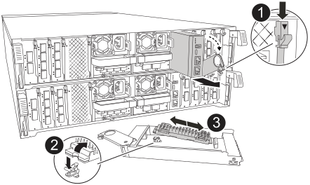

= 步驟1：更換開機媒體
:allow-uri-read: 

== 步驟1：更換開機媒體

開機媒體位於系統管理模組內、可從系統中移除模組來存取。

. 請用拇指推動每個磁碟機，直到您感覺到正向停止為止，以確保機箱中的所有磁碟機都穩固地安裝在中間背板上。
+
image::../media/drw_a800_drive_seated_IEOPS-960.svg[安裝磁碟機]

. 移至機箱背面。如果您尚未接地、請正確接地。
. 拔下控制器的 PSU。
+

NOTE: 如果您的系統有直流電源、請從 PSU 拔下電源區塊。

+
.. 拔下連接至系統管理模組的所有纜線。請務必標示纜線的連接位置、以便在重新安裝模組時、將纜線連接至正確的連接埠。
.. 向下轉動纜線管理承載器、方法是拉動纜線管理承載器內側兩側的按鈕、然後向下旋轉承載器。
.. 按下系統管理 CAM 按鈕。CAM 控制桿會從機箱移出。
.. 向下轉動 CAM 拉桿、然後從控制器模組中移除 System Management 模組。
.. 將系統管理模組放在防靜電墊上、以便存取開機媒體。

. 從管理模組中移除開機媒體：
+

+
[cols="1,4"]
|===

 a| 
image::../media/icon_round_1.png[編號 1]
 a| 
系統管理模組 CAM 栓鎖

 a| 
image::../media/icon_round_2.png[編號 2]
 a| 
開機媒體鎖定按鈕

 a| 
image::../media/icon_round_3.png[編號 3]
 a| 
開機媒體

|===
+
.. 按下藍色鎖定按鈕。
.. 向上旋轉開機媒體、將其滑出插槽、然後將其放在一邊。

. 將替換開機媒體安裝至系統管理模組：
+
.. 將開機媒體的邊緣對齊插槽外殼、然後將其輕推入插槽。
.. 朝鎖定按鈕方向向下旋轉開機媒體。
.. 按下鎖定按鈕、將開機媒體完全向下旋轉、然後放開鎖定按鈕。

. 重新安裝系統管理模組：
+
.. 將纜線管理承載器向上旋轉至關閉位置。
.. 可重新學習系統管理模組。

== 步驟2：將開機映像傳輸到開機媒體

您安裝的替換開機媒體沒有 ONTAP 映像。您可以將 ONTAP 映像從下載適當的 ONTAP 服務映像到 USB 快閃磁碟機、然後再將其傳輸到替換的開機媒體 https://mysupport.netapp.com/["NetApp 支援網站"]。

.開始之前
* 您必須擁有格式化為FAT32的USB隨身碟、且容量至少為4GB。
* 下載與受損控制器執行的相同映像版本 ONTAP 的複本。您可以從 NetApp 支援網站上的「下載」區段下載適當的映像。如果您的 ONTAP 版本支援 NVE 、請使用 `version -v`命令來顯示。如果顯示命令輸出，則 `<10no- DARE>`表示您的 ONTAP 版本不支援 NVE 。
+
** 如果您的 ONTAP 版本支援 NVE 、請下載具有 NetApp Volume Encryption 的映像、如下載按鈕所示。
** 如果不支援 NVE 、請下載不含 NetApp Volume Encryption 的映像、如下載按鈕所示。

* 如果您的系統是 HA 配對、則必須在控制器的節點管理連接埠（通常是 e0M 介面）之間建立網路連線。

.步驟
. 從下載適當的服務映像、並將其複製 https://mysupport.netapp.com/["NetApp 支援網站"] 到 USB 快閃磁碟機。
+
.. 從頁面上的「下載」連結、將服務影像下載到筆記型電腦上的工作空間。
.. 解壓縮服務映像。
+

NOTE: 如果您使用Windows擷取內容、請勿使用WinZipto擷取netboot映像。使用其他擷取工具、例如7-Zip或WinRAR。

+
USB 快閃磁碟機應具有受損控制器所執行的適當 ONTAP 映像。

.. 從筆記型電腦中取出USB隨身碟。

. 將 USB 快閃磁碟機插入系統管理模組上的 USB-A 連接埠。
+
請確定您將USB隨身碟安裝在標示為USB裝置的插槽中、而非USB主控台連接埠中。

. 將電源線插入電源供應器。一旦電源恢復，控制器就會重新啟動。
+

NOTE: 如果您有直流電源，請將電源塊重新連接到電源。

. 在載入程式提示字元下按Ctrl-C停止、以中斷開機程序。
+
如果您錯過此訊息、請按Ctrl-C、選取開機至維護模式的選項、然後停止控制器以開機至載入器。

