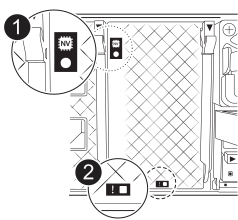
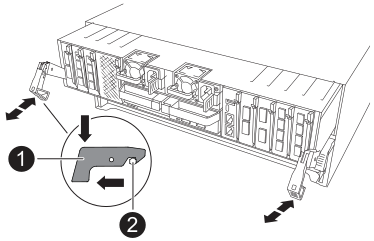

= 
:allow-uri-read: 

更換控制器模組或更換控制器模組內部的元件時、您必須從機箱中移除控制器模組。

.步驟
. 請用拇指推動每個磁碟機，直到您感覺到正向停止為止，以確保機箱中的所有磁碟機都穩固地安裝在中間背板上。
+
image::../media/drw_a800_drive_seated_IEOPS-960.svg[安裝磁碟機]

. 檢查故障控制器模組背面插槽 4/5 中的琥珀色 NVRAM 狀態 LED 是否熄滅。尋找 NV 圖示。
+

+
[cols="1,4"]
|===

 a| 
image:../media/icon_round_1.png["編號 1"]
 a| 
NVRAM 狀態 LED

 a| 
image:../media/icon_round_2.png["編號 2"]
 a| 
NVRAM 注意 LED

|===
+
** 如果 NV LED 熄滅、請前往下一步。
** 如果 NV LED 閃爍、請等待閃爍停止。如果持續閃爍超過 5 分鐘、請聯絡技術支援部門尋求協助。

. 如果您尚未接地、請正確接地。
. 從控制器模組電源供應器（ PSU ）拔下控制器模組電源供應器纜線。
+

NOTE: 如果您的系統有直流電源、請從 PSU 拔下電源區塊。

. 從控制器模組拔下系統纜線、 SFP 和 QSFP 模組（如有需要）、並追蹤纜線的連接位置。
+
將纜線留在纜線管理裝置中、以便在重新安裝纜線管理裝置時、整理好纜線。

. 從控制器模組中取出纜線管理裝置。
. 向下按兩個鎖定栓、然後同時向下轉動兩個鎖條。
+
控制器模組會稍微移出機箱。

+

+
[cols="1,4"]
|===

 a| 
image:../media/icon_round_1.png["編號 1"]
 a| 
鎖定鎖定

 a| 
image:../media/icon_round_2.png["編號 2"]
 a| 
鎖定銷

|===
. 將控制器模組滑出機箱、然後放在平穩的表面上。
+
將控制器模組滑出機箱時、請確定您支援控制器模組的底部。

