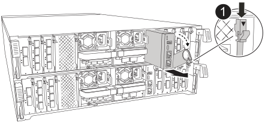

= 
:allow-uri-read: 

.步驟
. 從受損的控制器模組中移除系統管理模組：
+

+
[cols="1,4"]
|===

 a| 
image::../media/icon_round_1.png[編號 1]
 a| 
系統管理模組 CAM 栓鎖

|===
+
.. 按下系統管理 CAM 按鈕。
.. 向下轉動凸輪桿。
.. 將手指環入 CAM 槓桿、然後將模組直接從系統中拉出。

. 將系統管理模組安裝到更換控制器模組中、其插槽與受損控制器模組的插槽相同：
+
.. 將系統管理模組的邊緣與系統開口對齊、然後將其輕輕推入控制器模組。
.. 將模組輕輕滑入插槽、直到凸輪閂鎖開始與 I/O 凸輪銷接合、然後將凸輪閂鎖完全向上旋轉、將模組鎖定到位。

