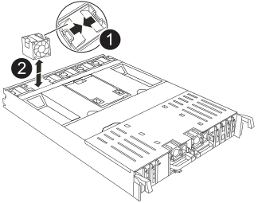

= 步驟1：關閉受損的控制器
:allow-uri-read: 

若要更換風扇、請移除故障的風扇模組、然後以新的風扇模組進行更換。

== 步驟1：關閉受損的控制器

使用下列其中一個選項來關閉或接管受損的控制器。

[role="tabbed-block"]
====
.選項1：大多數系統
--
若要關閉受損的控制器、您必須判斷控制器的狀態、並在必要時接管控制器、以便健全的控制器繼續從受損的控制器儲存設備提供資料。

.關於這項工作
* 如果您有 SAN 系統，則必須檢查故障控制器 SCSI 刀鋒的事件訊息  `cluster kernel-service show`。 `cluster kernel-service show`命令（從 priv 進階模式）會顯示節點名稱、link:https://docs.netapp.com/us-en/ontap/system-admin/display-nodes-cluster-task.html["仲裁狀態"]該節點的可用度狀態、以及該節點的作業狀態。
+
每個SCSI刀鋒處理序都應與叢集中的其他節點處於仲裁狀態。任何問題都必須先解決、才能繼續進行更換。

* 如果叢集有兩個以上的節點、則叢集必須處於仲裁狀態。如果叢集未達到法定人數、或健全的控制器顯示為「假」、表示符合資格和健全狀況、則您必須在關閉受損的控制器之前修正問題；請參閱 link:https://docs.netapp.com/us-en/ontap/system-admin/synchronize-node-cluster-task.html?q=Quorum["將節點與叢集同步"^]。

.步驟
. 如果啟用 AutoSupport 、請叫用 AutoSupport 訊息來隱藏自動建立個案： `system node autosupport invoke -node * -type all -message MAINT=<# of hours>h`
+
下列AutoSupport 資訊不顯示自動建立案例兩小時： `cluster1:> system node autosupport invoke -node * -type all -message MAINT=2h`

. 停用健全控制器主控台的自動恢復功能：「torage容錯移轉修改–節點本機-自動恢復錯誤」
+

NOTE: 當您看到_是否要停用自動恢復？_時、請輸入「y」。

. 將受損的控制器移至載入器提示：
+
[cols="1,2"]
|===
| 如果受損的控制器正在顯示... | 然後... 

 a| 
載入程式提示
 a| 
前往下一步。

 a| 
正在等待恢復...
 a| 
按Ctrl-C、然後在出現提示時回應「y」。

 a| 
系統提示或密碼提示
 a| 
從正常控制器接管或停止受損的控制器：「torage容錯移轉接管-節點_受損節點_節點名稱_」

當受損的控制器顯示正在等待恢復...時、請按Ctrl-C、然後回應「y」。

|===

--
.選項2：控制器位於MetroCluster 一個不二之處
--
若要關閉受損的控制器、您必須判斷控制器的狀態、並在必要時接管控制器、以便健全的控制器繼續從受損的控制器儲存設備提供資料。

* 如果叢集有兩個以上的節點、則叢集必須處於仲裁狀態。如果叢集未達到法定人數、或健全的控制器顯示為「假」、表示符合資格和健全狀況、則您必須在關閉受損的控制器之前修正問題；請參閱 link:https://docs.netapp.com/us-en/ontap/system-admin/synchronize-node-cluster-task.html?q=Quorum["將節點與叢集同步"^]。
* 您必須已確認 MetroCluster 組態狀態已設定、且節點處於啟用和正常狀態(`metrocluster node show`）。

.步驟
. 如果啟用了此功能、請叫用下列訊息來抑制自動建立案例：「System Node現象叫用節點*-type all -Message MAn=number_of_hs_Downh」AutoSupport AutoSupport AutoSupport
+
下列AutoSupport 資訊不顯示自動建立案例兩小時的訊息：「cluster1：*>系統節點AutoSupport 、叫用節點*-輸入ALL -Message MAn=2h」

. 停用健全控制器主控台的自動恢復功能：「torage容錯移轉修改–節點本機-自動恢復錯誤」
. 將受損的控制器移至載入器提示：
+
[cols="1,2"]
|===
| 如果受損的控制器正在顯示... | 然後... 

 a| 
載入程式提示
 a| 
前往下一節。

 a| 
正在等待恢復...
 a| 
按Ctrl-C、然後在出現提示時回應「y」。

 a| 
系統提示或密碼提示（輸入系統密碼）
 a| 
從正常控制器接管或停止受損的控制器：「torage容錯移轉接管-節點_受損節點_節點名稱_」

當受損的控制器顯示正在等待恢復...時、請按Ctrl-C、然後回應「y」。

|===

--
====

== 步驟2：移除控制器模組

更換控制器模組或更換控制器模組內部的元件時、您必須從機箱中移除控制器模組。

. 在機箱正面、用您的拇指將每個磁碟機穩固推入、直到您感覺到有正面的停止為止。如此可確保磁碟機穩固地安裝在機箱中板上。
+
image::../media/drw_a800_drive_seated_IEOPS-960.svg[安裝磁碟機]

. 檢查故障控制器模組背面插槽 4/5 中的琥珀色 NVRAM 狀態 LED 是否熄滅。尋找 NV 圖示。
+
image::../media/drw_a1K-70-90_nvram-led_ieops-1463.svg[NVRAM 注意與狀態 LED 位置圖]

+
[cols="1,4"]
|===

 a| 
image:../media/icon_round_1.png["編號 1"]
 a| 
NVRAM 狀態 LED

 a| 
image:../media/icon_round_2.png["編號 2"]
 a| 
NVRAM 注意 LED

|===
+
** 如果 NV LED 熄滅、請前往下一步。
** 如果 NV LED 閃爍、請等待閃爍停止。如果持續閃爍超過 5 分鐘、請聯絡技術支援部門尋求協助。

. 如果您尚未接地、請正確接地。
. 從控制器模組電源供應器（ PSU ）拔下控制器模組電源供應器纜線。
+

NOTE: 如果您的系統有直流電源、請從 PSU 拔下電源區塊。

. 從控制器模組拔下系統纜線、 SFP 和 QSFP 模組（如有需要）、並追蹤纜線的連接位置。
+
將纜線留在纜線管理裝置中、以便在重新安裝纜線管理裝置時、整理好纜線。

. 從控制器模組中取出纜線管理裝置。
. 向下按兩個鎖定栓、然後同時向下轉動兩個鎖條。
+
控制器模組會稍微移出機箱。

+
image::../media/drw_a70-90_pcm_remove_replace_ieops-1365.svg[控制器移除圖形]

+
[cols="1,4"]
|===

 a| 
image:../media/icon_round_1.png["編號 1"]
 a| 
鎖定鎖定

 a| 
image:../media/icon_round_2.png["編號 2"]
 a| 
鎖定銷

|===
. 將控制器模組滑出機箱、然後放在平穩的表面上。
+
將控制器模組滑出機箱時、請確定您支援控制器模組的底部。

== 步驟 3 ：更換風扇

若要更換風扇、請移除故障的風扇模組、然後以新的風扇模組進行更換。

. 檢查主控台錯誤訊息、找出您必須更換的風扇模組。
. 將風扇模組側邊的鎖定彈片夾住、然後將風扇模組從控制器模組中直接提出、以移除風扇模組。
+

+
[cols="1,4"]
|===

 a| 
image:../media/icon_round_1.png["編號 1"]
| 風扇鎖定彈片 

 a| 
image:../media/icon_round_2.png["編號 2"]
| 風扇模組 
|===
. 將更換風扇模組的邊緣與控制器模組的開孔對齊、然後將更換的風扇模組滑入控制器模組、直到鎖定鎖條卡入定位。

== 步驟4：重新安裝控制器模組

重新安裝控制器模組、然後重新啟動。

. 將通風管往下轉動、以確保通風管完全關閉。
+
它必須與控制器模組金屬板齊平。

. 將控制器模組的一端與機箱的開口對齊、然後將控制器模組輕推至系統的一半。
+

NOTE: 在指示之前、請勿將控制器模組完全插入機箱。

. 視需要重新設定儲存系統。
+
如果您移除收發器（ QSFP 或 SFP ）、請記得在使用光纖纜線時重新安裝。

+

NOTE: 請確定主控台纜線已連接至修復的控制器模組、以便在重新開機時接收主控台訊息。修復後的控制器會從正常運作的控制器接收電力、並在完全裝入機箱後立即開始重新開機。

. 完成控制器模組的重新安裝：
+
.. 將控制器模組穩固地推入機箱、直到它與中間板完全接入。
+
控制器模組完全就位時、鎖定鎖條會上升。

+

NOTE: 將控制器模組滑入機箱時、請勿過度施力、以免損壞連接器。

.. 將鎖定閂向上旋轉至鎖定位置。

+

NOTE: 如果控制器開機至 Loader 提示字元、請使用命令將其重新開機 `boot_ontap`。

. 將電源線插入電源供應器。
+

NOTE: 如果您有直流電源、請在控制器模組完全插入機箱後、將電源區塊重新連接至電源供應器。

. 將功能受損的控制器恢復正常運作，只需歸還其儲存設備 `storage failover giveback -ofnode _impaired_node_name_`：。
. 如果已停用自動恢復功能、請重新啟用： `storage failover modify -node local -auto-giveback true`。
. 如果啟用 AutoSupport 、則還原 / 恢復自動建立個案： `system node autosupport invoke -node * -type all -message MAINT=END`。

== 步驟5：將故障零件歸還給NetApp

如套件隨附的RMA指示所述、將故障零件退回NetApp。如 https://mysupport.netapp.com/site/info/rma["零件退貨與更換"]需詳細資訊、請參閱頁面。
