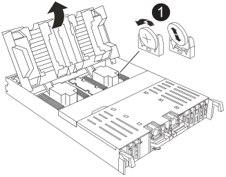

= 步驟4：重新安裝控制器模組
:allow-uri-read: 

取出故障的 RTC 電池、然後安裝替換的 RTC 電池。

.步驟
. 打開控制器頂端的控制器通風管。
+
.. 將手指插入通風管遠端的凹處。
.. 提起通風管、並將其向上旋轉至最遠的位置。

. 找到通風管下方的 RTC 電池。
+

+
[cols="1,4"]
|===

 a| 
image:../media/icon_round_1.png["編號 1"]
| RTC電池與外殼 
|===
. 將電池從電池座中輕推、將電池從電池座中轉開、然後將其從電池座中取出。
+
從電池座取出電池時、請注意電池的極性。電池標有加號、必須正確放置在電池座中。支架附近的加號表示電池的放置方式。

. 從防靜電包裝袋中取出替換電池。
. 記下RTC電池的極性、然後以一定角度向下推電池、將其插入電池座。
. 目視檢查電池、確定電池已完全裝入電池座、且極性正確。

== 步驟4：重新安裝控制器模組

重新安裝控制器模組、然後重新啟動。

.步驟
. 將通風管往下轉動、以確保通風管完全關閉。
+
它必須與控制器模組金屬板齊平。

. 將控制器模組的一端與機箱的開口對齊、然後將控制器模組輕推至系統的一半。
+

NOTE: 在指示之前、請勿將控制器模組完全插入機箱。

. 視需要重新設定儲存系統。
+
如果您移除收發器（ QSFP 或 SFP ）、請記得在使用光纖纜線時重新安裝。

+
請確定主控台纜線已連接至修復的控制器模組、以便在重新開機時接收主控台訊息。修復後的控制器會從正常運作的控制器接收電力、並在完全裝入機箱後立即開始重新開機。

. 完成控制器模組的重新安裝：
+
.. 將控制器模組穩固地推入機箱、直到它與中間板完全接入。
+
控制器模組完全就位時、鎖定鎖條會上升。

+
將控制器模組滑入機箱時、請勿過度施力、以免損壞連接器。

.. 將鎖定閂向上旋轉至鎖定位置。

. 將電源線插入電源供應器。一旦電源恢復，控制器就會重新啟動。
+
如果您有直流電源、請在控制器模組完全插入機箱後、將電源區塊重新連接至電源供應器。

. 將受損的控制器歸還其儲存設備、使其恢復正常運作：
+
`storage failover giveback -ofnode _impaired_node_name_`。

. 如果自動恢復已停用、請重新啟用：
+
`storage failover modify -node local -auto-giveback true`。

. 如果啟用 AutoSupport ，則還原 / 恢復自動建立個案：
+
`system node autosupport invoke -node * -type all -message MAINT=END`。

