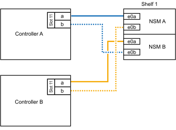
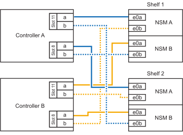

= 
:allow-uri-read: 

當需要額外儲存（至內部機櫃）時、您最多可以將兩個 NS224 機櫃熱新增至 AFF A70 或 AFF A90 HA 配對。

.開始之前
* 您必須已檢閱 link:requirements-hot-add-shelf.html["熱新增需求和最佳實務做法"]。
* 您必須已完成中的適用程序 link:prepare-hot-add-shelf.html["準備熱新增機櫃"]。
* 您必須已安裝機櫃、開啟電源、並依照中所述設定機櫃 ID link:prepare-hot-add-shelf.html["安裝用於熱新增的機櫃"]。

.關於這項工作
* 本程序假設您的 HA 配對只有內部儲存設備（無外部機櫃）、而且每個控制器中最多可熱新增兩個額外機櫃和兩個具備切換功能的 I/O 模組。
* 此程序可解決下列熱新增案例：
+
** 將第一個機櫃熱新增至 HA 配對、並在每個控制器中使用一個具備切換功能的 I/O 模組。
** 將第一個機櫃熱新增至 HA 配對、每個控制器都有兩個具備切換功能的 I/O 模組。
** 熱 - 將第二個機櫃新增至 HA 配對、每個控制器都有兩個具備切換功能的 I/O 模組。

.步驟
. 如果您要在每個控制器模組中使用一組具備切換功能的連接埠（一個具備切換功能的 I/O 模組）來熱新增一個機櫃、而且這是 HA 配對中唯一的 NS224 機櫃、請完成下列子步驟。
+
否則、請前往下一步。

+

NOTE: 此步驟假設您已在插槽 11 中安裝具備 ROCE 功能的 I/O 模組。

+
.. 纜線櫃NSM A連接埠e0a、用於控制器A插槽11連接埠A（e11a）。
.. 纜線櫃NSM A連接埠e0b至控制器B插槽11連接埠b（e11b）。
.. 纜線櫃NSM B連接埠e0A至控制器B插槽11連接埠A（e11a）。
.. 纜線櫃NSM B連接埠e0b至控制器A插槽11連接埠b（e11b）。
+
下圖顯示使用每個控制器模組中一個具備RoCE功能的I/O模組、連接一個熱新增機櫃的纜線：

+

. 如果您在每個控制器模組中使用兩組具備RoCE功能的連接埠（兩個具備RoCE功能的I/O模組）熱新增一或兩個磁碟櫃、請完成適用的子步驟。
+

NOTE: 此步驟假設您已在插槽 11 和 8 中安裝具備 ROCE 功能的 I/O 模組。

+
[cols="1,3"]
|===
| 磁碟櫃 | 纜線 

 a| 
機櫃1.
 a| 
.. 將NSM A連接埠e0a纜線連接至控制器A插槽11連接埠A（e11a）。
.. 將NSM A連接埠e0b纜線連接至控制器B插槽8連接埠b（e8b）。
.. 將NSM B連接埠e0A纜線連接至控制器B插槽11連接埠A（e11a）。
.. 將NSM B連接埠e0b纜線連接至控制器A插槽8連接埠b（e8b）。
.. 如果您要熱新增第二個機櫃、請完成「'helf 2'」子步驟；否則、請前往步驟3。

下圖顯示每個控制器模組中使用兩個具備切換功能的 I/O 模組、為一個熱新增機櫃佈線的情況：

image::../media/drw_ns224_vino_i_1shelf_2cards_ieops-1640.svg[AFF A70 或 A90 的纜線、含一個機櫃和兩個 IO 模組]

 a| 
機櫃2.
 a| 
.. 將NSM A連接埠e0a纜線連接至控制器A插槽8連接埠A（e8a）。
.. 將NSM A連接埠e0b纜線連接至控制器B插槽11連接埠b（e11b）。
.. 將NSM B連接埠e0A纜線連接至控制器B插槽8連接埠A（e8a）。
.. 將NSM B連接埠e0b纜線連接至控制器A插槽11連接埠b（e11b）。
.. 前往步驟3。

下圖顯示使用每個控制器模組中兩個具備 CE 功能的 I/O 模組、為兩個熱新增機櫃進行纜線連接：

|===
. 使用驗證熱添加的機櫃是否已正確連接 https://mysupport.netapp.com/site/tools/tool-eula/activeiq-configadvisor["Active IQ Config Advisor"^]。
+
如果產生任何纜線錯誤、請遵循所提供的修正行動。

.接下來呢？
如果您在準備此程序時停用了自動磁碟機指派、則需要手動指派磁碟機所有權、然後視需要重新啟用自動磁碟機指派。前往 link:complete-hot-add-shelf.html["完成熱新增"]。

否則、您就會完成熱新增機櫃程序。
