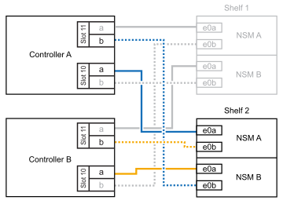
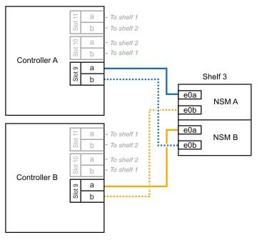
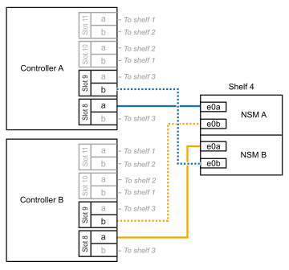

= 
:allow-uri-read: 

您可以將最多三個額外的 NS224 機櫃（總共四個機櫃）熱新增至 AFF A1K HA 配對。

.開始之前
* 您必須已檢閱 link:requirements-hot-add-shelf.html["熱新增需求和最佳實務做法"]。
* 您必須已完成中的適用程序 link:prepare-hot-add-shelf.html["準備熱新增機櫃"]。
* 您必須已安裝機櫃、開啟電源、並依照中所述設定機櫃 ID link:prepare-hot-add-shelf.html["安裝用於熱新增的機櫃"]。

.關於這項工作
* 本程序假設您的 HA 配對至少有一個現有的 NS224 機櫃。
* 此程序可解決下列熱新增案例：
+
** 在 HA 配對中熱新增第二個機櫃、每個控制器都有兩個具備切換功能的 I/O 模組。（您已安裝第二個 I/O 模組、並將第一個機櫃重新連接至兩個 I/O 模組、或是已將第一個機櫃連接至兩個 I/O 模組。將第二個機櫃連接至兩個 I/O 模組）。
** 在 HA 配對中熱新增第三個機櫃、每個控制器都有三個具備切換功能的 I/O 模組。（您已安裝第三個 I/O 模組、並將第三個機櫃連接至第三個 I/O 模組）。
** 在 HA 配對中熱新增第三個機櫃、每個控制器都有四個具備切換功能的 I/O 模組。（您已安裝第三和第四個 I/O 模組、並將第三個機櫃連接至第三和第四個 I/O 模組）。
** 在 HA 配對中熱新增第四個機櫃、每個控制器都有四個具備切換功能的 I/O 模組。（您已安裝第四個 I/O 模組、並將第三個機櫃重新連接至第三個和第四個 I/O 模組、或已將第三個機櫃連接至第三個和第四個 I/O 模組。將第四個機櫃連接至第三個和第四個 I/O 模組）。

.步驟
. 如果您要熱新增的NS224磁碟櫃是HA配對中的第二個NS224磁碟櫃、請完成下列子步驟。
+
否則、請前往下一步。

+
.. 纜線櫃NSM A連接埠e0a、用於控制器A插槽10連接埠A（E10A）。
.. 纜線櫃NSM A連接埠e0b至控制器B插槽11連接埠b（e11b）。
.. 纜線櫃NSM B連接埠e0A至控制器B插槽10連接埠A（E10A）。
.. 纜線櫃NSM B連接埠e0b至控制器A插槽11連接埠b（e11b）。
+
下圖重點說明 HA 配對中第二個機櫃的纜線、每個控制器中有兩個具備切換功能的 I/O 模組：

+

. 如果您要熱新增的 NS224 機櫃是 HA 配對中的第三個 NS224 機櫃、每個控制器中有三個具備切換功能的 I/O 模組、請完成下列子步驟。否則、請前往下一步。
+
.. 纜線架 NSM A 連接埠 e0a 至控制器插槽 9 連接埠 A （ e9a ）。
.. 纜線櫃NSM A連接埠e0b至控制器B插槽9連接埠b（e9b）。
.. 纜線架 NSM B 連接埠 e0A 至控制器 B 插槽 9 連接埠 A （ e9a ）。
.. 纜線櫃NSM B連接埠e0b至控制器A插槽9連接埠b（e9b）。
+
下圖重點說明 HA 配對中第三個機櫃的纜線、每個控制器中有三個具備切入功能的 I/O 模組：

+

. 如果您要熱新增的 NS224 機櫃是 HA 配對中的第三個 NS224 機櫃、每個控制器中有四個具備切換功能的 I/O 模組、請完成下列子步驟。否則、請前往下一步。
+
.. 纜線架 NSM A 連接埠 e0a 至控制器插槽 9 連接埠 A （ e9a ）。
.. 纜線櫃NSM A連接埠e0b至控制器B插槽8連接埠b（e8b）。
.. 纜線架 NSM B 連接埠 e0A 至控制器 B 插槽 9 連接埠 A （ e9a ）。
.. 纜線櫃NSM B連接埠e0b至控制器A插槽8連接埠b（e8b）。
+
下圖重點說明 HA 配對中第三個機櫃的纜線、每個控制器中有四個具備切入功能的 I/O 模組：

+
image::../media/drw_ns224_vino_m_3shelves_4cards_ieops-1644.svg[AFF A1K 纜線、含三個機櫃和四個 IO 模組]

. 如果您要熱新增的 NS224 機櫃是 HA 配對中的第四個 NS224 機櫃、每個控制器中有四個具備切換功能的 I/O 模組、請完成下列子步驟。
+
.. 纜線架 NSM A 連接埠 e0a 至控制器插槽 8 連接埠 A （ e8a ）。
.. 纜線櫃NSM A連接埠e0b至控制器B插槽9連接埠b（e9b）。
.. 纜線架 NSM B 連接埠 e0A 至控制器 B 插槽 8 連接埠 A （ e8a ）。
.. 纜線櫃NSM B連接埠e0b至控制器A插槽9連接埠b（e9b）。
+
下圖重點說明 HA 配對中第四個機櫃的纜線、每個控制器中有四個具備切入功能的 I/O 模組：

+

. 使用驗證熱添加的機櫃是否已正確連接 https://mysupport.netapp.com/site/tools/tool-eula/activeiq-configadvisor["Active IQ Config Advisor"^]。
+
如果產生任何纜線錯誤、請遵循所提供的修正行動。

.接下來呢？
如果您在準備此程序時停用了自動磁碟機指派、則需要手動指派磁碟機所有權、然後視需要重新啟用自動磁碟機指派。前往 link:complete-hot-add-shelf.html["完成熱新增"]。

否則、您就會完成熱新增機櫃程序。
