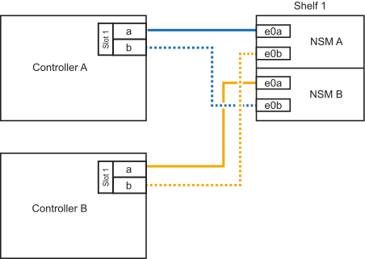

= 
:allow-uri-read: 

.開始之前
* 您必須已檢閱 link:requirements-hot-add-shelf.html["熱新增需求和最佳實務做法"]。
* 您必須已完成中的適用程序 link:prepare-hot-add-shelf.html["準備熱新增機櫃"]。
* 您必須已安裝機櫃、開啟電源、並依照中所述設定機櫃 ID link:prepare-hot-add-shelf.html["安裝用於熱新增的機櫃"]。

.關於這項工作
從平台機箱背面看、左側的RoCE卡連接埠為連接埠「a」（e1a）、右側連接埠為連接埠「b」（e1b）。

.步驟
. 纜線連接機櫃：
+
.. 纜線櫃NSM A連接埠e0a、用於控制器A插槽1連接埠A（e1a）。
.. 纜線櫃NSM A連接埠e0b至控制器B插槽1連接埠b（e1b）。
.. 纜線櫃NSM B連接埠e0A至控制器B插槽1連接埠A（e1a）。
.. 纜線櫃NSM B連接埠e0b連接至控制器A插槽1連接埠b（e1b）。+下圖顯示機櫃佈線完成後的情形。
+

. 使用驗證熱添加的機櫃是否已正確連接 https://mysupport.netapp.com/site/tools/tool-eula/activeiq-configadvisor["Active IQ Config Advisor"^]。
+
如果產生任何纜線錯誤、請遵循所提供的修正行動。

.接下來呢？
如果您在準備此程序時停用了自動磁碟機指派、則需要手動指派磁碟機所有權、然後視需要重新啟用自動磁碟機指派。前往 link:complete-hot-add-shelf.html["完成熱新增"]。

否則、您就會完成熱新增機櫃程序。
