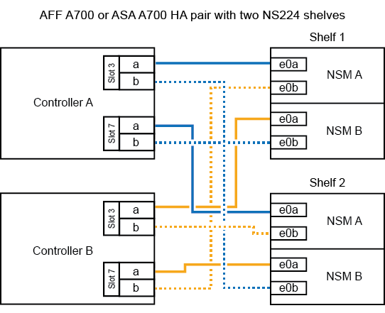

= 
:allow-uri-read: 

.開始之前
如果您要熱新增初始 NS224 機櫃（ HA 配對中沒有 NS224 機櫃）、則必須在每個控制器中安裝核心傾印模組（ X9170A 、 NVMe 1TB SSD ）、以支援核心傾印（儲存核心檔案）。

+ 請參閱 link:../fas9000/caching-module-and-core-dump-module-replace.html["更換快取模組、或新增/更換核心傾印模組（AFF 即：VA700和FAS9000）"^]。

.關於這項工作
如何將 NS224 機櫃連接至 AFF A700 HA 配對、取決於您要熱新增的機櫃數量、以及您在控制器上使用的具備 ROCE 功能的連接埠集數（一或兩個）。

.步驟
. 如果您要在每個控制器上使用一組具備切換功能的連接埠（一個具備切換功能的 I/O 模組）來熱新增一個機櫃、而且這是 HA 配對中唯一的 NS224 機櫃、請完成下列子步驟。
+
否則、請前往下一步。

+

NOTE: 此步驟假設您已在每個控制器的插槽 3 中安裝具備 ROCE 功能的 I/O 模組、而非插槽 7 。

+
.. 纜線櫃NSM A連接埠e0a、用於控制插槽3連接埠a
.. 纜線櫃NSM A連接埠e0b至控制器B插槽3連接埠b.
.. 纜線櫃NSM B連接埠e0A至控制器B插槽3連接埠a
.. 纜線櫃NSM B連接埠e0b連接至控制器A插槽3連接埠b.
+
下圖顯示使用每個控制器中一個具備切換功能的 I/O 模組來連接一個熱新增機櫃的纜線：

+
image::../media/drw_ns224_a700_1shelf.png[AFF A700 的纜線、其中包含一個 NS224 機櫃和一組 IO 模組連接埠]

. 如果您要在每個控制器中使用兩組具備 ROCE 功能的連接埠（兩個具備 ROCE 功能的 I/O 模組）來熱新增一個或兩個機櫃、請完成適用的子步驟。
+
[cols="1,3"]
|===
| 磁碟櫃 | 纜線 

 a| 
機櫃1.
 a| 

NOTE: 這些子步驟假設您是從機櫃連接埠e0a佈線至插槽3中具有RoCE功能的I/O模組、而非插槽7開始佈線。

.. 將NSM A連接埠e0a纜線連接至控制器A插槽3連接埠a
.. 將NSM A連接埠e0b纜線連接至控制器B插槽7連接埠b.
.. 將NSM B連接埠e0A纜線連接至控制器B插槽3連接埠a
.. 將NSM B連接埠e0b纜線連接至控制器A插槽7連接埠b.
.. 如果您要快速新增第二個擱板，請完成「`擱板 2`」子步驟；否則，請前往下一步。

 a| 
機櫃2.
 a| 

NOTE: 這些子步驟假設您是從機櫃連接埠e0a佈線至插槽7中具備RoCE功能的I/O模組、而非插槽3（與機櫃1的佈線子步驟相關）開始佈線。

.. 將NSM A連接埠e0a纜線連接至控制器A插槽7連接埠a
.. 將NSM A連接埠e0b纜線連接至控制器B插槽3連接埠b.
.. 將NSM B連接埠e0A纜線連接至控制器B插槽7連接埠a
.. 將NSM B連接埠e0b纜線連接至控制器A插槽3連接埠b.
.. 前往下一步。

|===
+
下圖顯示第一個和第二個熱新增磁碟櫃的纜線佈線：

+

. 使用驗證熱添加的機櫃是否已正確連接 https://mysupport.netapp.com/site/tools/tool-eula/activeiq-configadvisor["Active IQ Config Advisor"^]。
+
如果產生任何纜線錯誤、請遵循所提供的修正行動。

