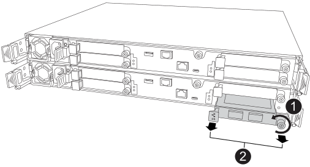

= 
:allow-uri-read: 

使用等效的 I/O 模組更換插槽 4 中發生故障的叢集和 HA I/O 模組：

.步驟
. 如果您尚未接地、請正確接地。
. 從受損的控制器中移除發生故障的叢集和 HA I/O 模組：
+

+
[cols="1,4"]
|===

 a| 
image::../media/icon_round_1.png[編號 1]
 a| 
逆時針旋轉 I/O 模組指旋螺絲以鬆開。

 a| 
image::../media/icon_round_2.png[編號 2]
 a| 
使用左側的連接埠標籤卡榫和右側的翼形螺絲將 I/O 模組從控制器中拉出。

|===
. 將替換叢集和 HA I/O 模組安裝到插槽 4 中：
+
.. 將I/O模組與插槽邊緣對齊。
.. 輕輕地將 I/O 模組完全推入插槽，確保 I/O 模組正確插入連接器。
+
您可以使用左側的卡榫和右側的翼形螺絲來推入 I/O 模組。

.. 順時針旋轉指旋螺絲以旋緊。

. 連接集群和 HA I/O 模組。

