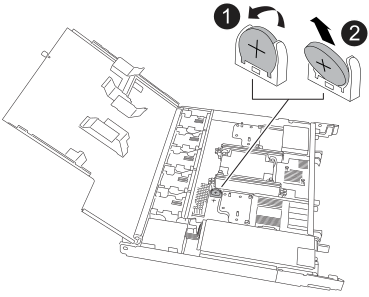

= 
:allow-uri-read: 

取出故障的 RTC 電池，然後安裝替換的 RTC 電池。

.步驟
. 找到RTC電池。
. 取出 RTC 電池：
+

+
[cols="1,4"]
|===

 a| 
image::../media/icon_round_1.png[編號 1]
 a| 
輕輕旋轉 RTC 電池，使其與固定座成一定的角度。

 a| 
image::../media/icon_round_2.png[編號 2]
 a| 
將 RTC 電池從其固定座中取出。

|===
. 安裝替換 RTC 電池：
+
.. 從防靜電包裝袋中取出替換電池。
.. 放置電池，使電池上的加號朝向外，與主機板上的加號相對應。
.. 以一定角度將電池插入電池盒，然後將其直立推入，使其完全插入電池盒中。
.. 目視檢查電池，確保電池完全裝入電池座，且極性正確。

