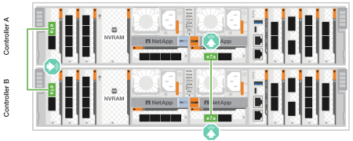
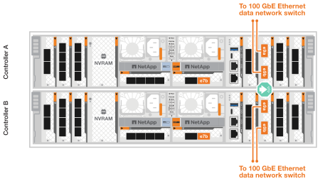
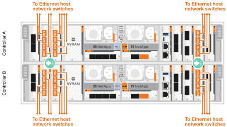
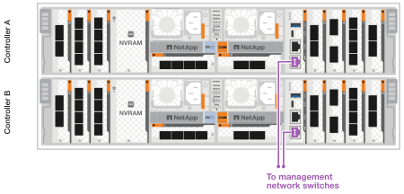
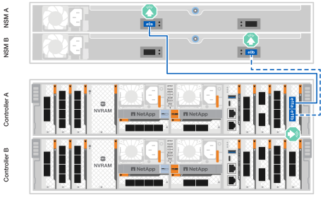
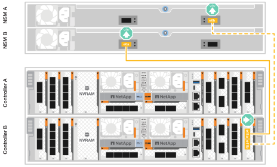
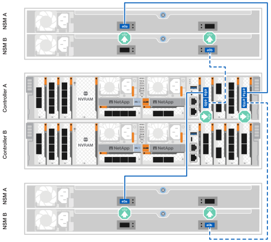
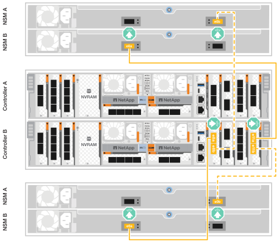

= 步驟 1 ：將儲存控制器連接到您的網路
:allow-uri-read: 

.開始之前
檢查纜線連接器拉式彈片方向是否正確、請參閱纜線連接圖中的圖例箭頭。

image::../media/drw_cable_pull_tab_direction_ieops-1699.svg[纜線拉式彈片方向範例]

* 插入連接器時、您應該會覺得它卡入定位；如果您不覺得卡住、請將其取下、將纜線頭翻轉過來、然後再試一次。
* 如果連接至光纖交換器、請先將小型可插拔（ SFP ）收發器插入控制器連接埠、再將纜線連接至連接埠。

== 步驟 1 ：將儲存控制器連接到您的網路

將控制器直接彼此連接、並連接到主機網路。

.開始之前
如需將儲存系統連接至主機網路交換器的相關資訊、請聯絡您的網路管理員。

.關於這項工作
這些程序顯示一般組態。具體的佈線取決於您的儲存系統所訂購的元件。如需完整的組態和插槽優先順序詳細資料、請參閱 link:https://hwu.netapp.com["NetApp Hardware Universe"^]。

[role="tabbed-block"]
====
.ASA A1K 儲存系統
--
將儲存控制器彼此連接以建立 ONTAP 叢集連線、然後將每個控制器上的乙太網路連接埠連接至主機網路。

.步驟
. 使用叢集 /HA 互連纜線將連接埠 e1a 連接至 e1a 、並將連接埠 e7a 連接至 e7a 。
+

NOTE: 叢集互連流量和 HA 流量共用相同的實體連接埠。

+
.. 將控制器 A 上的連接埠 e1a 連接到控制器 B 上的連接埠 e1A
.. 將控制器 A 上的連接埠 e7a 連接至控制器 B 上的連接埠 e1A
+
* 叢集 / HA 互連纜線 *

+
image::../media/oie_cable_25Gb_Ethernet_SFP28_IEOPS-1069.svg[叢集 HA 纜線]

+
image::../media/drw_a1k_tnsc_cluster_cabling_ieops-1648.svg[雙節點無交換器叢集佈線圖]

. 將乙太網路模組連接埠連接到主機網路。
+
以下是一些典型的主機網路纜線範例。如需特定系統組態的詳細資訊、請參閱 link:https://hwu.netapp.com["NetApp Hardware Universe"^] 。

+
.. 如圖所示、將連接埠 e9a 和 e9b 連接至乙太網路資料網路交換器。
+

NOTE: 為了讓叢集和 HA 流量發揮最大的系統效能、最佳做法是不要使用連接埠 e1b 和 e7b 連接埠來進行主機網路連線。請使用獨立的主機卡來發揮最大效能。

+
*100 GbE 纜線 *

+
image::../media/oie_cable_sfp_gbe_copper.svg[100Gb 乙太網路纜線]

+
image::../media/drw_a1k_network_cabling1_ieops-1649.svg[連接至 100Gb 乙太網路的纜線]

.. 連接 10/25 GbE 主機網路交換器。
+
*10/25 GbE 主機 *

+
image::../media/oie_cable_sfp_gbe_copper.svg[10/25Gb 乙太網路纜線]

+
image::../media/drw_a1k_network_cabling2_ieops-1650.svg[連接到 10/25Gb 乙太網路的纜線]

. 使用 1000BASE-T RJ-45 纜線將控制器管理（扳手）連接埠連接至管理網路交換器。
+
image::../media/oie_cable_rj45.svg[RJ-45 纜線]

+
* 1000BASE-T RJ-45 纜線 *

+
image::../media/drw_a1k_management_connection_ieops-1651.svg[連線至您的管理網路]

IMPORTANT: 請勿插入電源線。

--
.ASA A70 和 ASA A90 儲存系統
--
將儲存控制器彼此連接以建立 ONTAP 叢集連線、然後將每個控制器上的乙太網路連接埠連接至主機網路。

.步驟
. 使用叢集 /HA 互連纜線、將連接埠 e1a 連接至 e1a 、並將連接埠 e7a 連接至 e7a 。
+

NOTE: 叢集互連流量和 HA 流量共用相同的實體連接埠。

+
.. 將控制器 A 上的連接埠 e1a 連接到控制器 B 上的連接埠 e1A
.. 將控制器 A 上的連接埠 e7a 連接至控制器 B 上的連接埠 e1A
+
* 叢集 / HA 互連纜線 *

+
image::../media/oie_cable_25Gb_Ethernet_SFP28_IEOPS-1069.svg[叢集 HA 纜線]

+

. 將乙太網路模組連接埠連接到主機網路。
+
以下是一些典型的主機網路纜線範例。如需特定系統組態的詳細資訊、請參閱 link:https://hwu.netapp.com["NetApp Hardware Universe"^] 。

+
.. 如圖所示、將連接埠 e9a 和 e9b 連接至乙太網路資料網路交換器。
+

NOTE: 為了讓叢集和 HA 流量發揮最大的系統效能、最佳做法是不要使用連接埠 e1b 和 e7b 連接埠來進行主機網路連線。請使用獨立的主機卡來發揮最大效能。

+
*100 GbE 纜線 *

+
image::../media/oie_cable_sfp_gbe_copper.svg[100Gb 乙太網路纜線]

+

.. 連接 10/25 GbE 主機網路交換器。
+
*4 個連接埠、 10/25 GbE 主機 *

+
image::../media/oie_cable_sfp_gbe_copper.svg[10/25 GB 纜線]

+

. 使用 1000BASE-T RJ-45 纜線將控制器管理（扳手）連接埠連接至管理網路交換器。
+
image::../media/oie_cable_rj45.svg[RJ45 纜線]

+
* 1000BASE-T RJ-45 纜線 *

+

IMPORTANT: 請勿插入電源線。

--
====

== 步驟 2 ：將儲存控制器連接至儲存櫃

以下佈線程序說明如何將控制器連接至一個機櫃和兩個機櫃。您最多可以直接將四個機櫃連線至控制器。

[role="tabbed-block"]
====
.A1K系統ASA
--
請選擇符合您設定的下列其中一個纜線選項。

.選項 1 ：將控制器連接至一個 NS224 儲存櫃
[%collapsible]
=====
將每個控制器連接至 NS224 機櫃上的 NSM 模組。圖形顯示每個控制器的纜線：控制器 A 纜線以藍色顯示、控制器 B 纜線則以黃色顯示。

.步驟
. 在控制器 A 上、連接下列連接埠：
+
.. 將連接埠 e11a 連接至 NSM A 連接埠 e0a 。
.. 將連接埠 e11b 連接至連接埠 NSM B 連接埠 e0b 。
+
image:../media/drw_a1k_1shelf_cabling_a_ieops-1703.svg["將控制器 A e11a 和 e11b 移至單一 NS224 機櫃"]

. 在控制器 B 上、連接下列連接埠：
+
.. 將連接埠 e11a 連接至 NSM B 連接埠 e0A 。
.. 將連接埠 e11b 連接至 NSM a 連接埠 e0b 。
+
image:../media/drw_a1k_1shelf_cabling_b_ieops-1704.svg["纜線控制器 B 連接埠 e11a 和 e11b 至單一 NS224 機櫃"]

=====
.選項 2 ：將控制器連接至兩個 NS224 儲存櫃
[%collapsible]
=====
將每個控制器連接至兩個 NS224 機櫃上的 NSM 模組。圖形顯示每個控制器的纜線：控制器 A 纜線以藍色顯示、控制器 B 纜線則以黃色顯示。

.步驟
. 在控制器 A 上、連接下列連接埠：
+
.. 將連接埠 e11a 連接至機櫃 1 NSM A 連接埠 e0a 。
.. 將連接埠 e11b 連接至機櫃 2 NSM B 連接埠 e0b 。
.. 將連接埠 E10A 連接至機櫃 2 NSM A 連接埠 e0a 。
.. 將連接埠 e10b 連接至機櫃 1 NSM a 連接埠 e0b 。
+
image:../media/drw_a1k_2shelf_cabling_a_ieops-1705.svg["控制器 A 的控制器與機櫃連線"]

. 在控制器 B 上、連接下列連接埠：
+
.. 將連接埠 e11a 連接至機櫃 1 NSM B 連接埠 e0A 。
.. 將連接埠 e11b 連接至機櫃 2 NSM a 連接埠 e0b 。
.. 將連接埠 E10A 連接至機櫃 2 NSM B 連接埠 e0A 。
.. 將連接埠 e10b 連接至機櫃 1 NSM a 連接埠 e0b 。
+
image:../media/drw_a1k_2shelf_cabling_b_ieops-1706.svg["控制器 B 的控制器與機櫃連線"]

=====
--
.ASA A70 和 A90 系統
--
請選擇符合您設定的下列其中一個纜線選項。

.選項 1 ：將控制器連接至一個 NS224 儲存櫃
[%collapsible]
=====
將每個控制器連接至 NS224 機櫃上的 NSM 模組。圖形顯示每個控制器的纜線：控制器 A 纜線以藍色顯示、控制器 B 纜線則以黃色顯示。

*100 GbE QSFP28 銅線 *

image::../media/oie_cable100_gbe_qsfp28.svg[100 GbE QSFP28 銅線]

.步驟
. 將控制器 A 連接埠 e11a 連接至 NSM A 連接埠 e0a 。
. 將控制器 A 連接埠 e11b 連接至連接埠 NSM B 連接埠 e0b 。
+

. 將控制器 B 連接埠 e11a 連接至 NSM B 連接埠 e0A 。
. 將控制器 B 連接埠 e11b 連接至 NSM A 連接埠 e0b 。
+

=====
.選項 2 ：將控制器連接至兩個 NS224 儲存櫃
[%collapsible]
=====
將每個控制器連接至兩個 NS224 機櫃上的 NSM 模組。圖形顯示每個控制器的纜線：控制器 A 纜線以藍色顯示、控制器 B 纜線則以黃色顯示。

*100 GbE QSFP28 銅線 *

image::../media/oie_cable100_gbe_qsfp28.svg[100 GbE QSFP28 銅線]

.步驟
. 在控制器 A 上、連接下列連接埠：
+
.. 將連接埠 e11a 連接至機櫃 1 、 NSM A 連接埠 e0a 。
.. 將連接埠 e11b 連接至機櫃 2 、 NSM B 連接埠 e0b 。
.. 將連接埠 e8a 連接至機櫃 2 、 NSM A 連接埠 e0a 。
.. 將連接埠 e8b 連接至機櫃 1 、 NSM B 連接埠 e0b 。
+

. 在控制器 B 上、連接下列連接埠：
+
.. 將連接埠 e11a 連接至機櫃 1 、 NSM B 連接埠 e0A 。
.. 將連接埠 e11b 連接至機櫃 2 、 NSM A 連接埠 e0b 。
.. 將連接埠 e8a 連接至機櫃 2 、 NSM B 連接埠 e0a 。
.. 將連接埠 e8b 連接至機櫃 1 、 NSM A 連接埠 e0b 。
+

=====
--
====