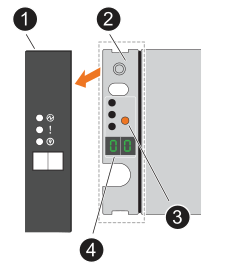

= 
:allow-uri-read: 

每個機櫃都以獨特的機櫃 ID 加以區分。此 ID 可確保儲存系統設定中的機櫃各有不同。

.關於這項工作
* 有效的機櫃ID為01至99。
+
如果您的內部機櫃（儲存設備）整合在控制器中、則會將固定機櫃 ID 指派為 00 。

* 您必須關閉每個 SAS 機櫃電源供應器的電源開關，等待適當的時間，然後重新開啟電源），機櫃 ID 才會生效。

.步驟
. 先將電源線連接至機櫃，然後使用電源線固定器將電源線固定到位，再將電源線連接至不同電路上的電源，然後開啟每個電源供應器（位於機櫃背面）上的電源開關，以開啟機櫃電源。
+
機櫃開機時會自動開機。

. 取下左端蓋，即可存取面板上的橘色機櫃 ID 按鈕。
+

+
[cols="20%,80%"]
|===

 a| 
image::../media/icon_round_1.png[編號 1]
 a| 
機櫃端蓋

 a| 
image::../media/icon_round_2.png[[ 請撥號碼 2]
 a| 
機櫃面板

 a| 
image::../media/icon_round_3.png[[ 請撥號碼 3]
 a| 
機櫃 ID 按鈕

 a| 
image::../media/icon_round_4.png[[ 請撥號碼 4]
 a| 
機櫃 ID 號碼

|===
. 變更機櫃ID的第一個編號：
+
.. 按住「機櫃 ID 」按鈕、直到數位顯示器上的第一個數字閃爍、然後放開按鈕。
+
此數字可能需要15秒的時間才能開始閃爍。這會啟動機櫃ID程式設定模式。

+

NOTE: 如果 ID 需要超過 15 秒的時間來閃爍、請再次按住「機櫃 ID 」按鈕、並確保完全按下。

.. 按下並放開「機櫃 ID 」按鈕以進階數字、直到您達到所需的數字、從 0 到 9 為止。
+
每個新聞稿和發佈持續時間可短至一秒。

+
第一個數字會持續閃爍。

. 變更機櫃ID的第二個編號：
+
.. 按住按鈕、直到數位顯示器上的第二個數字開始閃爍。
+
最多可能需要三秒時間、才能讓號碼開始閃燈。

+
數位顯示器上的第一個數字會停止閃爍。

.. 按下並放開「機櫃 ID 」按鈕以進階數字、直到您達到所需的數字、從 0 到 9 為止。
+
第二個數字會持續閃爍。

. 鎖定所需的號碼、然後按住機櫃 ID 按鈕、直到第二個號碼停止閃爍、以結束程式設定模式。
+
此數字可能需要三秒鐘才能停止閃爍。

+
數位顯示器上的兩個數字都會開始閃爍、且琥珀色 LED 會在大約五秒後亮起、提醒您擱置的機櫃 ID 尚未生效。

. 將機櫃關機至少 10 秒、使機櫃 ID 生效。
+
.. 關閉每個電源供應器上的電源開關。
.. 等待10秒。
.. 開啟每個電源供應器上的電源開關，以完成電源循環。
+
電源供應器電源開啟時，雙色 LED 應會亮起綠色。

. 更換左端蓋。

