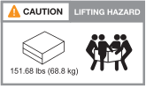

= 安裝所需的設備
:allow-uri-read: 

== 安裝所需的設備

若要安裝儲存系統、您需要下列設備和工具。

* 存取網頁瀏覽器以設定儲存系統
* 靜電釋放（ ESD ）固定帶
* 手電筒
* 具備 USB/ 序列連線的筆記型電腦或主控台
* 迴紋針或窄尖圓珠筆、用於設定 NS224 儲存櫃 ID
* 2號十字螺絲起子

== 起重預防措施

儲存系統和儲存櫃很重。抬起和移動這些項目時請務必謹慎。

=== 儲存系統重量

移動或提起儲存系統時、請採取必要的預防措施。

[role="tabbed-block"]
====
.A1K
--
A1K 儲存系統的重量可達 62.83 磅（ 28.5 公斤）。若要抬起系統、請使用兩個人或液壓舉升設備。

image::../media/drw_a1k_weight_caution_ieops-1698.svg[AFF A1K 提升注意事項圖示]

--
.A70 和 A90
--
A70 儲存系統或 A90 儲存系統的重量可達 151.68 磅（ 68.8 公斤）。若要抬起系統、請使用四個人或液壓舉升設備。

--
====

=== 儲存櫃重量

NS224 儲存櫃的重量可達 66.78 磅（ 30.29 公斤）。若要抬起儲存架、請使用兩個人或液壓舉升設備。請將所有元件保留在儲存櫃（前後）、以避免在機櫃重量上出現不均衡的情況。

image::../media/drw_ns224_lifting_weight_ieops-1716.svg[NS224 舉升注意事項]

.相關資訊
* https://library.netapp.com/ecm/ecm_download_file/ECMP12475945["安全資訊與法規注意事項"^]

