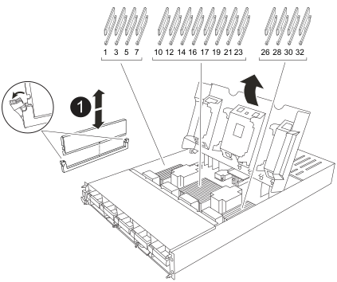

= 更換控制器模組硬體 - AFF A1K
:allow-uri-read: 
:icons: font
:imagesdir: ../media/

[role="lead"]
若要更換控制器、您必須移除受損的控制器、將 FRU 元件移至更換的控制器模組、在機箱中安裝更換的控制器模組、然後將系統開機至維護模式。

== 步驟 1 移除控制器模組

更換控制器模組或更換控制器模組內的元件時、您必須從機箱中移除控制器模組。

. 檢查系統插槽 4/5 中的 NVRAM 狀態 LED 。控制器模組前面板上也有 NVRAM LED 。尋找 NV 圖示：
+
image::../media/drw_a1K-70-90_nvram-led_ieops-1463.svg[NVRAM 注意與狀態 LED 位置圖]

+
[cols="1,4"]
|===

 a| 
image:../media/legend_icon_01.svg["編號 1 、寬度 = 30px"]
 a| 
NVRAM 狀態 LED

 a| 
image:../media/legend_icon_02.svg["編號 1 、寬度 = 30px"]
 a| 
NVRAM 注意 LED

|===
+

NOTE: 如果 NVRAM 狀態 LED 閃爍、可能表示控制器模組未正確接管或停止（未認可的資料）。如果合作夥伴控制器模組未成功接管受損的控制器模組、請先聯絡 https://mysupport.netapp.com/site/global/dashboard["NetApp支援"] 、再繼續執行此程序。

+
故障控制器模組上 NVRAM 狀態 LED 的一般行為如下：

+
** 從控制器模組拔下電源、控制器模組處於「等待恢復」狀態、或控制器模組未正確接管或停止（未認可的資料）時、 NVRAM 狀態 LED 會閃爍。
** 從機箱中移除控制器模組時、 NVRAM 狀態 LED 會閃爍、這可能表示控制器模組未正確接管或停止（未認可的資料）。確認已由合作夥伴控制器模組完全接管控制器模組、或顯示受損控制器模組 `waiting for giveback`。然後、可以忽略閃爍的 LED （並從機箱中移除控制器）。

. 如果您尚未接地、請正確接地。
. 在裝置正面、將手指勾入鎖定凸輪的孔中、壓緊凸輪桿上的彈片、然後輕輕地同時將兩個鎖條牢牢地朝您的方向旋轉。
+
控制器模組會稍微移出機箱。

+
image::../media/drw_a1k_pcm_remove_replace_ieops-1375.svg[控制器移除圖形]

+
[cols="1,4"]
|===

 a| 
image:../media/legend_icon_01.svg["編號 1 、寬度 = 30px"]
| A 鎖定凸輪栓鎖 
|===
. 將控制器模組滑出機箱、然後放在平坦穩定的表面上。
+
將控制器模組滑出機箱時、請務必支撐控制器模組的底部。

== 步驟2：移動風扇

您必須將五個風扇模組從受損的控制器模組移至更換的控制器模組。

. 如果您尚未接地、請正確接地。
. 用兩隻手抓住擋板兩側的開孔、然後朝自己的方向拉動擋板、直到擋板從機箱框架上的球形接線柱中釋放為止、以卸下擋板（如有必要）。
. 按下風扇模組上的灰色鎖定按鈕、將風扇模組直接從機箱中拉出、確定您用自己的手來支撐它。
+

NOTE: 風扇模組很短。請務必用手支撐風扇模組的底部、以免突然從機箱中掉落而造成傷害。

+
image::../media/drw_a1k_fan_remove_replace_ieops-1376.svg[風扇移除 AFF A1K]

+
[cols="1,4"]
|===

 a| 
image::../media/legend_icon_01.svg[編號 1]
 a| 
黑色鎖定按鈕

|===
. 將風扇安裝在更換的控制器模組中：
+
.. 將風扇外殼的邊緣與更換控制器模組正面的開口對齊。
.. 將風扇模組一路輕輕滑入更換的控制器模組、直到其鎖定到位。

. 對其餘的風扇模組重複上述步驟。

== 步驟 3 ：移動 NV 電池

將 NV 電池移至更換控制器。

. 打開 NV 電池通風管蓋、找到 NV 電池。
+
image::../media/drw_a1k_remove_replace_nvmembat_ieops-1379.svg[NV 電池移除 AFF A1K]

+
[cols="1,4"]
|===

 a| 
image::../media/legend_icon_01.svg[編號 1]
| NV 電池通風管蓋 

 a| 
image::../media/legend_icon_02.svg[編號 2]
 a| 
NV 電池插頭

 a| 
image::../media/legend_icon_03.svg[編號 3]
 a| 
NV電池套件

|===
. 將電池向上提、以取用電池插頭。
. 擠壓電池插頭正面的固定夾、將插頭從插槽中拔下、然後從插槽拔下電池纜線。
. 將電池從通風管和控制器模組中取出。
. 將電池組移至更換控制器模組、然後將其安裝在 NV 電池通風管中：
+
.. 打開更換控制器模組中的 NV 電池通風管。
.. 將電池插頭插入插槽、並確定插頭已鎖定到位。
.. 將電池套件插入插槽、然後穩固地向下按電池套件、以確保其鎖定到位。
.. 關閉通風管蓋。

== 步驟4：移動系統DIMM

將 DIMM 移至更換的控制器模組。

. 打開主板通風管並找到 DIMM 。
+

+
[cols="1,4"]
|===

 a| 
image::../media/legend_icon_01.svg[編號 1]
 a| 
系統DIMM

|===
. 請注意插槽中的DIMM方向、以便您以適當的方向將DIMM插入更換的控制器模組。
. 緩慢地將DIMM兩側的兩個DIMM彈出彈片分開、然後將DIMM從插槽中滑出、藉此將DIMM從插槽中退出。
+

NOTE: 小心拿住DIMM的邊緣、避免對DIMM電路板上的元件施加壓力。

. 找到要在替換控制器模組中安裝 DIMM 的插槽。
. 將DIMM正面插入插槽。
+
DIMM可緊密插入插槽、但應該很容易就能裝入。如果沒有、請重新將DIMM與插槽對齊、然後重新插入。

+

NOTE: 目視檢查DIMM、確認其對齊並完全插入插槽。

. 在DIMM頂端邊緣小心地推入、但穩固地推入、直到彈出彈出彈片卡入DIMM兩端的槽口。
. 對其餘的DIMM重複這些步驟。關閉主機板通風管。

== 步驟5：安裝控制器模組

重新安裝控制器模組並將其開機。

. 如果您尚未這麼做、請關閉通風管。
. 將控制器模組的末端與機箱中的開口對齊、然後將控制器模組滑入機箱、並將控制桿從系統正面旋轉。
. 一旦控制器模組停止滑動、請向內旋轉 CAM 把手、直到卡入風扇下方
+

NOTE: 將控制器模組滑入機箱時、請勿過度施力、以免損壞連接器。

+
一旦控制器模組完全插入機箱中、就會開始開機。

. 如果您使用「儲存容錯移轉修改節點本機-自動恢復true」命令停用自動恢復。
. 如果啟用 AutoSupport 、請使用命令還原 / 恢復自動建立個案 `system node autosupport invoke -node * -type all -message MAINT=END` 。

