= 連接硬體 - AFF A1K
:allow-uri-read: 
:icons: font
:imagesdir: ../media/

[role="lead"]
為 AFF A1K 儲存系統安裝機架硬體後、請安裝控制器的網路纜線、並將纜線連接到控制器和儲存櫃。

.開始之前
如需將儲存系統連接至交換器的相關資訊、請聯絡您的網路管理員。

.關於這項工作
* 這些程序顯示一般組態。具體的佈線取決於您的儲存系統所訂購的元件。如需完整的組態和插槽優先順序詳細資料、請參閱 link:https://hwu.netapp.com["NetApp Hardware Universe"^]。
* AFF A1K 控制器上的 I/O 插槽編號為 1 至 11 。
+
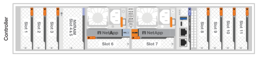

* 將連接器插入連接埠時，纜線連接器拉片上的箭頭圖示會顯示正確的方向（上或下）。
+
插入連接器時、您應該會感覺到它卡入到位；如果您沒有感覺到它卡入定位、請將其移除、將其翻轉、然後再試一次。

+
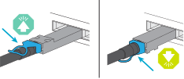

* 如果要將纜線連接至光纖交換器，請先將光纖收發器插入控制器連接埠，再將纜線連接至交換器連接埠。

== 步驟 1 ：連接叢集 / HA 連線

將控制器連接至 ONTAP 叢集。此程序會因您的儲存系統機型和 I/O 模組組組態而異。

NOTE: 叢集互連流量和 HA 流量共用相同的實體連接埠。

[role="tabbed-block"]
====
.無交換器叢集纜線
--
使用叢集 /HA 互連纜線將連接埠 e1a 連接至 e1a 、並將連接埠 e7a 連接至 e7a 。

.步驟
. 將控制器 A 上的連接埠 e1a 連接到控制器 B 上的連接埠 e1a
. 將控制器 A 上的連接埠 e7a 連接至控制器 B 上的連接埠 e1a
+
* 叢集 / HA 互連纜線 *

+

+
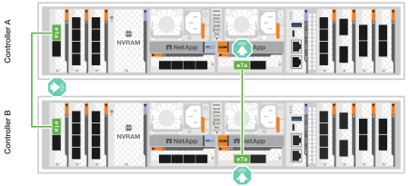

--
.交換式叢集纜線
--
使用 100 GbE 纜線將連接埠 e1a 連接至 e1a ，並將連接埠 e7a 連接至 e7a 。

.步驟
. 將控制器 A 上的連接埠 e1a 和控制器 B 上的連接埠 e1a 連接至叢集網路交換器 A
. 將控制器 A 上的連接埠 e7a 和控制器 B 上的連接埠 e7a 連接至叢集網路交換器 B
+
*100 GbE 纜線 *

+
image::../media/oie_cable100_gbe_qsfp28.png[100 GB 纜線]

+
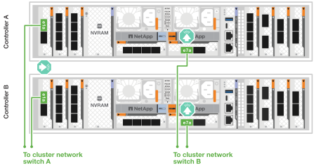

--
====

== 步驟 2 ：連接主機網路連線

將乙太網路模組連接埠連接到主機網路。

以下是一些典型的主機網路纜線範例。如需特定系統組態的詳細資訊、請參閱 link:https://hwu.netapp.com["NetApp Hardware Universe"^] 。

.步驟
. 將連接埠 e9a 和 e9b 連接至乙太網路資料網路交換器。
+

NOTE: 請勿使用連接埠 e1b 和 e7b 連接埠進行主機網路連線。使用單獨的主機卡。

+
*100 GbE 纜線 *

+
image::../media/oie_cable_sfp_gbe_copper.png[100Gb 乙太網路纜線]

+
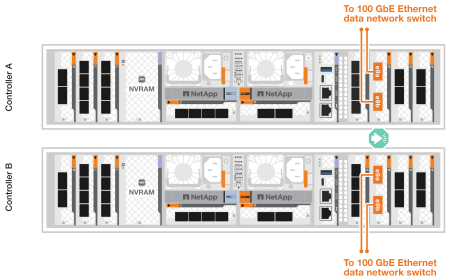

. 連接 10/25 GbE 主機網路交換器。
+
*10/25 GbE 主機 *

+
image::../media/oie_cable_sfp_gbe_copper.png[10/25Gb 乙太網路纜線]

+
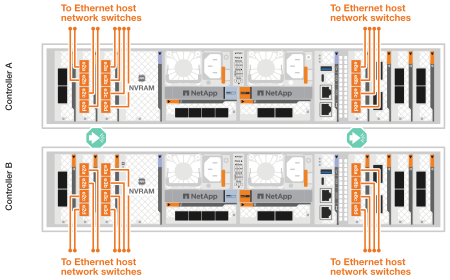

== 步驟 3 ：連接管理網路連線

使用 1000BASE-T RJ-45 纜線，將每個控制器上的管理（扳手）連接埠連接到管理網路交換器。

* 1000BASE-T RJ-45 纜線 *

image::../media/oie_cable_rj45.png[RJ-45 纜線]

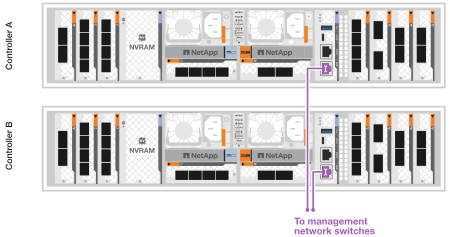

IMPORTANT: 請勿插入電源線。

== 步驟 4 ：連接機櫃連接線

以下佈線程序說明如何將控制器連接至儲存櫃。請選擇符合您設定的下列其中一個纜線選項。

如需儲存系統支援的最大機櫃數量以及所有纜線選項link:https://hwu.netapp.com["NetApp Hardware Universe"^]，請參閱。

.關於這項工作
AFF A1K 儲存系統支援具有 NSM100 或 NSM100B 模組的 NS224 架。模組之間的主要區別是：

* NSM100 機架模組使用內建連接埠 e0a 和 e0b。
* NSM100B 架模組使用插槽 1 中的連接埠 e1a 和 e1b。

以下佈線範例顯示了 NS224 機架中的 NSM100 模組（涉及機架模組連接埠）。

[role="tabbed-block"]
====
.選項 1 ：連接至一個 NS224 儲存櫃
--
將每個控制器連接至 NS224 機櫃上的 NSM 模組。圖形顯示控制器 A 的藍色纜線和控制器 B 的黃色纜線。

*100 GbE QSFP28 銅線 *

image::../media/oie_cable100_gbe_qsfp28.png[100 GbE QSFP28 銅線]

.步驟
. 在控制器 A 上、連接下列連接埠：
+
.. 將連接埠 e11a 連接至 NSM A 連接埠 e0a 。
.. 將連接埠 e11b 連接至連接埠 NSM B 連接埠 e0b 。
+
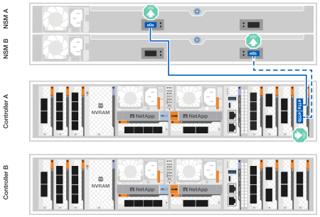

. 在控制器 B 上、連接下列連接埠：
+
.. 將連接埠 e11a 連接至 NSM B 連接埠 e0A 。
.. 將連接埠 e11b 連接至 NSM a 連接埠 e0b 。
+
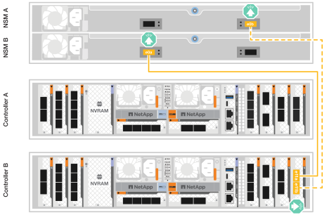

--
.選項 2 ：連接兩個 NS224 儲存櫃
--
將每個控制器連接至兩個 NS224 機櫃上的 NSM 模組。圖形顯示控制器 A 的藍色纜線和控制器 B 的黃色纜線。

*100 GbE QSFP28 銅線 *

image::../media/oie_cable100_gbe_qsfp28.png[100 GbE QSFP28 銅線]

.步驟
. 在控制器 A 上、連接下列連接埠：
+
.. 將連接埠 e11a 連接至機櫃 1 NSM A 連接埠 e0a 。
.. 將連接埠 e11b 連接至機櫃 2 NSM B 連接埠 e0b 。
.. 將連接埠 E10A 連接至機櫃 2 NSM A 連接埠 e0a 。
.. 將連接埠 e10b 連接至機櫃 1 NSM a 連接埠 e0b 。
+
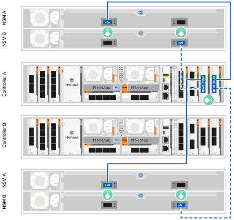

. 在控制器 B 上、連接下列連接埠：
+
.. 將連接埠 e11a 連接至機櫃 1 NSM B 連接埠 e0A 。
.. 將連接埠 e11b 連接至機櫃 2 NSM a 連接埠 e0b 。
.. 將連接埠 E10A 連接至機櫃 2 NSM B 連接埠 e0A 。
.. 將連接埠 e10b 連接至機櫃 1 NSM a 連接埠 e0b 。
+
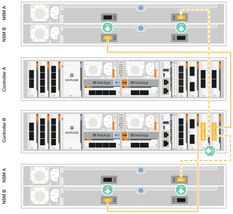

--
====
.接下來呢？
為 AFF A1K 系統連接硬體之後，您link:install-power-hardware.html["開啟 AFF A1K 儲存系統電源"]就可以了。
