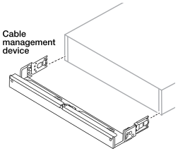

= 安裝硬體 - AFF A1K
:allow-uri-read: 
:icons: font
:imagesdir: ../media/

[role="lead"]
下列說明說明如何將硬體安裝在空置的機櫃或電信機架中。如果您的機櫃已預先填入、請跳過此步驟。

.開始之前
* 您應該檢閱 https://library.netapp.com/ecm/ecm_download_file/ECMP12475945["安全注意事項"] 文件、並瞭解移動和安裝硬體的預防措施。
* 您應該隨附軌道套件的說明。
* 您應注意與平台和機櫃重量相關的安全考量。

.步驟
. 視需要、依照套件隨附的說明、安裝平台和機櫃的軌道套件。
. 在機櫃或電信機架中安裝及保護您的平台：
+
.. 將平台放置在機櫃或電信機架中間的軌道上、然後從底部支撐平台並將其滑入定位。
.. 使用隨附的安裝螺絲、將平台固定在機櫃或電信機架上。

. 安裝機櫃或機櫃：
+
.. 將機架背面放在軌道上、然後從底部支撐機架、並將其滑入機櫃或電信機架。
+
如果您要安裝多個機櫃、請將第一個機櫃直接放在控制器上方。將第二個機櫃直接放在控制器下方。對任何其他磁碟機櫃重複此模式。

.. 使用隨附的安裝螺絲、將機櫃固定在機櫃或電信機架上。

. 將纜線管理裝置連接至平台背面。
+

. 將擋板連接至平台正面。

