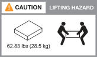
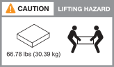

= 安裝需求 - AFF A1K
:allow-uri-read: 
:icons: font
:imagesdir: ../media/

[role="lead"]
檢閱 AFF A1K 儲存系統和儲存櫃所需的設備和起重注意事項。

== 安裝所需的設備

若要安裝儲存系統、您需要下列設備和工具。

* 存取網頁瀏覽器以設定儲存系統
* 靜電釋放（ ESD ）固定帶
* 手電筒
* 具備 USB/ 序列連線的筆記型電腦或主控台
* 2號十字螺絲起子

== 起重預防措施

儲存系統和儲存櫃很重。抬起和移動這些項目時請務必謹慎。

=== 儲存系統重量

移動或提起儲存系統時、請採取必要的預防措施。

A1K 儲存系統的重量可達 62.83 磅（ 28.5 公斤）。若要抬起儲存系統，請使用兩個人或液壓舉升設備。

=== 機櫃重量

移動或舉起貨架時，請採取必要的預防措施。

NS224 機櫃最重可達 66.78 磅（ 30.29 公斤）。若要抬起貨架，請兩個人或液壓舉升。請將所有元件保留在機架中（前後），以避免機架重量不均衡。

.相關資訊
* https://library.netapp.com/ecm/ecm_download_file/ECMP12475945["安全資訊與法規注意事項"^]： a1k! ：

.接下來呢？
在您檢閱過硬體需求之後link:install-prepare.html["準備安裝 AFF A1K 儲存系統"]，您就可以了。
