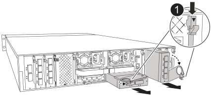

= 新增 I/O 模組 - AFF A1K
:allow-uri-read: 
:icons: font
:imagesdir: ../media/

[role="lead"]
您可以將 I/O 模組新增至儲存系統、方法是將新的 I/O 模組新增至具有空插槽的儲存系統、或是在完全填入的儲存系統中以新的 I/O 模組取代 I/O 模組。

.開始之前
* 檢查 https://hwu.netapp.com/["NetApp Hardware Universe"^] 以確定新的 I/O 模組與您執行的儲存系統和 ONTAP 版本相容。
* 如果有多個插槽可用、請檢查中的插槽優先順序 https://hwu.netapp.com/["NetApp Hardware Universe"^] 並使用適用於您I/O模組的最佳工具。
* 確定所有其他元件都正常運作。

== 選項 1 ：將 I/O 模組新增至具有空插槽的儲存系統

您可以將 I/O 模組新增至儲存系統的空模組插槽。

=== 步驟1：關閉受損節點

使用下列其中一個選項來關閉或接管受損的控制器。

[role="tabbed-block"]
====
.選項1：大多數系統
--
若要關閉受損的控制器、您必須判斷控制器的狀態、並在必要時接管控制器、以便健全的控制器繼續從受損的控制器儲存設備提供資料。

.關於這項工作
如果叢集有兩個以上的節點、則叢集必須處於仲裁狀態。如果叢集未達到法定人數、或健全的控制器顯示為「假」、表示符合資格和健全狀況、則您必須在關閉受損的控制器之前修正問題；請參閱 link:https://docs.netapp.com/us-en/ontap/system-admin/synchronize-node-cluster-task.html?q=Quorum["將節點與叢集同步"^]。

.步驟
. 如果啟用 AutoSupport 、請叫用 AutoSupport 訊息命令來抑制自動建立個案： `system node autosupport invoke -node * -type all -message MAINT=number_of_hours_downh`
+
下列 AutoSupport 命令會禁止自動建立案例兩小時： `cluster1:*> system node autosupport invoke -node * -type all -message MAINT=2h`

. 停用健全控制器主控台的自動恢復功能：「torage容錯移轉修改–節點本機-自動恢復錯誤」
. 將受損的控制器移至載入器提示：
+
[cols="1,2"]
|===
| 如果受損的控制器正在顯示... | 然後... 

 a| 
載入程式提示
 a| 
前往下一步。

 a| 
《等待贈品……》
 a| 
按Ctrl-C、然後在出現提示時回應「y」。

 a| 
系統提示或密碼提示（輸入系統密碼）
 a| 
從健全的控制器停止或接管受損的控制器： `storage failover takeover -ofnode _impaired_node_name_`

當受損的控制器顯示正在等待恢復...時、請按Ctrl-C、然後回應「y」。

|===

--
.選項2：控制器位於MetroCluster 一個不二之處
--
若要關閉受損的控制器、您必須判斷控制器的狀態、並在必要時接管控制器、以便健全的控制器繼續從受損的控制器儲存設備提供資料。

* 如果叢集有兩個以上的節點、則叢集必須處於仲裁狀態。如果叢集未達到法定人數、或健全的控制器顯示為「假」、表示符合資格和健全狀況、則您必須在關閉受損的控制器之前修正問題；請參閱 link:https://docs.netapp.com/us-en/ontap/system-admin/synchronize-node-cluster-task.html?q=Quorum["將節點與叢集同步"^]。
* 如果您使用MetroCluster 的是功能不全的組態、則必須確認MetroCluster 已設定「功能不全」狀態、且節點處於啟用且正常的狀態（「MetroCluster 功能不全」）。

.步驟
. 如果啟用了此功能、請叫用下列訊息來抑制自動建立案例：「System Node現象叫用節點*-type all -Message MAn=number_of_hs_Downh」AutoSupport AutoSupport AutoSupport
+
下列AutoSupport 資訊不顯示自動建立案例兩小時的訊息：「cluster1：*>系統節點AutoSupport 、叫用節點*-輸入ALL -Message MAn=2h」

. 停用健全控制器主控台的自動恢復功能：「torage容錯移轉修改–節點本機-自動恢復錯誤」
. 將受損的控制器移至載入器提示：
+
[cols="1,2"]
|===
| 如果受損的控制器正在顯示... | 然後... 

 a| 
載入程式提示
 a| 
前往下一步。

 a| 
正在等待恢復...
 a| 
按Ctrl-C、然後在出現提示時回應「y」。

 a| 
系統提示或密碼提示（輸入系統密碼）
 a| 
從正常控制器接管或停止受損的控制器：「torage容錯移轉接管-節點_受損節點_節點名稱_」

當受損的控制器顯示正在等待恢復...時、請按Ctrl-C、然後回應「y」。

|===

--
====

=== 步驟2：新增I/O模組

. 如果您尚未接地、請正確接地。
. 從控制器的 PSU 拔下電源供應器（ PSU ）纜線。
+

NOTE: 如果您的儲存系統有 DC PSU 、請從 PSU 拔下電源線區塊。

. 向下轉動纜線管理托盤、方法是拉動纜線管理托盤內部的按鈕、然後向下旋轉。
. 從載體中卸下目標插槽空白模組：
+

NOTE: 下圖顯示移除水平和垂直 I/O 模組。一般而言、您只會移除一個 I/O 模組。

+

+
[cols="1,4"]
|===

 a| 
image:../media/legend_icon_01.png["編號 1"]
| CAM 鎖定按鈕 
|===
+
.. 按下目標插槽中遮光模組上的凸輪鎖扣。
.. 向下轉動凸輪栓鎖、直到卡入定位為止。對於水平模組、請將 CAM 儘量遠離模組。
.. 將手指連入凸輪桿開口處、然後將模組從機箱中拉出、即可將模組從機箱中取出。

. 安裝I/O模組：
+
.. 將 I/O 模組與機箱插槽開口的邊緣對齊。
.. 將模組一路滑入機箱中的插槽、然後將 CAM 栓鎖完全向上旋轉、將模組鎖定到位。

. 連接 I/O 模組纜線。
+
如果 I/O 模組是 NIC 、請將模組連接至資料交換器。

+
如果 I/O 模組是儲存模組、請將其連接至 NS224 機櫃。

+

NOTE: 請確定所有未使用的I/O插槽均已安裝空白、以避免可能的散熱問題。

. 將纜線管理承載器向上旋轉至關閉位置。
. 從載入程式提示字元_by_重新啟動控制器
+

NOTE: 這會重新初始化PCIe卡和其他元件、然後重新啟動節點。

. 從合作夥伴控制器中歸還控制器： _storage 容錯移轉恢復恢復 -ofnode_node_name_
. 對控制器B重複這些步驟
. 如果您使用「儲存容錯移轉修改節點本機-自動恢復true」命令停用自動恢復。
. 如果啟用 AutoSupport 、請使用命令還原 / 恢復自動建立個案 `system node autosupport invoke -node * -type all -message MAINT=END` 。
. 如果您安裝了儲存 I/O 模組、請依照中所述、安裝 NS224 機櫃並連接纜線 https://docs.netapp.com/us-en/ontap-systems/ns224/hot-add-shelf.html["熱新增機櫃"^]。

== 選項 2 ：在沒有空插槽的儲存系統中新增 I/O 模組

您可以移除現有的 I/O 模組、並以不同的 I/O 模組來更換、以在完全填入的系統中變更 I/O 插槽中的 I/O 模組。

. 如果您：
+
[cols="1,2"]
|===
| 取代... | 然後... 

 a| 
NIC I/O模組的連接埠數量相同
 a| 
當控制器模組關閉時、LIF會自動移轉。

 a| 
NIC I/O模組、連接埠較少
 a| 
將選取的生命由永久重新指派至不同的主連接埠。如需使用 System Manager 永久移動生命的相關資訊、請參閱 https://docs.netapp.com/ontap-9/topic/com.netapp.doc.onc-sm-help-960/GUID-208BB0B8-3F84-466D-9F4F-6E1542A2BE7D.html["移轉LIF"^] 。

 a| 
具有儲存I/O模組的NIC I/O模組
 a| 
使用System Manager將lifs永久移轉至不同的主連接埠、如所述 https://docs.netapp.com/ontap-9/topic/com.netapp.doc.onc-sm-help-960/GUID-208BB0B8-3F84-466D-9F4F-6E1542A2BE7D.html["移轉LIF"^]。

|===

=== 步驟1：關閉受損節點

使用下列其中一個選項來關閉或接管受損的控制器。

[role="tabbed-block"]
====
.選項1：大多數系統
--
若要關閉受損的控制器、您必須判斷控制器的狀態、並在必要時接管控制器、以便健全的控制器繼續從受損的控制器儲存設備提供資料。

.關於這項工作
如果叢集有兩個以上的節點、則叢集必須處於仲裁狀態。如果叢集未達到法定人數、或健全的控制器顯示為「假」、表示符合資格和健全狀況、則您必須在關閉受損的控制器之前修正問題；請參閱 link:https://docs.netapp.com/us-en/ontap/system-admin/synchronize-node-cluster-task.html?q=Quorum["將節點與叢集同步"^]。

.步驟
. 如果啟用 AutoSupport 、請叫用 AutoSupport 訊息命令來抑制自動建立個案： `system node autosupport invoke -node * -type all -message MAINT=number_of_hours_downh`
+
下列 AutoSupport 命令會禁止自動建立案例兩小時： `cluster1:*> system node autosupport invoke -node * -type all -message MAINT=2h`

. 停用健全控制器主控台的自動恢復功能：「torage容錯移轉修改–節點本機-自動恢復錯誤」
. 將受損的控制器移至載入器提示：
+
[cols="1,2"]
|===
| 如果受損的控制器正在顯示... | 然後... 

 a| 
載入程式提示
 a| 
前往下一步。

 a| 
《等待贈品……》
 a| 
按Ctrl-C、然後在出現提示時回應「y」。

 a| 
系統提示或密碼提示（輸入系統密碼）
 a| 
從健全的控制器停止或接管受損的控制器： `storage failover takeover -ofnode _impaired_node_name_`

當受損的控制器顯示正在等待恢復...時、請按Ctrl-C、然後回應「y」。

|===

--
.選項2：控制器位於MetroCluster 一個不二之處
--

NOTE: 如果您的系統採用雙節點MetroCluster 的功能、請勿使用此程序。

若要關閉受損的控制器、您必須判斷控制器的狀態、並在必要時接管控制器、以便健全的控制器繼續從受損的控制器儲存設備提供資料。

* 如果叢集有兩個以上的節點、則叢集必須處於仲裁狀態。如果叢集未達到法定人數、或健全的控制器顯示為「假」、表示符合資格和健全狀況、則您必須在關閉受損的控制器之前修正問題；請參閱 link:https://docs.netapp.com/us-en/ontap/system-admin/synchronize-node-cluster-task.html?q=Quorum["將節點與叢集同步"^]。
* 如果您使用MetroCluster 的是功能不全的組態、則必須確認MetroCluster 已設定「功能不全」狀態、且節點處於啟用且正常的狀態（「MetroCluster 功能不全」）。

.步驟
. 如果啟用 AutoSupport 、請叫用 AutoSupport 命令來抑制自動建立個案： `system node autosupport invoke -node * -type all -message MAINT=number_of_hours_downh`
+
下列 AutoSupport 命令會禁止自動建立案例兩小時： `cluster1:*> system node autosupport invoke -node * -type all -message MAINT=2h`

. 停用健全控制器主控台的自動恢復功能：「torage容錯移轉修改–節點本機-自動恢復錯誤」
. 將受損的控制器移至載入器提示：
+
[cols="1,2"]
|===
| 如果受損的控制器正在顯示... | 然後... 

 a| 
載入程式提示
 a| 
前往下一步。

 a| 
正在等待恢復...
 a| 
按Ctrl-C、然後在出現提示時回應「y」。

 a| 
系統提示或密碼提示（輸入系統密碼）
 a| 
從健全的控制器停止或接管受損的控制器： `storage failover takeover -ofnode _impaired_node_name_`

當受損的控制器顯示正在等待恢復...時、請按Ctrl-C、然後回應「y」。

|===

--
====

=== 步驟 2 ：更換 I/O 模組

. 如果您尚未接地、請正確接地。
. 從控制器拔下 PSU 的 PSU 纜線。
+

NOTE: 如果您的儲存系統有 DC PSU 、請從 PSU 拔下電源線區塊。

. 拔下目標I/O模組上的任何纜線。
. 向下轉動纜線管理托盤、方法是拉動纜線管理托盤內部的按鈕、然後向下旋轉。
. 從機箱中移除目標I/O模組：
+

NOTE: 下圖顯示移除水平和垂直 I/O 模組。一般而言、您只會移除一個 I/O 模組。

+

+
[cols="1,4"]
|===

 a| 
image:../media/legend_icon_01.png["編號 1"]
| CAM 鎖定按鈕 
|===
+
.. 按下 CAM LATCH 按鈕。
+
CAM栓鎖會從機箱移出。

.. 向下轉動凸輪栓鎖、直到卡入定位為止。對於水平模組、請將 CAM 儘量遠離模組。
.. 將手指連入凸輪桿開口處、然後將模組從機箱中拉出、即可將模組從機箱中取出。
+
請務必追蹤I/O模組所在的插槽。

. 將 I/O 模組安裝至機箱中的目標插槽：
+
.. 將模組與機箱插槽開口的邊緣對齊。
.. 將模組一路滑入機箱中的插槽、然後將 CAM 栓鎖完全向上旋轉、將模組鎖定到位。

. 連接 I/O 模組纜線。
. 重複執行移除和安裝步驟、以更換控制器的其他模組。
. 重新連接 PSU 。
. 將纜線管理承載器向上旋轉至關閉位置。
. 從載入程式提示字元： _by_ 重新啟動控制器
+
.. 檢查控制器上的 BMC 版本： _ 系統服務處理器 show_
.. 如有需要、請更新 BMC 韌體： _ 系統服務處理器映像更新 _
.. 重新開機節點： _ 再見 _
+

NOTE: 這會重新初始化PCIe卡和其他元件、然後重新啟動節點。

+

NOTE: 如果您在重新開機期間遇到問題、請參閱 https://mysupport.netapp.com/site/bugs-online/product/ONTAP/BURT/1494308["Burt 1494308 - 在 I/O 模組更換期間、可能會觸發環境關機"]

. 從合作夥伴控制器中歸還控制器： _storage 容錯移轉恢復恢復 -ofnode_node_name_
. 停用時啟用自動恢復： _storage 容錯移轉修改 -node local -auto-贈 品 true_
. 如果您新增：
+
[cols="1,2"]
|===
| 如果 I/O 模組為 .. | 然後... 

 a| 
NIC 模組
 a| 
對於每個連接埠、使用「儲存連接埠修改節點*_<節點名稱>_-port *_<連接埠名稱>_-mode network」命令。

 a| 
儲存模組
 a| 
按照中所述，安裝和連接 NS224 機櫃 https://docs.netapp.com/us-en/ontap-systems/ns224/hot-add-shelf.html["熱新增機櫃"^]。

|===
. 對控制器B重複這些步驟

