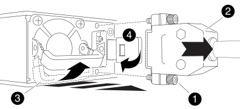

= 更換電源供應器 - AFF A1K
:allow-uri-read: 
:icons: font
:imagesdir: ../media/

[role="lead"]
更換電源供應器（PSU）時、需要先將目標PSU從電源拔下、拔下電源線、移除舊的PSU、然後安裝替換的PSU、再將其重新連接至電源。

電源供應器備援且可熱交換。

.關於這項工作
本程序是為了一次更換一個PSU而編寫。

IMPORTANT: 請勿混用不同效率額定值的PSU。永遠像這樣更換。

請針對您的PSU類型使用適當的程序：AC或DC。

[role="tabbed-block"]
====
.選項1：更換AC PSU
--
若要更換AC PSU、請完成下列步驟。

.步驟
. 如果您尚未接地、請正確接地。
. 根據主控台錯誤訊息或PSU上的紅色故障LED、識別您要更換的PSU。
. 中斷PSU連線：
+
.. 打開電源線固定器、然後從PSU拔下電源線。

. 向上轉動握把、按下鎖定彈片、然後將PSU從控制器模組中拉出、以移除PSU。
+

CAUTION: PSU很短。從控制器模組中取出時、請務必用兩隻手支撐、以免突然從控制器模組中迴轉而造成傷害。

+
image::../media/drw_a1k_psu_remove_replace_ieops-1378.svg[更換 PSU]

+
[cols="1,4"]
|===

 a| 
image:../media/icon_round_1.png["編號 1"]
 a| 
Terracotta PSU 鎖定標籤

|===
. 在控制器模組中安裝替換PSU：
+
.. 用手支撐並將替換PSU的邊緣與控制器模組的開孔對齊。
.. 將PSU輕推入控制器模組、直到鎖定彈片卡入定位。
+
電源供應器只能與內部連接器正確接合、並以一種方式鎖定到位。

+

NOTE: 為避免損壞內部連接器、請勿在將PSU滑入系統時過度施力。

. 重新連接PSU纜線：
+
.. 將電源線重新連接至PSU。
.. 使用電源線固定器將電源線固定至PSU。

+
電源恢復至PSU後、狀態LED應為綠色。

. 如套件隨附的RMA指示所述、將故障零件退回NetApp。如 https://mysupport.netapp.com/site/info/rma["零件退貨與更換"^]需詳細資訊、請參閱頁面。

--
.選項2：更換DC PSU
--
若要更換DC PSU、請完成下列步驟。

.步驟
. 如果您尚未接地、請正確接地。
. 根據主控台錯誤訊息或PSU上的紅色故障LED、識別您要更換的PSU。
. 中斷PSU連線：
+
.. 使用栓上的指旋螺絲、將D-sub DC纜線接頭轉鬆。
.. 從PSU拔下纜線、並將其放在一邊。

. 向上轉動握把、按下鎖定彈片、然後將PSU從控制器模組中拉出、以移除PSU。
+

CAUTION: PSU很短。從控制器模組中取出時、請務必用兩隻手支撐、以免突然從控制器模組中迴轉而造成傷害。

+

+
[cols="1,4"]
|===

 a| 
image:../media/icon_round_1.png["編號 1"]
 a| 
指旋螺絲

 a| 
image:../media/icon_round_2.png["編號 2"]
 a| 
D-sub DC電源PSU纜線連接器

 a| 
image:../media/icon_round_3.png["編號 3"]
 a| 
電源供應器握把

 a| 
image:../media/icon_round_4.png["編號 4."]
 a| 
藍色PSU鎖定彈片

|===
. 在控制器模組中安裝替換PSU：
+
.. 用手支撐並將替換PSU的邊緣與控制器模組的開孔對齊。
.. 將PSU輕推入控制器模組、直到鎖定彈片卡入定位。
+
電源供應器只能與內部連接器正確接合、並以一種方式鎖定到位。

+

NOTE: 為避免損壞內部連接器、請勿在將PSU滑入系統時過度施力。

. 重新連接D-sub DC電源線：
+
.. 將電源線接頭插入PSU。
.. 使用指旋螺絲將電源纜線固定至PSU。
+
電源恢復至PSU後、狀態LED應為綠色。

. 如套件隨附的RMA指示所述、將故障零件退回NetApp。如 https://mysupport.netapp.com/site/info/rma["零件退貨與更換"^]需詳細資訊、請參閱頁面。

--
====