= 連接硬體 - AFF A20 ， AFF A30 和 AFF A50
:allow-uri-read: 
:icons: font
:imagesdir: ../media/

[role="lead"]
安裝 AFF A20 ， AFF A30 或 AFF A50 儲存系統硬體後，請將控制器連接至網路和機櫃。

.開始之前
如需將儲存系統連接至網路交換器的相關資訊，請聯絡您的網路管理員。

.關於這項工作
* 叢集 / HA 和主機網路纜線程序顯示一般組態。
+
如果您在此處看不到您的組態，請前往link:https://hwu.netapp.com["NetApp Hardware Universe"^]以取得完整的組態和插槽優先順序資訊，以連接儲存系統。

* 將連接器插入連接埠時，纜線連接器拉片上的箭頭圖示會顯示正確的方向（上或下）。
+
插入連接器時、您應該會感覺到它卡入到位；如果您沒有感覺到它卡入定位、請將其移除、將其翻轉、然後再試一次。

+
image:../media/drw_cable_pull_tab_direction_ieops-1699.svg["纜線拉片方向"]

* 如果要將纜線連接至光纖交換器，請先將光纖收發器插入控制器連接埠，再將纜線連接至交換器連接埠。

== 步驟 1 ：連接叢集 / HA 連線

連接控制器以建立 ONTAP 叢集連線。

[role="tabbed-block"]
====
.無交換器叢集纜線
--
.AFF A30 或 AFF A50 ，含兩個雙埠 40/100 GbE I/O 模組
[%collapsible]
=====
.步驟
. 連接叢集 / HA 互連連線：
+

NOTE: 叢集互連流量和 HA 流量共用相同的實體連接埠（位於插槽 2 和 4 的 I/O 模組上）。連接埠為 40/100 GbE 。

+
.. 纜線控制器 A 連接埠 E2A 至控制器 B 連接埠 E2A 。
.. 纜線控制器 A 連接埠 E4A 至控制器 B 連接埠 E4A 。
+

NOTE: I/O 模組連接埠 e2b 和 e4b 未使用，可供主機網路連線使用。

+
*100 GbE 叢集 / HA 互連纜線 *

+
image::../media/oie_cable100_gbe_qsfp28.png[叢集 HA 100 GbE 纜線]

+
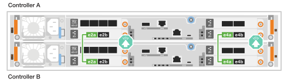

=====
.AFF A30 或 AFF A50 搭配一個雙埠 40/100 GbE I/O 模組
[%collapsible]
=====
.步驟
. 連接叢集 / HA 互連連線：
+

NOTE: 叢集互連流量和 HA 流量共用相同的實體連接埠（位於插槽 4 的 I/O 模組上）。連接埠為 40/100 GbE 。

+
.. 纜線控制器 A 連接埠 E4A 至控制器 B 連接埠 E4A 。
.. 纜線控制器 A 連接埠 e4b 至控制器 B 連接埠 e4b 。
+
*100 GbE 叢集 / HA 互連纜線 *

+
image::../media/oie_cable100_gbe_qsfp28.png[叢集 HA 100 GbE 纜線]

+
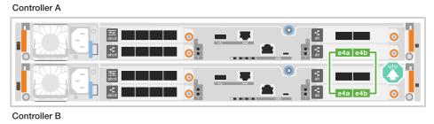

=====
.AFF A20 搭配一個雙連接埠 10/25 GbE I/O 模組
[%collapsible]
=====
.步驟
. 連接叢集 / HA 互連連線：
+

NOTE: 叢集互連流量和 HA 流量共用相同的實體連接埠（位於插槽 4 的 I/O 模組上）。連接埠為 10/25 GbE 。

+
.. 纜線控制器 A 連接埠 E4A 至控制器 B 連接埠 E4A 。
.. 纜線控制器 A 連接埠 e4b 至控制器 B 連接埠 e4b 。
+
*25 GbE 叢集 / HA 互連纜線 *

+
image:../media/oie_cable_sfp_gbe_copper.png["GbE SFP 銅線連接器"]

+
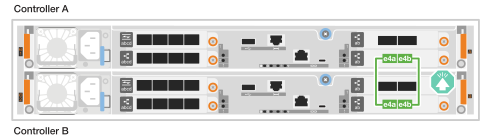

=====
--
.交換式叢集纜線
--
.AFF A30 或 AFF A50 ，含兩個雙埠 40/100 GbE I/O 模組
[%collapsible]
=====
.步驟
. 連接叢集 / HA 互連連線：
+

NOTE: 叢集互連流量和 HA 流量共用相同的實體連接埠（位於插槽 2 和 4 的 I/O 模組上）。連接埠為 40/100 GbE 。

+
.. 纜線控制器 A 連接埠 E4A 至叢集網路交換器 A
.. 纜線控制器 A 連接埠 E2A 至叢集網路交換器 B
.. 纜線控制器 B 連接埠 E4A 至叢集網路交換器 A
.. 纜線控制器 B 連接埠 E2A 至叢集網路交換器 B
+

NOTE: I/O 模組連接埠 e2b 和 e4b 未使用，可供主機網路連線使用。

+
*40/100 GbE 叢集 / HA 互連纜線 *

+
image::../media/oie_cable100_gbe_qsfp28.png[叢集 HA 40/100 GbE 纜線]

+
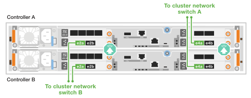

=====
.AFF A30 或 AFF A50 搭配一個雙埠 40/100 GbE I/O 模組
[%collapsible]
=====
.步驟
. 將控制器連接至叢集網路交換器：
+

NOTE: 叢集互連流量和 HA 流量共用相同的實體連接埠（位於插槽 4 的 I/O 模組上）。連接埠為 40/100 GbE 。

+
.. 纜線控制器 A 連接埠 E4A 至叢集網路交換器 A
.. 纜線控制器 A 連接埠 e4b 至叢集網路交換器 B
.. 纜線控制器 B 連接埠 E4A 至叢集網路交換器 A
.. 纜線控制器 B 連接埠 e4b 至叢集網路交換器 B
+
*40/100 GbE 叢集 / HA 互連纜線 *

+
image::../media/oie_cable100_gbe_qsfp28.png[叢集 HA 40/100 GbE 纜線]

+
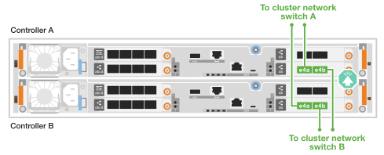

=====
.AFF A20 搭配一個雙連接埠 10/25 GbE I/O 模組
[%collapsible]
=====
. 將控制器連接至叢集網路交換器：
+

NOTE: 叢集互連流量和 HA 流量共用相同的實體連接埠（位於插槽 4 的 I/O 模組上）。連接埠為 10/25 GbE 。

+
.. 纜線控制器 A 連接埠 E4A 至叢集網路交換器 A
.. 纜線控制器 A 連接埠 e4b 至叢集網路交換器 B
.. 纜線控制器 B 連接埠 E4A 至叢集網路交換器 A
.. 纜線控制器 B 連接埠 e4b 至叢集網路交換器 B
+
*10/25 GbE 叢集 / HA 互連纜線 *

+
image:../media/oie_cable_sfp_gbe_copper.png["GbE SFP 銅線連接器"]

+
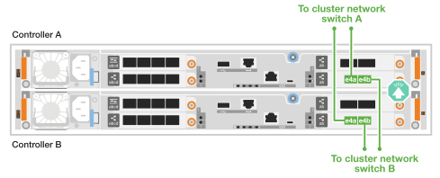

=====
--
====

== 步驟 2 ：連接主機網路連線

將控制器連接至乙太網路或 FC 主機網路。

[role="tabbed-block"]
====
.乙太網路主機纜線
--
.AFF A30 或 AFF A50 ，含兩個雙埠 40/100 GbE I/O 模組
[%collapsible]
=====
.步驟
. 在每個控制器上，使用纜線連接埠 e2b 和 e4b 連接乙太網路主機網路交換器。
+

NOTE: 插槽 2 和插槽 4 中 I/O 模組的連接埠為 40/100 GbE （主機連線為 40/100 GbE ）。

+
*40/100 GbE 纜線 *

+
image::../media/oie_cable_sfp_gbe_copper.png[40/100 GB 纜線]

+
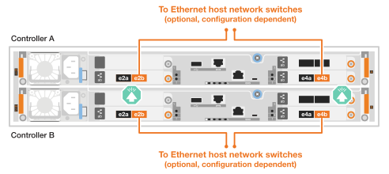

=====
.AFF A20 ， A30 或 AFF A50 ，搭配一個 4 埠 10/25 GbE I/O 模組
[%collapsible]
=====
.步驟
. 在每個控制器上，將連接埠 E2A ， e2b ， e2c 和 e2d 連接至乙太網路主機網路交換器。
+
*10/25 GbE 纜線 *

+
image:../media/oie_cable_sfp_gbe_copper.png["GbE SFP 銅線連接器"]

+
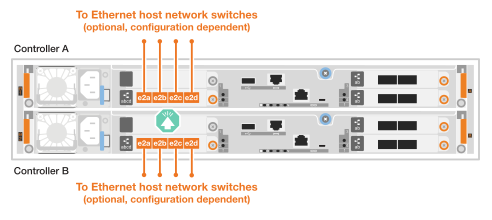

=====
--
.FC 主機纜線
--
.AFF A20 ， A30 或 AFF A50 ，搭配一個 4 埠 64 Gb/s FC I/O 模組
[%collapsible]
=====
.步驟
. 在每個控制器上，將連接埠 1a ， 1b ， 1c 和 1D 連接至 FC 主機網路交換器。
+
* 64 Gb/s FC 纜線 *

+
image:../media/oie_cable_sfp_gbe_copper.png["64 GB 光纖通道纜線"]

+
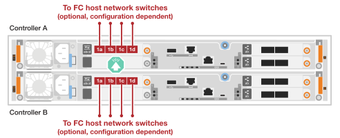

=====
--
====

== 步驟 3 ：連接管理網路連線

將控制器連接至管理網路。

. 將每個控制器上的管理（扳手）連接埠連接到管理網路交換器。
+
* 1000BASE-T RJ-45 纜線 *

+
image::../media/oie_cable_rj45.png[RJ-45 纜線]

+
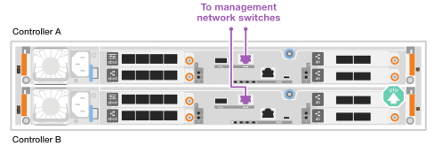

IMPORTANT: 請勿插入電源線。

== 步驟 4 ：連接機櫃連接線

本程序說明如何將控制器連接至一個 NS224 機櫃。

.關於這項工作
* 如需儲存系統支援的最大機櫃數量，以及所有纜線選項（例如光纖和交換器連接），請參閱link:https://hwu.netapp.com["NetApp Hardware Universe"^]。
* NS224 架佈線程式顯示 NSM100B 模組而非 NSM100 模組。無論使用哪種類型的 NSM 模組，佈線都是相同的，只有連接埠名稱不同：
+
** NSM100B 模組使用插槽 1 中 I/O 模組上的連接埠 e1a 和 e1b。
** NSM100 模組使用內建（板載）連接埠 e0a 和 e0b。

* 使用儲存系統隨附的儲存電纜將每個控制器連接到 NS224 架上的每個 NSM 模組，儲存電纜可以是以下電纜類型：
+
*100 GbE QSFP28 銅線 *

+
image::../media/oie_cable100_gbe_qsfp28.png[100 GbE QSFP28 銅線]

* 圖形顯示控制器 A 的藍色纜線和控制器 B 的黃色纜線。

.步驟
. 將控制器A纜線連接至機櫃：
+
.. 纜線控制器 A 連接埠 e3a 至 NSM A 連接埠 e1a 。
.. 纜線控制器 A 連接埠 e3b 至 NSM B 連接埠 e1b 。
+
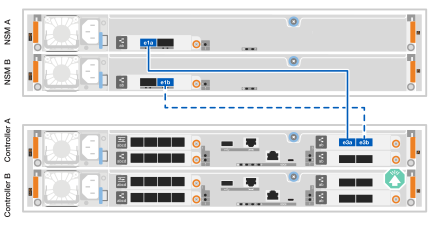

. 將控制器B纜線連接至機櫃：
+
.. 纜線控制器 B 連接埠 e3a 至 NSM B 連接埠 e1a 。
.. 纜線控制器 B 連接埠 e3b 至 NSM A 連接埠 e1b 。
+
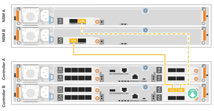

.接下來呢？
為儲存系統連接硬體之後，您link:install-power-hardware.html["開啟儲存系統電源"]就可以了。
