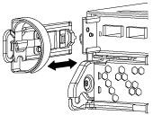

= 更換即時時鐘電池 - AFF A220
:allow-uri-read: 
:icons: font
:imagesdir: ../media/

[role="lead"]
您必須使用經認可的 RTC 電池。

您可以更換控制器模組中的即時時鐘（RTc）電池、讓系統的服務和應用程式繼續運作、而這些服務和應用程式必須仰賴精確的時間同步。

* 您可以將此程序用於ONTAP 系統支援的所有版本的功能
* 系統中的所有其他元件都必須正常運作；否則、您必須聯絡技術支援部門。

== 步驟1：關閉受損的控制器

若要關閉受損的控制器、您必須判斷控制器的狀態、並在必要時接管控制器、以便健全的控制器繼續從受損的控制器儲存設備提供資料。

.關於這項工作
* 如果您有 SAN 系統，則必須檢查故障控制器 SCSI 刀鋒的事件訊息  `cluster kernel-service show`。 `cluster kernel-service show`命令（從 priv 進階模式）會顯示節點名稱、link:https://docs.netapp.com/us-en/ontap/system-admin/display-nodes-cluster-task.html["仲裁狀態"]該節點的可用度狀態、以及該節點的作業狀態。
+
每個SCSI刀鋒處理序都應與叢集中的其他節點處於仲裁狀態。任何問題都必須先解決、才能繼續進行更換。

* 如果叢集有兩個以上的節點、則叢集必須處於仲裁狀態。如果叢集未達到法定人數、或健全的控制器顯示為「假」、表示符合資格和健全狀況、則您必須在關閉受損的控制器之前修正問題；請參閱 link:https://docs.netapp.com/us-en/ontap/system-admin/synchronize-node-cluster-task.html?q=Quorum["將節點與叢集同步"^]。

.步驟
. 如果啟用了「支援」功能、請叫用下列消息來禁止自動建立個案AutoSupport AutoSupport ：
+
`system node autosupport invoke -node * -type all -message MAINT=<# of hours>h`

+
下列AutoSupport 資訊不顯示自動建立案例兩小時：

+
`cluster1:> system node autosupport invoke -node * -type all -message MAINT=2h`

. 停用自動交還：
+
.. 從健康控制器的控制台輸入以下命令：
+
`storage failover modify -node _impaired_node_name_ -auto-giveback false`

.. 進入 `y`當您看到提示「您是否要停用自動回饋？」時

. 將受損的控制器移至載入器提示：
+
[cols="1,2"]
|===
| 如果受損的控制器正在顯示... | 然後... 

 a| 
載入程式提示
 a| 
前往下一步。

 a| 
正在等待恢復...
 a| 
按Ctrl-C、然後在出現提示時回應「y」。

 a| 
系統提示或密碼提示
 a| 
從健全的控制器接管或停止受損的控制器：

`storage failover takeover -ofnode _impaired_node_name_ -halt _true_`

--halt true_ 參數會帶您進入 Loader 提示字元。

|===

== 步驟2：移除控制器模組

若要存取控制器內部的元件、您必須先從系統中移除控制器模組、然後移除控制器模組上的護蓋。

. 如果您尚未接地、請正確接地。
. 解開將纜線綁定至纜線管理裝置的掛勾和迴圈帶、然後從控制器模組拔下系統纜線和SFP（如有需要）、並追蹤纜線的連接位置。
+
將纜線留在纜線管理裝置中、以便在重新安裝纜線管理裝置時、整理好纜線。

. 從控制器模組的左側和右側移除纜線管理裝置、並將其放在一邊。
+

. 壓下CAM把手上的栓鎖直到釋放為止、完全打開CAM把把、以從中間板釋放控制器模組、然後用兩隻手將控制器模組從機箱中拉出。
+
image::../media/drw_2240_x_opening_cam_latch.png[打開凸輪把手栓鎖]

. 翻轉控制器模組、將其放置在平穩的表面上。
. 滑入藍色彈片以釋放護蓋、然後將護蓋向上旋轉並開啟、即可開啟護蓋。
+
image::../media/drw_2600_opening_pcm_cover.png[開啟或關閉控制器模組]

== 步驟3：更換RTC電池

若要更換RTC電池、請將其放在控制器內、然後依照特定的步驟順序進行。

. 如果您尚未接地、請正確接地。
. 找到RTC電池。
+
image::../media/drw_2600_rtc_battery.png[取出 RTC 電池]

. 將電池從電池座中輕推、將電池從電池座中轉開、然後將其從電池座中取出。
+

NOTE: 從電池座取出電池時、請注意電池的極性。電池標有加號、必須正確放置在電池座中。支架附近的加號表示電池的放置方式。

. 從防靜電包裝袋中取出替換電池。
. 在控制器模組中找到空的電池座。
. 記下RTC電池的極性、然後以一定角度向下推電池、將其插入電池座。
. 目視檢查電池、確定電池已完全裝入電池座、且極性正確。

== 步驟4：重新安裝控制器模組、並在更換RTC電池後設定時間/日期

更換控制器模組中的元件之後、您必須在系統機箱中重新安裝控制器模組、重設控制器上的時間和日期、然後將其開機。

. 如果您尚未這麼做、請關閉通風管或控制器模組護蓋。
. 將控制器模組的一端與機箱的開口對齊、然後將控制器模組輕推至系統的一半。
+
在指示之前、請勿將控制器模組完全插入機箱。

. 視需要重新安裝系統。
+
如果您移除媒體轉換器（QSFP或SFP）、請記得在使用光纖纜線時重新安裝。

. 如果電源供應器已拔下、請將其插回、然後重新安裝電源線固定器。
. 完成控制器模組的重新安裝：
+
.. 將CAM握把置於開啟位置時、將控制器模組穩固推入、直到它與中間背板接觸並完全就位、然後將CAM握把關閉至鎖定位置。
+

NOTE: 將控制器模組滑入機箱時、請勿過度施力、以免損壞連接器。

.. 如果您尚未重新安裝纜線管理裝置、請重新安裝。
.. 使用掛勾和迴圈固定帶將纜線綁定至纜線管理裝置。
.. 重新連接電源供應器和電源的電源線、然後開啟電源以開始開機程序。
.. 在載入程式提示下停止控制器。

. 重設控制器上的時間和日期：
+
.. 使用「show date」命令檢查健全控制器上的日期和時間。
.. 在目標控制器的載入器提示下、檢查時間和日期。
.. 如有必要、請使用「設置日期mm/dd/ymm/西元年」命令來修改日期。
.. 如有必要、請使用「Set Time hh：mm：sss」命令、以GMT0設定時間。
.. 確認目標控制器上的日期和時間。

. 在載入程式提示下、輸入「bye」重新初始化PCIe卡和其他元件、然後讓控制器重新開機。
. 將控制器恢復正常運作、方法是歸還儲存設備：「torage容錯移轉恢復-ofnode_disapped_node_name_」
. 如果停用自動還原、請重新啟用：「儲存容錯移轉修改節點本機-自動恢復true」

== 步驟5：在雙節點MetroCluster 的不二組態中切換回集合體

此工作僅適用於雙節點MetroCluster 的不完整組態。

.步驟
. 驗證所有節點是否都處於「啟用」狀態：MetroCluster 「顯示節點」
+
[listing]
----
cluster_B::>  metrocluster node show

DR                           Configuration  DR
Group Cluster Node           State          Mirroring Mode
----- ------- -------------- -------------- --------- --------------------
1     cluster_A
              controller_A_1 configured     enabled   heal roots completed
      cluster_B
              controller_B_1 configured     enabled   waiting for switchback recovery
2 entries were displayed.
----
. 確認所有SVM上的重新同步已完成：MetroCluster 「Svserver show」
. 驗證修復作業所執行的任何自動LIF移轉是否已成功完成：「MetroCluster 還原檢查LIF show」
. 從存續叢集中的任何節點使用「MetroCluster 還原」命令執行切換。
. 確認切換作業已完成：MetroCluster 「不顯示」
+
當叢集處於「等待切換」狀態時、切換回復作業仍在執行中：

+
[listing]
----
cluster_B::> metrocluster show
Cluster              Configuration State    Mode
--------------------	------------------- 	---------
 Local: cluster_B configured       	switchover
Remote: cluster_A configured       	waiting-for-switchback
----
+
當叢集處於「正常」狀態時、即可完成切換作業：

+
[listing]
----
cluster_B::> metrocluster show
Cluster              Configuration State    Mode
--------------------	------------------- 	---------
 Local: cluster_B configured      		normal
Remote: cluster_A configured      		normal
----
+
如果切換需要很長時間才能完成、您可以使用「MetroCluster show config-repl複 寫res同步 狀態show」命令來檢查進行中的基準狀態。

. 重新建立任何SnapMirror或SnapVault 不完整的組態。

== 步驟6：將故障零件歸還給NetApp

如套件隨附的RMA指示所述、將故障零件退回NetApp。如 https://mysupport.netapp.com/site/info/rma["零件退貨與更換"]需詳細資訊、請參閱頁面。
