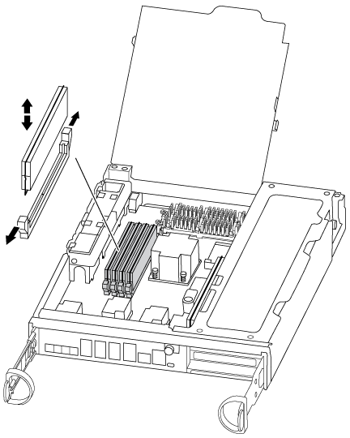

= 更換DIMM AFF - REVA300
:allow-uri-read: 
:icons: font
:imagesdir: ../media/

[role="lead"]
當儲存系統遇到錯誤時、您必須更換控制器中的 DIMM 、例如根據健全狀況監視器警示或不可修正的 ECC 錯誤（可修正的錯誤修正碼）過多、通常是由於單一 DIMM 故障而導致、導致儲存系統無法開機 ONTAP 。

系統中的所有其他元件都必須正常運作；否則、您必須聯絡技術支援部門。

您必須使用從供應商處收到的替換FRU元件來更換故障元件。

== 步驟1：關閉受損的控制器

使用適合您組態的適當程序來關閉或接管受損的控制器。

[role="tabbed-block"]
====
.選項1：大多數組態
--
若要關閉受損的控制器、您必須判斷控制器的狀態、並在必要時接管控制器、以便健全的控制器繼續從受損的控制器儲存設備提供資料。

.關於這項工作
* 如果您有 SAN 系統，則必須檢查故障控制器 SCSI 刀鋒的事件訊息  `cluster kernel-service show`。 `cluster kernel-service show`命令（從 priv 進階模式）會顯示節點名稱、link:https://docs.netapp.com/us-en/ontap/system-admin/display-nodes-cluster-task.html["仲裁狀態"]該節點的可用度狀態、以及該節點的作業狀態。
+
每個SCSI刀鋒處理序都應與叢集中的其他節點處於仲裁狀態。任何問題都必須先解決、才能繼續進行更換。

* 如果叢集有兩個以上的節點、則叢集必須處於仲裁狀態。如果叢集未達到法定人數、或健全的控制器顯示為「假」、表示符合資格和健全狀況、則您必須在關閉受損的控制器之前修正問題；請參閱 link:https://docs.netapp.com/us-en/ontap/system-admin/synchronize-node-cluster-task.html?q=Quorum["將節點與叢集同步"^]。

.步驟
. 如果啟用了「支援」功能、請叫用下列消息來禁止自動建立個案AutoSupport AutoSupport ：
+
`system node autosupport invoke -node * -type all -message MAINT=<# of hours>h`

+
下列AutoSupport 資訊不顯示自動建立案例兩小時：

+
`cluster1:> system node autosupport invoke -node * -type all -message MAINT=2h`

. 停用自動交還：
+
.. 從健康控制器的控制台輸入以下命令：
+
`storage failover modify -node local -auto-giveback false`

.. 進入 `y`當您看到提示「您是否要停用自動回饋？」時

. 將受損的控制器移至載入器提示：
+
[cols="1,2"]
|===
| 如果受損的控制器正在顯示... | 然後... 

 a| 
載入程式提示
 a| 
前往下一步。

 a| 
正在等待恢復...
 a| 
按Ctrl-C、然後在出現提示時回應「y」。

 a| 
系統提示或密碼提示
 a| 
從健全的控制器接管或停止受損的控制器：

`storage failover takeover -ofnode _impaired_node_name_ -halt _true_`

--halt true_ 參數會帶您進入 Loader 提示字元。

|===

--
.選項2：控制器位於雙節點MetroCluster 的不二
--
若要關閉受損的控制器、您必須判斷控制器的狀態、並在必要時切換控制器、使健全的控制器繼續從受損的控制器儲存設備提供資料。

.關於這項工作
* 您必須在本程序結束時保持電源供應器開啟、才能為健全的控制器提供電力。

.步驟
. 檢查MetroCluster 「不正常」狀態、判斷受損的控制器是否已自動切換至「正常」控制器MetroCluster ：「不正常」
. 視是否發生自動切換而定、請根據下表繼續進行：
+
[cols="1,2"]
|===
| 如果控制器受損... | 然後... 

 a| 
已自動切換
 a| 
繼續下一步。

 a| 
尚未自動切換
 a| 
從健全的控制器執行計畫性的切換作業MetroCluster ：「『交換切換’」

 a| 
尚未自動切換、您嘗試使用MetroCluster 「還原切換」命令進行切換、切換遭到否決
 a| 
請檢閱否決訊息、如有可能、請解決此問題、然後再試一次。如果您無法解決問題、請聯絡技術支援部門。

|===
. 從MetroCluster 存續的叢集執行「f恢復 階段Aggregate」命令、以重新同步資料集合體。
+
[listing]
----
controller_A_1::> metrocluster heal -phase aggregates
[Job 130] Job succeeded: Heal Aggregates is successful.
----
+
如果治療被否決、您可以選擇MetroCluster 使用「-overre-etoes」參數重新發出「還原」命令。如果您使用此選用參數、系統將會置換任何軟質否決、以防止修復作業。

. 使用MetroCluster flexoperationshow命令確認作業已完成。
+
[listing]
----
controller_A_1::> metrocluster operation show
    Operation: heal-aggregates
      State: successful
Start Time: 7/25/2016 18:45:55
   End Time: 7/25/2016 18:45:56
     Errors: -
----
. 使用「shorage Aggregate show」命令來檢查集合體的狀態。
+
[listing]
----
controller_A_1::> storage aggregate show
Aggregate     Size Available Used% State   #Vols  Nodes            RAID Status
--------- -------- --------- ----- ------- ------ ---------------- ------------
...
aggr_b2    227.1GB   227.1GB    0% online       0 mcc1-a2          raid_dp, mirrored, normal...
----
. 使用「MetroCluster f恢復 階段根集合體」命令來修復根集合體。
+
[listing]
----
mcc1A::> metrocluster heal -phase root-aggregates
[Job 137] Job succeeded: Heal Root Aggregates is successful
----
+
如果修復被否決、您可以選擇使用MetroCluster -overrover-etoes參數重新發出「還原」命令。如果您使用此選用參數、系統將會置換任何軟質否決、以防止修復作業。

. 在MetroCluster 目的地叢集上使用「停止作業show」命令、確認修復作業已完成：
+
[listing]
----

mcc1A::> metrocluster operation show
  Operation: heal-root-aggregates
      State: successful
 Start Time: 7/29/2016 20:54:41
   End Time: 7/29/2016 20:54:42
     Errors: -
----
. 在受損的控制器模組上、拔下電源供應器。

--
====

== 步驟2：開啟控制器模組

若要存取控制器內部的元件、您必須先從系統中移除控制器模組、然後移除控制器模組上的護蓋。

. 如果您尚未接地、請正確接地。
. 解開將纜線綁定至纜線管理裝置的掛勾和迴圈帶、然後從控制器模組拔下系統纜線和SFP（如有需要）、並追蹤纜線的連接位置。
+
將纜線留在纜線管理裝置中、以便在重新安裝纜線管理裝置時、整理好纜線。

. 從控制器模組的左側和右側移除纜線管理裝置、並將其放在一邊。
+
image::../media/drw_32xx_cbl_mgmt_arm.png[取下纜線管理臂 ][]

. 旋鬆控制器模組CAM握把上的指旋螺絲。
+
image::../media/drw_8020_cam_handle_thumbscrew.png[擰鬆指旋螺絲以打開 CAM 把手]

+
|===

 a| 
image:../media/icon_round_1.png["編號 1"]
| 指旋螺絲 

 a| 
image:../media/icon_round_2.png["編號 2"]
 a| 
CAM握把

|===
. 向下拉CAM把手上、開始將控制器模組從機箱中滑出。
+
將控制器模組滑出機箱時、請確定您支援控制器模組的底部。

== 步驟3：更換DIMM

若要更換DIMM、請在控制器內找到DIMM、然後依照特定的步驟順序進行。

. 如果您尚未接地、請正確接地。
. 檢查控制器模組上的NVMEM LED。
+
在更換系統元件之前、您必須執行乾淨的系統關機、以避免在非揮發性記憶體（NVMEM）中遺失未寫入的資料。LED位於控制器模組背面。尋找下列圖示：

+
image::../media/drw_hw_nvram_icon.png[NV LED]

. 如果NVMEM LED未更新、則在NVMEM中沒有任何內容；您可以跳過下列步驟、繼續執行本程序中的下一個工作。
. 拔下電池：
+

NOTE: 當您停止系統時、NVMEM LED會在將內容降級至快閃記憶體時閃爍。完成轉出後、LED會關閉。

+
** 如果電源中斷而未完全關機、則NVMEM LED會持續閃燈直到卸電量完成、然後LED會關閉。
** 如果LED亮起且電源開啟、則未寫入的資料會儲存在NVMEM上。
+
這通常發生在Data ONTAP 不受控制的關機過程中、因為已成功開機。

+
... 打開CPU通風管、找到NVMEM電池。
+
image::../media/drw_rxl_nvmem_battery.png[更換NVMEM電池]

+
|===

 a| 
image:../media/icon_round_1.png["編號 1"]
| NVMEM電池鎖定索引標籤 

 a| 
image:../media/icon_round_2.png["編號 2"]
 a| 
NVMEM電池

|===
... 找到電池插塞、並將電池插塞正面的固定夾壓下、以從插槽釋放插塞、然後從插槽拔下電池纜線。
... 等待幾秒鐘、然後將電池插回插槽。

. 返回此程序的步驟2、重新檢查NVMEM LED。
. 找到控制器模組上的DIMM。
. 請注意插槽中的DIMM方向、以便您以適當的方向插入替換的DIMM。
. 緩慢地將DIMM兩側的兩個DIMM彈出彈片分開、然後將DIMM從插槽中滑出、藉此將DIMM從插槽中退出。
+

NOTE: 小心拿住DIMM的邊緣、避免對DIMM電路板上的元件施加壓力。

+
系統DIMM的數量和位置取決於您的系統機型。

+
下圖顯示系統DIMM的位置：

+

. 從防靜電包裝袋中取出備用DIMM、拿住DIMM的邊角、然後將其對準插槽。
+
DIMM插針之間的槽口應與插槽中的卡舌對齊。

. 確定連接器上的DIMM彈出彈片處於開啟位置、然後將DIMM正面插入插槽。
+
DIMM可緊密插入插槽、但應該很容易就能裝入。如果沒有、請重新將DIMM與插槽對齊、然後重新插入。

+

NOTE: 目視檢查DIMM、確認其對齊並完全插入插槽。

. 在DIMM頂端邊緣小心地推入、但穩固地推入、直到彈出彈出彈片卡入DIMM兩端的槽口。
. 找到NVMEM電池插頭插槽、然後擠壓電池纜線插頭正面的固定夾、將其插入插槽。
+
請確定插頭鎖定在控制器模組上。

. 合上控制器模組護蓋。

== 步驟4：重新安裝控制器

更換控制器模組中的元件之後、您必須在系統機箱中重新安裝控制器模組。

. 如果您尚未接地、請正確接地。
. 將控制器模組的一端與機箱的開口對齊、然後將控制器模組輕推至系統的一半。
+

NOTE: 在指示之前、請勿將控制器模組完全插入機箱。

. 視需要重新安裝系統。
+
如果您移除媒體轉換器（QSFP或SFP）、請記得在使用光纖纜線時重新安裝。

. 完成控制器模組的重新安裝：
+
控制器模組一旦完全插入機箱、就會開始開機。

+
.. 將CAM握把置於開啟位置時、將控制器模組穩固推入、直到它與中間背板接觸並完全就位、然後將CAM握把關閉至鎖定位置。
+

NOTE: 將控制器模組滑入機箱時、請勿過度施力、以免損壞連接器。

.. 鎖緊控制器模組背面CAM握把上的指旋螺絲。
.. 如果您尚未重新安裝纜線管理裝置、請重新安裝。
.. 使用掛勾和迴圈固定帶將纜線綁定至纜線管理裝置。

== 步驟 5 ：（僅限雙節點 MetroCluster ）：切換回集合體

此工作僅適用於雙節點MetroCluster 的不完整組態。

.步驟
. 驗證所有節點是否都處於「啟用」狀態：MetroCluster 「顯示節點」
+
[listing]
----
cluster_B::>  metrocluster node show

DR                           Configuration  DR
Group Cluster Node           State          Mirroring Mode
----- ------- -------------- -------------- --------- --------------------
1     cluster_A
              controller_A_1 configured     enabled   heal roots completed
      cluster_B
              controller_B_1 configured     enabled   waiting for switchback recovery
2 entries were displayed.
----
. 確認所有SVM上的重新同步已完成：MetroCluster 「Svserver show」
. 驗證修復作業所執行的任何自動LIF移轉是否已成功完成：「MetroCluster 還原檢查LIF show」
. 從存續叢集中的任何節點使用「MetroCluster 還原」命令執行切換。
. 確認切換作業已完成：MetroCluster 「不顯示」
+
當叢集處於「等待切換」狀態時、切換回復作業仍在執行中：

+
[listing]
----
cluster_B::> metrocluster show
Cluster              Configuration State    Mode
--------------------	------------------- 	---------
 Local: cluster_B configured       	switchover
Remote: cluster_A configured       	waiting-for-switchback
----
+
當叢集處於「正常」狀態時、即可完成切換作業：

+
[listing]
----
cluster_B::> metrocluster show
Cluster              Configuration State    Mode
--------------------	------------------- 	---------
 Local: cluster_B configured      		normal
Remote: cluster_A configured      		normal
----
+
如果切換需要很長時間才能完成、您可以使用「MetroCluster show config-repl複 寫res同步 狀態show」命令來檢查進行中的基準狀態。

. 重新建立任何SnapMirror或SnapVault 不完整的組態。

== 步驟6：將故障零件歸還給NetApp

如套件隨附的RMA指示所述、將故障零件退回NetApp。如 https://mysupport.netapp.com/site/info/rma["零件退貨與更換"]需詳細資訊、請參閱頁面。
