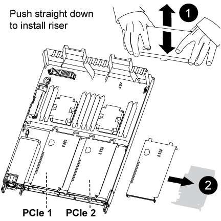

= 更換控制器模組硬體AFF - REVA320
:allow-uri-read: 
:icons: font
:imagesdir: ../media/

[role="lead"]
若要更換控制器模組硬體、您必須移除受損的控制器、將FRU元件移至更換的控制器模組、在機箱中安裝更換的控制器模組、然後將系統開機至維護模式。

== 步驟1：移除控制器模組

若要存取控制器模組內部的元件、您必須從機箱中移除控制器模組。

您可以使用下列映像或書面步驟、從機箱中移除控制器模組。

下圖顯示從受損的控制器模組移除纜線和纜線管理臂：

image::../media/drw_a320_controller_cable_unplug_animated_gif.png[DRW A320控制器纜線拔下動畫式Gif]

下圖顯示從機箱中移除受損的控制器模組：

image::../media/drw_a320_controller_remove_animated_gif.png[DRW A320控制器移除動畫Gif]

. 如果您尚未接地、請正確接地。
. 從電源拔下控制器模組的電源供應器。
. 解開將纜線綁定至纜線管理裝置的掛勾和迴圈帶、然後從控制器模組拔下系統纜線和SFP（如有需要）、並追蹤纜線的連接位置。
+
將纜線留在纜線管理裝置中、以便在重新安裝纜線管理裝置時、整理好纜線。

. 從控制器模組的左側和右側移除纜線管理裝置、並將其放在一邊。
. 從機箱中取出控制器模組：
+
.. 將您的指夾插入控制器模組兩側的鎖定機制。
.. 按下鎖定機制頂端的橘色彈片、直到它清除機箱上的鎖定銷為止。
+
鎖定機制掛勾應幾乎垂直、且應遠離機箱插銷。

.. 將控制器模組往您的方向輕拉幾英吋、以便抓住控制器模組的兩側。
.. 用兩隻手將控制器模組從機箱中輕拉出、然後放在平穩的表面上。

== 步驟2：搬移電源供應器

更換控制器模組時、您必須將電源供應器從受損的控制器模組移至更換的控制器模組。

. 旋轉CAM握把、以便在按下藍色鎖定彈片的同時、將電源供應器從控制器模組中拉出。
+

CAUTION: 電源供應器不足。從控制器模組中取出時、請務必用兩隻手支撐、以免突然從控制器模組中迴轉而造成傷害。

. 將電源供應器移至新的控制器模組、然後安裝。
. 用兩隻手支撐電源供應器的邊緣、並將其與控制器模組的開口對齊、然後將電源供應器輕推入控制器模組、直到鎖定彈片卡入定位。
+
電源供應器只能與內部連接器正確接合、並以一種方式鎖定到位。

+

NOTE: 為避免損壞內部連接器、請勿在將電源供應器滑入系統時過度施力。

== 步驟3：移動NVDIMM電池

若要將NVDIMM電池從受損的控制器模組移至更換的控制器模組、您必須執行特定的步驟順序。

您可以使用下列圖例或書面步驟、將NVDIMM電池從受損的控制器模組移至更換的控制器模組。

image::../media/drw_a320_nvbat_move_animated_gif.png[DRW A320 nvbat"移動動畫Gif]

. 在控制器模組中找到NVDIMM電池。
. 找到電池插塞、並將電池插塞正面的固定夾壓下、以從插槽釋放插塞、然後從插槽拔下電池纜線。
. 抓住電池並按下標有「推」的藍色鎖定彈片、然後將電池從電池座和控制器模組中取出。
. 將電池移至更換的控制器模組。
. 將電池模組與電池的開孔對齊、然後將電池輕推入插槽、直到卡入定位。
+

NOTE: 請勿將電池纜線插回主機板、直到接到指示為止。

== 步驟4：移動開機媒體

您必須找到開機媒體、然後依照指示將其從受損的控制器模組中移除、並將其插入更換的控制器模組。

您可以使用下列圖例或書面步驟、將受損的控制器模組中的開機媒體移至更換的控制器模組。

image::../media/drw_a320_boot_media_move_animated_gif.png[DRW A320開機媒體移動動畫式Gif]

. 開啟通風管、並使用下列圖例或控制器模組上的FRU對應圖找到開機媒體：
. 從控制器模組中找出並移除開機媒體：
+
.. 按下開機媒體末端的藍色按鈕、直到開機媒體的邊緣清除藍色按鈕為止。
.. 向上轉動開機媒體、然後將開機媒體從插槽中輕拉出。

. 將開機媒體移至新的控制器模組、將開機媒體邊緣對齊插槽外殼、然後將其輕推入插槽。
. 檢查開機媒體、確定其完全正確地插入插槽中。
+
如有必要、請取出開機媒體並將其重新插入插槽。

. 將開機媒體鎖定到位：
+
.. 將開機媒體向下旋轉至主機板。
.. 用一根手指按下藍色按鈕、將開機媒體一端往開機媒體的末端推入藍色鎖定按鈕。
.. 向下推開機媒體時、請提起藍色鎖定按鈕、將開機媒體鎖定到位。

== 步驟5：移動DIMM

您需要找到DIMM、然後將其從受損的控制器模組移至更換的控制器模組。

您必須準備好新的控制器模組、以便將DIMM直接從受損的控制器模組移至更換控制器模組的對應插槽。

您可以使用下列圖例或書面步驟、將受損的控制器模組中的DIMM移至更換的控制器模組。

image::../media/drw_a320_dimm_move_animated_gif.png[DRW A320 DIMM搬移動動畫Gif]

. 找到控制器模組上的DIMM。
+
image::../media/drw_a320_dimm_map.png[DRW A320 DIMM對應]

+
|===

 a| 
image:../media/legend_icon_01.png["編號 1"]
| 通風管 

 a| 
image:../media/legend_icon_02.png["編號 2"]
 a| 
** 系統DIMM插槽：2、4、7、9、13、15、 18、20
** NVDIMM插槽：11.
+

NOTE: NVDIMM的外觀與系統DIMM大不相同。

|===
. 請注意插槽中的DIMM方向、以便您以適當的方向將DIMM插入更換的控制器模組。
. 確認NVDIMM電池未插入新的控制器模組。
. 將DIMM從受損的控制器模組移至更換的控制器模組：
+

NOTE: 請務必將每個DIMM安裝在受損控制器模組中所佔用的相同插槽中。

+
.. 緩慢地將DIMM兩側的DIMM彈出彈片分開、然後將DIMM從插槽中滑出、藉此將DIMM從插槽中退出。
+

NOTE: 小心拿住DIMM的邊緣、避免對DIMM電路板上的元件施加壓力。

.. 在更換的控制器模組上找到對應的DIMM插槽。
.. 確定DIMM插槽上的DIMM彈出彈片處於開啟位置、然後將DIMM正面插入插槽。
+
DIMM可緊密裝入插槽、但應能輕鬆裝入。如果沒有、請重新將DIMM與插槽對齊、然後重新插入。

.. 目視檢查DIMM、確認其對齊並完全插入插槽。
.. 對其餘的DIMM重複這些子步驟。

. 將NVDIMM電池插入主機板。
+
請確定插頭鎖定在控制器模組上。

== 步驟6：移動PCIe擴充卡

您必須將已安裝PCIe卡的PCIe擴充卡、從受損的控制器模組移至更換的控制器模組。

您可以使用下列圖例或書面步驟、將PCIe擴充卡從受損的控制器模組移至更換的控制器模組。

. 打開主機蓋上的藍色指旋螺絲、將主機蓋朝自己的方向滑出、將主機蓋向上旋轉、將其從控制器模組中提出、然後將其放在一邊、即可將主機蓋移到PCIe擴充卡上。
. 從更換的控制器模組中取出空的擴充卡。
+
.. 將您的手指放入擴充模組左側的孔中、用您的姆指抓住擴充卡。
.. 將擴充卡垂直向上提起並從支架中取出、然後將其放在一邊。
.. 對第二個擴充卡重複這些子步驟。

. 將PCIe擴充卡從受損的控制器模組移至更換控制器模組上的相同擴充槽：
+
.. 從受損的控制器模組中移除擴充卡、然後將其移至更換的控制器模組。
.. 將提升板垂直放入托架中、使其與支架對齊、並將提升板的插腳滑入支架背面的導入孔中。
.. 將擴充卡垂直向下插入主機板插槽、方法是沿擴充卡邊緣向下壓、直到卡入到位。
+
提升板應平穩安裝、且不需要太多的恢復能力。如果您遇到將擴充卡插入插槽的明顯阻力、請重新拔插支架中的擴充卡。

.. 對第二個擴充卡重複這些子步驟。
.. 將護蓋裝回PCIe擴充卡上。

== 步驟7：安裝控制器模組

將所有元件從受損的控制器模組移至更換的控制器模組之後、您必須將更換的控制器模組安裝到機箱中、然後將其開機至維護模式。

您可以使用下列圖例或書面步驟、在機箱中安裝更換的控制器模組。

image::../media/drw_a320_controller_install_animated_gif.png[DRW A320控制器安裝動畫Gif]

. 如果您尚未這麼做、請關閉控制器模組後端的通風管、然後將護蓋重新安裝到PCIe卡上。
. 將控制器模組的一端與機箱的開口對齊、然後將控制器模組輕推至系統的一半。
+

NOTE: 在指示之前、請勿將控制器模組完全插入機箱。

. 僅連接管理連接埠和主控台連接埠、以便存取系統以執行下列各節中的工作。
+

NOTE: 您將在本程序稍後將其餘纜線連接至控制器模組。

. 完成控制器模組的重新安裝：
+
.. 確定鎖銷臂鎖定在延伸位置。
.. 使用栓鎖臂、將控制器模組推入機箱支架、直到停止為止。
.. 按住鎖定機制頂端的橘色彈片。
.. 將控制器模組輕推入機箱支架、直到與機箱邊緣齊平為止。
+

NOTE: 鎖定機制臂滑入機箱。

+
控制器模組一旦完全插入機箱、就會開始開機。

.. 釋放栓鎖、將控制器模組鎖定到位。
.. 重新接上電源供應器。
.. 如果您尚未重新安裝纜線管理裝置、請重新安裝。
.. 按下「Ctrl-C」來中斷正常開機程序。

