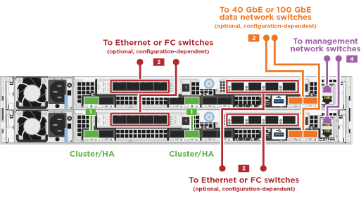
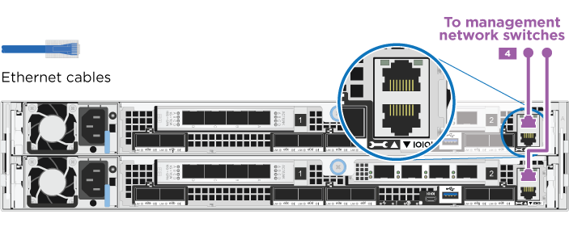

= 詳細指南AFF - VA320
:allow-uri-read: 
:icons: font
:imagesdir: ../media/

[role="lead"]
本指南提供安裝典型NetApp系統的詳細逐步指示。如果您需要更詳細的安裝說明、請使用本指南。

== 準備安裝

若要安裝AFF 您的32位版系統、您必須建立帳戶、註冊系統、並取得授權金鑰。您也需要為系統庫存適當數量和類型的纜線、並收集特定的網路資訊。

您必須能夠存取Hardware Universe 有關站台需求的資訊、以及設定系統的其他資訊。您也可以存取ONTAP 版本的《發行說明》、以取得更多關於此系統的資訊。

https://["NetApp Hardware Universe"]

http://["尋找ONTAP 您版本的更新說明"]

您必須在網站上提供下列資訊：

* 儲存系統的機架空間
* 2號十字螺絲起子
* 其他網路纜線、可將系統連接至網路交換器、筆記型電腦或主控台、並使用網路瀏覽器
* 具備RJ-45連線並可存取網頁瀏覽器的筆記型電腦或主控台
+
.. 打開所有包裝箱的內容物。
.. 從控制器記錄系統序號。
+
image::../media/drw_ssn_label.png[DRw SSN標籤]

.. 設定您的帳戶：
+
... 登入現有帳戶或建立帳戶。
... 註冊您的系統。
+
https://["NetApp產品註冊"]

.. 清點並記下您收到的纜線數量和類型。
+
下表列出您可能會收到的纜線類型。如果您收到的纜線未列於表中、請參閱Hardware Universe 《關於找出纜線並識別其用途的資訊》。

+
https://["NetApp Hardware Universe"]

+
[cols="1,2,1,2"]
|===
| 纜線類型... | 產品編號與長度 | 連接器類型 | 適用於... 

 a| 
100 GbE纜線（QSF（28）
 a| 
X66211A-05（112-00595）、0.5公尺

X66211A-1（112-00573）、1公尺

X66211A-2（112-00574）、2公尺

X66211A-5（112-00574）、5公尺
 a| 
image:../media/oie_cable100_gbe_qsfp28.png[""]
 a| 
儲存設備、叢集互連/HA和乙太網路資料（訂單相依）

 a| 
40 GbE纜線
 a| 
X66211A-1（112-00573）、1公尺；

X66211A-3（112-00543）、3公尺；

X66211A-5（112-00576）、5公尺
 a| 
image:../media/oie_cable_sfp_gbe_copper.png[""]
 a| 
儲存設備、叢集互連/HA和乙太網路資料（訂單相依）

 a| 
乙太網路纜線- MPO
 a| 
X66200-2（112-00326）、2公尺

X66250-5（112-00328）、5公尺

X66250-30（112-00331）、30公尺
 a| 
image:../media/oie_cable_etherned_mpo.png[""]
 a| 
乙太網路纜線（訂單相依）

 a| 
光纖纜線
 a| 
SR：

X6553-R6（112-00188）、2公尺

X654-R6（112-00189）、15公尺

X6537 - R6（112-00091）、30公尺

lr：

X66250-3（112-00342）、2公尺

X66260-5（112-003444）、5公尺

X66260-30（112-00354）、30分鐘
 a| 
image:../media/oie_cable_fiber_lc_connector.png[""]
 a| 
FC組態（訂單相依）

 a| 
RJ-45（訂單相依）
 a| 
X6585-R6（112-00291）、3公尺

X6562-R6（112-00196）、5公尺
 a| 
image:../media/oie_cable_rj45.png[""]
 a| 
管理網路

 a| 
micro-USB主控台纜線
 a| 
不適用
 a| 
image:../media/oie_cable_micro_usb.png[""]
 a| 
如果筆記型電腦或主控台不支援網路探索、則在軟體設定期間使用主控台連線。

 a| 
電源線
 a| 
不適用
 a| 
image:../media/oie_cable_power.png[""]
 a| 
開啟系統電源

|===
.. 下載並完成_Cluster組態工作表_。
+
https://["叢集組態工作表"]

== 安裝硬體

您需要在4柱機架或NetApp系統機櫃中（視情況而定）安裝系統。

. 視需要安裝軌道套件。
. 請依照軌道套件隨附的指示來安裝及固定系統。
+

NOTE: 您必須瞭解與系統重量相關的安全顧慮。

+
image::../media/drw_a320_weight_label.png[DRW A320重量標籤]

. 連接纜線管理裝置（如圖所示）。
+
image::../media/drw_a320_cable_management_arms.png[DRW A320纜線管理臂]

. 將擋板放在系統正面。

== 將控制器纜線連接至您的網路

您可以使用雙節點無交換式叢集方法或使用叢集互連網路、將控制器連接至網路。

=== 選項1：連接雙節點無交換式叢集

控制器模組上的選用資料連接埠、選用NIC卡和管理連接埠、都會連接至交換器。兩個控制器模組上的叢集互連/ HA連接埠均已連接纜線。

您必須聯絡網路管理員、以取得有關將系統連線至交換器的資訊。

請務必檢查圖示箭頭、以瞭解纜線連接器的拉式彈片方向是否正確。

image::../media/oie_cable_pull_tab_up.png[OIE纜線拉片向上]

NOTE: 插入連接器時、您應該會感覺到它卡入到位；如果您沒有感覺到它卡入定位、請將其移除、將其翻轉、然後再試一次。

. 您可以使用圖例或逐步指示來完成控制器與交換器之間的纜線連接：
+

+
[cols="1,2"]
|===
| 步驟 | 在每個控制器模組上執行 

 a| 
image:../media/oie_legend_icon_1_lg.png[""]
 a| 
使用100 GbE（QSFP28）纜線將叢集/ HA連接埠彼此連接：

** e0a至e0a
** e0d至e0dimage:../media/drw_a320_tnsc_cluster_ha_connection_step1a.png[""]

 a| 
image:../media/oie_legend_icon_2_o.png[""]
 a| 
如果您使用內建連接埠進行資料網路連線、請將100GbE或40GbE纜線連接至適當的資料網路交換器：

** e0g和e0小時image:../media/drw_a320_onboard_data_connection_step2.png[""]

 a| 
image:../media/oie_legend_icon_3_dr.png[""]
 a| 
如果您使用NIC卡進行乙太網路或FC連線、請將NIC卡連接至適當的交換器：

image::../media/drw_a320_nic_connections_step3.png[DRW A320 NIC連線步驟3]

 a| 
image:../media/oie_legend_icon_4_lp.png[""]
 a| 
使用RJ45纜線將e0M連接埠連接至管理網路交換器。

 a| 
image:../media/oie_legend_icon_attn_symbol.png[""]
 a| 
此時請勿插入電源線。

|===
. 纜線連接儲存設備： <<將控制器纜線連接至磁碟機櫃>>

=== 選項2：交換式叢集的佈線

控制器模組上的選用資料連接埠、選用NIC卡和管理連接埠、都會連接至交換器。叢集互連/ HA連接埠會連接至叢集/ HA交換器。

您必須聯絡網路管理員、以取得有關將系統連線至交換器的資訊。

請務必檢查圖示箭頭、以瞭解纜線連接器的拉式彈片方向是否正確。

image::../media/oie_cable_pull_tab_up.png[OIE纜線拉片向上]

NOTE: 插入連接器時、您應該會感覺到它卡入到位；如果您沒有感覺到它卡入定位、請將其移除、將其翻轉、然後再試一次。

. 您可以使用圖例或逐步指示來完成控制器與交換器之間的纜線連接：
+
image::../media/drw_a320_switched_network_cabling_composite_animated_GIF.png[DRW A320交換式網路纜線複合式動畫式GIF]

+
[cols="1,3"]
|===
| 步驟 | 在每個控制器模組上執行 

 a| 
image:../media/oie_legend_icon_1_lg.png[""]
 a| 
使用100 GbE（QSFP28）纜線將叢集/ HA連接埠連接至叢集/ HA交換器：

** 將兩個控制器上的e0a連接至叢集/ HA交換器
** 將兩個控制器上的e0d連接至叢集/ HA交換器image:../media/drw_a320_switched_cluster_ha_connection_step1b.png[""]

 a| 
image:../media/oie_legend_icon_2_o.png[""]
 a| 
如果您使用內建連接埠進行資料網路連線、請將100GbE或40GbE纜線連接至適當的資料網路交換器：

** e0g和e0小時image:../media/drw_a320_onboard_data_connection_step2.png[""]

 a| 
image:../media/oie_legend_icon_3_dr.png[""]
 a| 
如果您使用NIC卡進行乙太網路或FC連線、請將NIC卡連接至適當的交換器：

image::../media/drw_a320_nic_connections_step3.png[DRW A320 NIC連線步驟3]

 a| 
image:../media/oie_legend_icon_4_lp.png[""]
 a| 
使用RJ45纜線將e0M連接埠連接至管理網路交換器。

 a| 
image:../media/oie_legend_icon_attn_symbol.png[""]
 a| 
此時請勿插入電源線。

|===
. 纜線連接儲存設備： <<將控制器纜線連接至磁碟機櫃>>

== 將控制器纜線連接至磁碟機櫃

您必須使用內建儲存連接埠將控制器連接至機櫃。

=== 選項1：將控制器連接至單一磁碟機櫃

您必須將每個控制器纜線連接至NS224磁碟機櫃上的NSM模組。

請務必檢查圖示箭頭、以瞭解纜線連接器的拉式彈片方向是否正確。

image::../media/oie_cable_pull_tab_up.png[OIE纜線拉片向上]

NOTE: 插入連接器時、您應該會感覺到它卡入到位；如果您沒有感覺到它卡入定位、請將其移除、將其翻轉、然後再試一次。

. 您可以使用圖例或逐步指示、將控制器連接至單一機櫃。
+
image::../media/drw_a320_single_shelf_connections_animated_gif.png[DRW A320單一機櫃連線動畫Gif]

+
[cols="1,3"]
|===
| 步驟 | 在每個控制器模組上執行 

 a| 
image:../media/oie_legend_icon_1_mb.png[""]
 a| 
將控制器A纜線連接至機櫃 image:../media/drw_a320_storage_cabling_controller_a_single_shelf.png[""]

 a| 

 a| 
將控制器B纜線連接至機櫃： image:../media/drw_a320_storage_cabling_controller_b_single_shelf.png[""]

|===
. 若要完成系統設定、請參閱 <<完成系統設定與組態>>

=== 選項2：將控制器連接至兩個磁碟機櫃

您必須將每個控制器連接至兩個NS224磁碟機櫃上的NSM模組。

請務必檢查圖示箭頭、以瞭解纜線連接器的拉式彈片方向是否正確。

image::../media/oie_cable_pull_tab_up.png[OIE纜線拉片向上]

NOTE: 插入連接器時、您應該會感覺到它卡入到位；如果您沒有感覺到它卡入定位、請將其移除、將其翻轉、然後再試一次。

. 您可以使用下列圖例或書面步驟、將控制器連接至兩個磁碟機櫃。
+
image::../media/drw_a320_2_shevles_cabling_animated_gif.png[DRW A320 2 shevles纜線動畫式Gif]

+
[cols="1-3"]
|===
| 步驟 | 在每個控制器模組上執行 

 a| 
image:../media/oie_legend_icon_1_mb.png[""]
 a| 
將控制器A纜線連接至磁碟櫃： image:../media/drw_a320_2_shelves_cabling_controller_a.png[""]

 a| 

 a| 
將控制器B纜線連接至磁碟櫃： image:../media/drw_a320_2_shelves_cabling_controller_b.png[""]

|===
. 若要完成系統設定、請參閱 <<完成系統設定與組態>>

== 完成系統設定與組態

您只需連線至交換器和筆記型電腦、或直接連線至系統中的控制器、然後連線至管理交換器、即可使用叢集探索功能完成系統設定和組態。

=== 選項1：如果已啟用網路探索、請完成系統設定與組態

如果您的筆記型電腦已啟用網路探索功能、您可以使用自動叢集探索來完成系統設定與組態。

. 將電源線插入控制器電源供應器、然後將電源線連接至不同電路上的電源。
+
系統開始開機。初始開機最多可能需要八分鐘

. 請確定您的筆記型電腦已啟用網路探索功能。
+
如需詳細資訊、請參閱筆記型電腦的線上說明。

. 請使用下列動畫將筆記型電腦連線至管理交換器。
+
.動畫-將筆記型電腦連接到管理交換器
video::d61f983e-f911-4b76-8b3a-ab1b0066909b[panopto]
. 選取ONTAP 列出的功能表圖示以探索：
+
image::../media/drw_autodiscovery_controler_select.png[選擇「自動探索控制器」]

+
.. 開啟檔案總管。
.. 按一下左窗格中的網路。
.. 按一下滑鼠右鍵、然後選取重新整理。
.. 按兩下ONTAP 任一個「資訊」圖示、並接受畫面上顯示的任何憑證。
+

NOTE: XXXXX是目標節點的系統序號。

+
系統管理程式隨即開啟。

. 使用System Manager引導式設定、使用您在《_ NetApp ONTAP 資訊系統組態指南_》中收集的資料來設定您的系統。
+
https://["《組態指南》ONTAP"]

. 執行Config Advisor 下列項目來驗證系統的健全狀況：
. 完成初始組態之後、請前往 https://["S- ONTAP"] 頁面、以取得有關設定ONTAP 其他功能的資訊。

=== 選項2：如果未啟用網路探索、請完成系統設定與組態

如果您的筆記型電腦未啟用網路探索、您必須使用此工作完成組態設定。

. 連接纜線並設定筆記型電腦或主控台：
+
.. 使用N-8-1將筆記型電腦或主控台的主控台連接埠設為115200鮑。
+

NOTE: 請參閱筆記型電腦或主控台的線上說明、瞭解如何設定主控台連接埠。

.. 使用系統隨附的主控台纜線將主控台纜線連接至筆記型電腦或主控台、然後將筆記型電腦連接至管理子網路上的管理交換器。
+
image::../media/drw_a320_laptop_to_switch_and_controller.png[切換與控制器的DRW A320筆記型電腦]

.. 使用管理子網路上的TCP/IP位址指派給筆記型電腦或主控台。

. 請使用下列動畫來設定一或多個磁碟機櫃ID：
+
.動畫-設定磁碟機櫃ID
video::c600f366-4d30-481a-89d9-ab1b0066589b[panopto]
. 將電源線插入控制器電源供應器、然後將電源線連接至不同電路上的電源。
+
系統開始開機。初始開機最多可能需要八分鐘

. 將初始節點管理IP位址指派給其中一個節點。
+
[cols="1,3"]
|===
| 如果管理網路有DHCP ... | 然後... 

 a| 
已設定
 a| 
記錄指派給新控制器的IP位址。

 a| 
未設定
 a| 
.. 使用Putty、終端機伺服器或您環境的等效產品來開啟主控台工作階段。
+

NOTE: 如果您不知道如何設定Putty、請查看筆記型電腦或主控台的線上說明。

.. 在指令碼提示時輸入管理IP位址。

|===
. 使用筆記型電腦或主控台上的System Manager來設定叢集：
+
.. 將瀏覽器指向節點管理IP位址。
+

NOTE: 地址格式為+https://x.x.x.x+。

.. 使用您在《NetApp ONTAP 產品介紹》指南中收集的資料來設定系統。
+
https://["《組態指南》ONTAP"]

. 執行Config Advisor 下列項目來驗證系統的健全狀況：
. 完成初始組態之後、請前往 https://["S- ONTAP"] 頁面、以取得有關設定ONTAP 其他功能的資訊。

