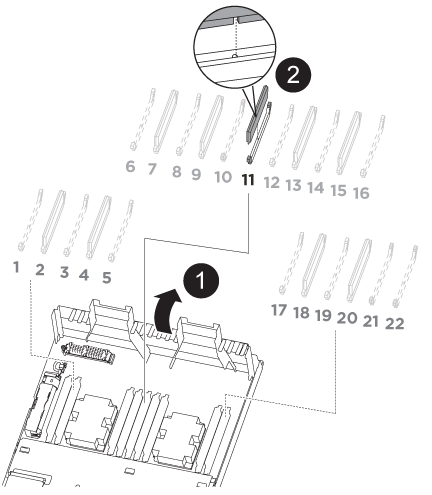

= 更換NVDIMM AFF - NVM-A320
:allow-uri-read: 
:icons: font
:imagesdir: ../media/

[role="lead"]
當系統登錄快閃存壽命即將結束、或辨識出的NVDIMM一般狀況不正常時、您必須更換控制器模組中的NVDIMM；否則會造成系統恐慌。

系統中的所有其他元件都必須正常運作；否則、您必須聯絡技術支援部門。

您必須使用從供應商處收到的替換FRU元件來更換故障元件。

== 步驟1：關閉受損的控制器

[role="lead"]
若要關閉受損的控制器、您必須判斷控制器的狀態、並在必要時接管控制器、以便健全的控制器繼續從受損的控制器儲存設備提供資料。

.關於這項工作
* 如果您使用NetApp儲存加密、則必須依照《NetApp ONTAP 加密電源指南》_的「將SED恢復為未受保護模式」一節中的指示、重設MSID。
+
https://docs.netapp.com/ontap-9/topic/com.netapp.doc.pow-nve/home.html["《NetApp加密電源指南》（英文）ONTAP"]

* 如果您使用SAN系統、則必須檢查受損控制器SCSI刀鋒的事件訊息（事件記錄顯示）。
+
每個SCSI刀鋒處理序都應與叢集中的其他節點處於仲裁狀態。任何問題都必須先解決、才能繼續進行更換。

* 如果叢集有兩個以上的節點、則叢集必須處於仲裁狀態。如果叢集未達到法定人數、或健全的控制器顯示為「假」、表示符合資格和健全狀況、則您必須在關閉受損的控制器之前修正問題；請參閱 link:https://docs.netapp.com/us-en/ontap/system-admin/index.html["使用CLI進行系統管理總覽"^]。
* 如果您使用MetroCluster 的是功能不全的組態、則必須確認MetroCluster 已設定「功能不全」狀態、且節點處於啟用且正常的狀態（「MetroCluster 功能不全」）。

.步驟
. 如果啟用了此功能、請叫用下列訊息來抑制自動建立案例：「System Node現象叫用節點*-type all -Message MAn=number_of_hs_Downh」AutoSupport AutoSupport AutoSupport
+
下列AutoSupport 資訊不顯示自動建立案例兩小時的訊息：「cluster1：*>系統節點AutoSupport 、叫用節點*-輸入ALL -Message MAn=2h」

. 停用健全控制器主控台的自動恢復功能：「torage容錯移轉修改–節點本機-自動恢復錯誤」
. 將受損的控制器移至載入器提示：
+
[cols="1,2"]
|===
| 如果受損的控制器正在顯示... | 然後... 

 a| 
載入程式提示
 a| 
移至「移除控制器模組」。

 a| 
正在等待恢復...
 a| 
按Ctrl-C、然後在出現提示時回應「y」。

 a| 
系統提示或密碼提示（輸入系統密碼）
 a| 
從正常控制器接管或停止受損的控制器：「torage容錯移轉接管-節點_受損節點_節點名稱_」

當受損的控制器顯示正在等待恢復...時、請按Ctrl-C、然後回應「y」。

|===

== 步驟2：移除控制器模組

[role="lead"]
若要存取控制器模組內部的元件、您必須從機箱中移除控制器模組。

. 如果您尚未接地、請正確接地。
. 從電源拔下控制器模組的電源供應器。
. 解開將纜線綁定至纜線管理裝置的掛勾和迴圈帶、然後從控制器模組拔下系統纜線和SFP（如有需要）、並追蹤纜線的連接位置。
+
image::../media/drw_a320_cable_management_arms.png[DRW A320纜線管理臂]

+
將纜線留在纜線管理裝置中、以便在重新安裝纜線管理裝置時、整理好纜線。

. 從控制器模組的左側和右側移除纜線管理裝置、並將其放在一邊。
. 從機箱中取出控制器模組：
+
image::../media/drw_a320_controller_remove_animated_gif.png[DRW A320控制器移除動畫Gif]

+
.. 將您的指夾插入控制器模組兩側的鎖定機制。
.. 按下鎖定機制頂端的橘色彈片、直到它清除機箱上的鎖定銷為止。

+
鎖定機制掛勾應幾乎垂直、且應遠離機箱插銷。

+
.. 將控制器模組往您的方向輕拉幾英吋、以便抓住控制器模組的兩側。
.. 用兩隻手將控制器模組從機箱中輕拉出、然後放在平穩的表面上。

== 步驟3：更換NVDIMM

[role="lead"]
若要更換NVDIMM、您必須使用通風管頂端的NVDIMM對應標籤、或使用NVDIMM旁的LED來定位NVDIMM、然後依照特定步驟順序加以更換。

NOTE: 當您停止系統時、NVDIMM LED會在減少內容時閃爍。完成轉出後、LED會關閉。

. 打開通風管、然後在控制器模組的插槽11中找到NVDIMM。
+

NOTE: NVDIMM的外觀與系統DIMM大不相同。

. 請注意NVDIMM在插槽中的方向、以便將NVDIMM以適當的方向插入替換控制器模組。
. 將NVDIMM從插槽中退出、方法是緩慢地將NVDIMM兩側的兩個NVDIMM彈出彈片分開、然後將NVDIMM從插槽中滑出並放在一邊。
+

NOTE: 小心拿住NVDIMM的邊緣、避免對NVDIMM電路板上的元件施加壓力。

. 從防靜電包裝袋中取出更換的NVDIMM、拿住NVDIMM的邊角、然後將其對準插槽。
+
NVDIMM插針的槽口應與插槽的卡舌對齊。

. 找到要安裝NVDIMM的插槽。
. 將NVDIMM正面插入插槽。
+
NVDIMM可緊密裝入插槽、但應能輕鬆放入。如果沒有、請重新將NVDIMM與插槽對齊、然後重新插入。

+

NOTE: 目視檢查NVDIMM、確認其已平均對齊並完全插入插槽。

. 小心但穩固地推入NVDIMM頂端邊緣、直到彈出彈片卡入NVDIMM末端的槽口。
. 關閉通風管。

== 步驟4：安裝控制器模組

[role="lead"]
在控制器模組中更換元件之後、您必須將控制器模組重新安裝到機箱中、然後將其開機至維護模式。

. 如果您尚未這麼做、請關閉控制器模組後端的通風管、然後將護蓋重新安裝到PCIe卡上。
. 將控制器模組的一端與機箱的開口對齊、然後將控制器模組輕推至系統的一半。
+

NOTE: 在指示之前、請勿將控制器模組完全插入機箱。

. 僅連接管理連接埠和主控台連接埠、以便存取系統以執行下列各節中的工作。
+

NOTE: 您將在本程序稍後將其餘纜線連接至控制器模組。

. 完成控制器模組的重新安裝：
+
.. 確定鎖銷臂鎖定在延伸位置。
.. 使用栓鎖臂、將控制器模組推入機箱支架、直到停止為止。
.. 按住鎖定機制頂端的橘色彈片。
.. 將控制器模組輕推入機箱支架、直到與機箱邊緣齊平為止。
+

NOTE: 鎖定機制臂滑入機箱。

+
控制器模組一旦完全插入機箱、就會開始開機。

.. 釋放栓鎖、將控制器模組鎖定到位。
.. 重新接上電源供應器。
.. 如果您尚未重新安裝纜線管理裝置、請重新安裝。
.. 按下「Ctrl-C」來中斷正常開機程序。

== 步驟5：執行診斷

[role="lead"]
更換系統中的NVDIMM之後、您應該對該元件執行診斷測試。

您的系統必須處於載入器提示狀態、才能開始診斷。

診斷程序中的所有命令都是由要更換元件的控制器發出。

. 如果要服務的控制器未出現在載入程式提示下、請重新啟動控制器：「ystem nodem halt -node_name」（系統節點停止節點節點節點名稱）
+
發出命令之後、您應該等到系統在載入程式提示字元停止。

. 在載入程式提示字元下、存取專為系統層級診斷所設計的特殊驅動程式、以正常運作：「boot_diags'（boot_diags'）
. 從顯示的功能表中選取*掃描系統*、即可執行診斷測試。
. 從顯示的功能表中選取*測試記憶體*。
. 從顯示的功能表中選取* NVDIMM Test*。
. 根據上述步驟的結果繼續進行：
+
** 如果測試失敗、請修正故障、然後重新執行測試。
** 如果測試報告無故障、請從功能表中選取重新開機、以重新啟動系統。

== 步驟6：執行診斷後、將控制器模組還原至運作狀態

[role="lead"]
完成診斷之後、您必須重新啟動系統、歸還控制器模組、然後重新啟用自動恢復功能。

. 視需要重新安裝系統。
+
如果您移除媒體轉換器（QSFP或SFP）、請記得在使用光纖纜線時重新安裝。

. 將控制器恢復正常運作、方法是歸還儲存設備：「torage容錯移轉恢復-ofnode_disapped_node_name_」
. 如果停用自動還原、請重新啟用：「儲存容錯移轉修改節點本機-自動恢復true」

== 步驟7：將故障零件歸還給NetApp

[role="lead"]
如套件隨附的RMA指示所述、將故障零件退回NetApp。請參閱 https://mysupport.netapp.com/site/info/rma["產品退貨安培；更換"] 頁面以取得更多資訊。
