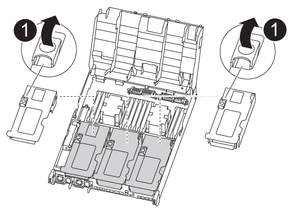
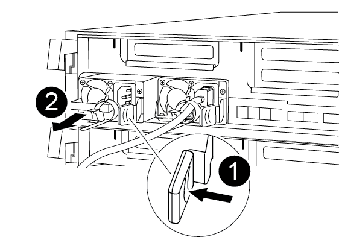

= 更換控制器模組硬體AFF - REVA400
:allow-uri-read: 
:icons: font
:imagesdir: ../media/

[role="lead"]
若要更換控制器模組硬體、您必須移除受損的控制器、將FRU元件移至更換的控制器模組、在機箱中安裝更換的控制器模組、然後將系統開機至維護模式。

== 步驟1：移除控制器模組

若要存取控制器模組內部的元件、您必須從機箱中移除控制器模組。

您可以使用下列、圖例或書面步驟、從機箱中移除控制器模組。

.動畫-移除控制器模組
video::ca74d345-e213-4390-a599-aae10019ec82[panopto]
. 如果您尚未接地、請正確接地。
. 釋放電源線固定器、然後從電源供應器拔下纜線。
. 解開將纜線綁定至纜線管理裝置的掛勾和迴圈帶、然後從控制器模組拔下系統纜線和SFP（如有需要）、並追蹤纜線的連接位置。
+
將纜線留在纜線管理裝置中、以便在重新安裝纜線管理裝置時、整理好纜線。

. 從控制器模組中取出纜線管理裝置、然後將其放在一旁。
. 向下按兩個鎖定栓、然後同時向下轉動兩個鎖條。
+
控制器模組會稍微移出機箱。

+
image:../media/drw_A400_Remove_controller.png[""]

+
[cols="10,90"]
|===

 a| 
image:../media/legend_icon_01.png["編號 1"]
 a| 
鎖定鎖條

 a| 
image:../media/legend_icon_02.png["編號 2"]
| 控制器稍微移出機箱 
|===
. 將控制器模組滑出機箱。
+
將控制器模組滑出機箱時、請確定您支援控制器模組的底部。

. 將控制器模組放在穩固的平面上。
. 在更換的控制器模組上、開啟通風管、並使用動畫、圖例或書面步驟、從控制器模組中移除空的擴充卡：
+
.動畫-從更換的控制器模組中移除空的擴充卡
video::49053752-e813-4c15-a917-ab190147fa6e[panopto]

[cols="10,90"]
|===

 a| 
image:../media/legend_icon_01.png["編號 1"]
 a| 
提升板釋放閂鎖

|===
. 將通風管側邊的鎖定彈片朝控制器模組中央按下。
. 將通風管朝控制器模組背面滑入、然後將其向上旋轉至完全開啟的位置。
. 向上轉動提升板1左側的提升板鎖定栓、並朝通風管方向轉動、將提升板向上提起、然後將其放在一邊。
. 對其餘的擴充卡重複上述步驟。

== 步驟2：搬移電源供應器

更換控制器模組時、您必須將電源供應器從受損的控制器模組移至更換的控制器模組。

您可以使用下列動畫、圖例或書面步驟、將電源供應器移至更換的控制器模組。

.動畫-移動電源供應器
video::92060115-1967-475b-b517-aad9012f130c[panopto]
. 移除電源供應器：
+

+
[cols="10,90"]
|===

 a| 
image:../media/legend_icon_01.png["編號 1"]
 a| 
PSU 鎖定彈片

 a| 
image:../media/legend_icon_02.png["編號 2"]
 a| 
電源線固定器

|===
+
.. 旋轉CAM握把、以便將電源供應器從機箱中拉出。
.. 按下藍色鎖定彈片、從機箱中釋放電源供應器。
.. 用兩隻手將電源供應器從機箱中拉出、然後放在一旁。

. 將電源供應器移至新的控制器模組、然後安裝。
. 用兩隻手支撐電源供應器的邊緣、並將其與控制器模組的開口對齊、然後將電源供應器輕推入控制器模組、直到鎖定彈片卡入定位。
+
電源供應器只能與內部連接器正確接合、並以一種方式鎖定到位。

+

NOTE: 為避免損壞內部連接器、請勿在將電源供應器滑入系統時過度施力。

. 針對任何剩餘的電源供應器、重複上述步驟。

== 步驟3：移動NVDIMM電池

若要將NVDIMM電池從受損的控制器模組移至更換的控制器模組、您必須執行特定的步驟順序。

您可以使用下列動畫、圖例或書面步驟、將NVDIMM電池從受損的控制器模組移至更換的控制器模組。

.動畫-移動NVDIMM電池
video::94d115b2-b02a-4234-805c-aad9012f204c[panopto]
image::../media/drw_A400_nvdimm-batt.png[DRW A400 NVDIMM電池]

[cols="10,90"]
|===

 a| 
image:../media/legend_icon_01.png["編號 1"]
 a| 
NVDIMM電池插塞

 a| 
image:../media/legend_icon_02.png["編號 2"]
 a| 
NVDIMM 電池鎖定彈片

 a| 
image:../media/legend_icon_03.png["編號 3"]
 a| 
NVDIMM電池

|===
. 打開通風管：
+
.. 將通風管側邊的鎖定彈片朝控制器模組中央按下。
.. 將通風管朝控制器模組背面滑入、然後將其向上旋轉至完全開啟的位置。

. 在控制器模組中找到NVDIMM電池。
. 找到電池插塞、並將電池插塞正面的固定夾壓下、以從插槽釋放插塞、然後從插槽拔下電池纜線。
. 抓住電池並按下標有「推」的藍色鎖定彈片、然後將電池從電池座和控制器模組中取出。
. 將電池移至更換的控制器模組。
. 將電池模組與電池的開孔對齊、然後將電池輕推入插槽、直到卡入定位。
+

NOTE: 請勿將電池纜線插回主機板、直到接到指示為止。

== 步驟4：移動開機媒體

您必須找到開機媒體、然後依照指示將其從受損的控制器模組中移除、並將其插入更換的控制器模組。

您可以使用下列動畫、圖例或書面步驟、將開機媒體從受損的控制器模組移至更換的控制器模組。

.動畫-移動開機媒體
video::2a14099c-85de-4a84-867c-aad9012efac8[panopto]
image::../media/drw_A400_Replace-boot_media.png[DRW A400更換開機媒體]

[cols="10,90"]
|===

 a| 
image:../media/legend_icon_01.png["編號 1"]
 a| 
開機媒體鎖定標籤

 a| 
image:../media/legend_icon_02.png["編號 2"]
 a| 
開機媒體

|===
. 從控制器模組中找出並移除開機媒體：
+
.. 按下開機媒體末端的藍色按鈕、直到開機媒體的邊緣清除藍色按鈕為止。
.. 向上轉動開機媒體、然後將開機媒體從插槽中輕拉出。

. 將開機媒體移至新的控制器模組、將開機媒體邊緣對齊插槽外殼、然後將其輕推入插槽。
. 檢查開機媒體、確定其完全正確地插入插槽中。
+
如有必要、請取出開機媒體並將其重新插入插槽。

. 將開機媒體鎖定到位：
+
.. 將開機媒體向下旋轉至主機板。
.. 按下藍色鎖定按鈕、使其處於開啟位置。
.. 用藍色按鈕將手指放在開機媒體的末端、然後將開機媒體末端穩固地向下推、以啟用藍色鎖定按鈕。

== 步驟5：移動PCIe擴充卡和夾層卡

在控制器更換程序中、您必須將PCIe擴充卡和夾層卡從受損的控制器模組移至更換的控制器模組。

您可以使用下列動畫、圖例或書面步驟、將PCIe擴充卡和夾層卡從受損的控制器模組移至更換的控制器模組。

移動PCIe擴充卡1和2（左和中擴充卡）：

.動畫-移動PCI擴充卡1和2
video::f4ee1d4d-6029-4fe6-a063-aad9012f170b[panopto]
移動夾層卡和擴充卡3（右擴充卡）：

.動畫-移動夾層卡和擴充卡3
video::b0c3b575-3434-4e00-a421-aad9012f2e9e[panopto]
image::../media/drw_A400_Replace-PCIe-cards.png[DRW A400取代PCIe卡]

[cols="10,90"]
|===

 a| 
image:../media/legend_icon_01.png["編號 1"]
 a| 
提升板鎖定鎖定

 a| 
image:../media/legend_icon_02.png["編號 2"]
 a| 
PCI 卡鎖定閂鎖

 a| 
image:../media/legend_icon_03.png["編號 3"]
 a| 
PCI 鎖定板

 a| 
image:../media/legend_icon_04.png["編號 4."]
 a| 
PCI 卡

|===
. 將PCIe擴充卡從受損的控制器模組移至更換的控制器模組：
+
.. 移除PCIe卡中的任何SFP或QSFP模組。
.. 向上轉動提升板左側的提升板鎖定栓、並朝通風管方向轉動。
+
提升板會從控制器模組稍微向上提升。

.. 向上提起提升板、然後將其移至更換的控制器模組。
.. 將擴充卡與擴充卡插槽的針腳對齊、將擴充卡向下壓到針腳上、將擴充卡正面推入主機板上的插槽、然後將鎖扣向下轉動、使其與擴充卡上的金屬板齊平。
.. 對第2個提升板重複此步驟。

. 移除3號擴充卡、移除夾層卡、並將兩者安裝至更換的控制器模組：
+
.. 移除PCIe卡中的任何SFP或QSFP模組。
.. 向上轉動提升板左側的提升板鎖定栓、並朝通風管方向轉動。
+
提升板會從控制器模組稍微向上提升。

.. 將擴充卡向上提起、然後將其放在穩固的平面上。
.. 旋鬆夾層卡上的指旋螺絲、然後將插卡從插槽中直接輕拉出、然後將其移至更換的控制器模組。
.. 在更換的控制器中安裝夾層、並使用指旋螺絲加以固定。
.. 在更換的控制器模組中安裝第三個擴充卡。

== 步驟6：移動DIMM

您需要找到DIMM、然後將其從受損的控制器模組移至更換的控制器模組。

您必須準備好新的控制器模組、以便將DIMM直接從受損的控制器模組移至更換控制器模組的對應插槽。

您可以使用下列動畫、圖例或書面步驟、將受損的控制器模組中的DIMM移至更換的控制器模組。

.動畫-移動DIMM
video::717b52fa-f236-4f3d-b07d-aad9012f51a3[panopto]
image::../media/drw_A400_Replace-NVDIMM-DIMM.png[DRW A400更換NVDIMM DIMM]

[cols="10,90"]
|===

 a| 
image:../media/legend_icon_01.png["編號 1"]
 a| 
DIMM 鎖定彈片

 a| 
image:../media/legend_icon_02.png["編號 2"]
 a| 
DIMM

 a| 
image:../media/legend_icon_03.png["編號 3"]
 a| 
DIMM 插槽

|===
. 找到控制器模組上的DIMM。
. 請注意插槽中的DIMM方向、以便您以適當的方向將DIMM插入更換的控制器模組。
. 確認NVDIMM電池未插入新的控制器模組。
. 將DIMM從受損的控制器模組移至更換的控制器模組：
+

NOTE: 請務必將每個DIMM安裝在受損控制器模組中所佔用的相同插槽中。

+
.. 緩慢地將DIMM兩側的DIMM彈出彈片分開、然後將DIMM從插槽中滑出、藉此將DIMM從插槽中退出。
+

NOTE: 小心拿住DIMM的邊緣、避免對DIMM電路板上的元件施加壓力。

.. 在更換的控制器模組上找到對應的DIMM插槽。
.. 確定DIMM插槽上的DIMM彈出彈片處於開啟位置、然後將DIMM正面插入插槽。
+
DIMM可緊密裝入插槽、但應能輕鬆裝入。如果沒有、請重新將DIMM與插槽對齊、然後重新插入。

.. 目視檢查DIMM、確認其對齊並完全插入插槽。
.. 對其餘的DIMM重複這些子步驟。

. 將NVDIMM電池插入主機板。
+
請確定插頭鎖定在控制器模組上。

== 步驟7：安裝控制器模組

將所有元件從受損的控制器模組移至更換的控制器模組之後、您必須將更換的控制器模組安裝到機箱中、然後將其開機至維護模式。

您可以使用下列動畫、圖例或書面步驟、在機箱中安裝更換的控制器模組。

.動畫-安裝控制器模組
video::0310fe80-b129-4685-8fef-ab19010e720a[panopto]
image::../media/drw_A400_Install_controller_source.png[DRW A400安裝控制器來源]

[cols="10,90"]
|===

 a| 
image:../media/legend_icon_01.png["編號 1"]
 a| 
控制器模組

 a| 
image:../media/legend_icon_02.png["編號 2"]
 a| 
控制器鎖定閂鎖

|===
. 如果您尚未這麼做、請關閉通風管。
. 將控制器模組的一端與機箱的開口對齊、然後將控制器模組輕推至系統的一半。
+

NOTE: 在指示之前、請勿將控制器模組完全插入機箱。

. 僅連接管理連接埠和主控台連接埠、以便存取系統以執行下列各節中的工作。
+

NOTE: 您將在本程序稍後將其餘纜線連接至控制器模組。

. 完成控制器模組的安裝：
+
.. 將電源線插入電源供應器、重新安裝電源線鎖環、然後將電源供應器連接至電源。
.. 使用鎖定鎖條、將控制器模組穩固地推入機箱、直到鎖定鎖條開始上升。
+

NOTE: 將控制器模組滑入機箱時、請勿過度施力、以免損壞連接器。

.. 將鎖定鎖條向上轉動、將鎖定鎖條向內傾、使其脫離鎖定插銷、將控制器推入到底、然後將鎖定鎖條向下推入鎖定位置、以將控制器模組完全裝入機箱。
+
控制器模組一旦完全插入機箱、就會開始開機。準備好中斷開機程序。

.. 如果您尚未重新安裝纜線管理裝置、請重新安裝。
.. 中斷正常開機程序、然後按「Ctrl-C」開機至載入器。
+

NOTE: 如果系統在開機功能表停止、請選取開機至載入器選項。

.. 在載入程式提示下、輸入「bye」重新初始化PCIe卡和其他元件。
.. 中斷開機程序、然後按「Ctrl-C」開機至載入器提示字元。
+
如果系統在開機功能表停止、請選取開機至載入器選項。

