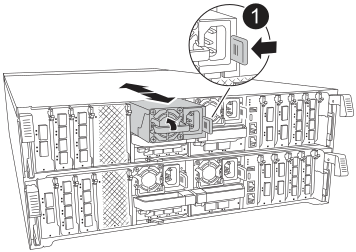

= 更換機箱 - AFF A70 和 AFF A90
:allow-uri-read: 
:icons: font
:imagesdir: ../media/

[role="lead"]
如果需要硬體故障，請更換 AFF A70 或 AFF A90 系統的機箱。更換程序包括移除控制器和電源供應器（ PSU ），移除磁碟機，安裝替換機箱，以及重新安裝機箱元件。

== 步驟 1 ：取下 PSU 和纜線

在卸下控制器之前，您必須先移除四個電源供應器（ PSU ），每個控制器兩個。移除它們可減輕每個控制器的整體重量。

.步驟
. 取下四個 PSU ：
+
.. 如果您尚未接地、請正確接地。
.. 從控制器模組 PSU 拔下電源線。
+
如果您的系統有直流電源、請從 PSU 拔下電源區塊。

.. 將 PSU 把手向上旋轉，以便將 PSU 拉出，按下 PSU 鎖定彈片，然後將 PSU 從控制器模組中拉出，以從控制器中移除 PSU 。
+

CAUTION: PSU很短。從控制器模組中取出時、請務必用兩隻手支撐、以免突然從控制器模組中迴轉而造成傷害。

+

+
[cols="1,4"]
|===

 a| 
image:../media/icon_round_1.png["編號 1"]
 a| 
Terracotta PSU 鎖定標籤

|===
.. 對其餘 PSU 重複這些步驟。

. 拔下纜線：
+
.. 從控制器模組拔下系統纜線，以及任何 SFP 和 QSFP 模組（如有需要），但將其留在纜線管理裝置中，以保持其井然有序。
+

NOTE: 在本程序開始時，纜線應已貼上標籤。

.. 從控制器模組中取出纜線管理裝置，並將其放在一邊。

== 步驟 2 ：卸下控制器模組和磁碟機

從機箱中卸下控制器，然後從機箱中卸下驅動器。

.步驟
. 檢查每個控制器模組背面插槽 4/5 中的琥珀色 NVRAM 狀態 LED 是否熄滅。尋找 NV 圖示。
+
image::../media/drw_a1K-70-90_nvram-led_ieops-1463.svg[NVRAM 注意與狀態 LED 位置圖]

+
[cols="1,4"]
|===

 a| 
image:../media/icon_round_1.png["編號 1"]
 a| 
NVRAM 狀態 LED

 a| 
image:../media/icon_round_2.png["編號 2"]
 a| 
NVRAM 注意 LED

|===
+
** 如果 NVRAM LED 熄滅、請前往下一步。
** 如果 NVRAM LED 閃爍、請等待閃爍停止。如果持續閃爍超過 5 分鐘，請聯絡 http://mysupport.netapp.com/["NetApp 支援網站"^]尋求協助。

. 卸下控制器模組：
+
.. 按下控制器上的兩個鎖定閂鎖，然後同時向下旋轉兩個閂鎖。
+
控制器模組會稍微移出機箱。

+
image::../media/drw_a70-90_pcm_remove_replace_ieops-1365.svg[控制器移除圖形]

+
[cols="1,4"]
|===

 a| 
image:../media/icon_round_1.png["編號 1"]
 a| 
鎖定鎖定

 a| 
image:../media/icon_round_2.png["編號 2"]
 a| 
鎖定銷

|===
.. 使用鎖定閂鎖將控制器模組滑出機箱，然後將其放在平坦穩固的表面上。
+
將控制器模組滑出機箱時、請確定您支援控制器模組的底部。

.. 對第二個控制器模組重複這些步驟。

. 移除磁碟機：
+
.. 從系統正面輕移擋板。
.. 按下 LED 下方磁碟機承載器頂端的釋放按鈕。
.. 將CAM握把拉到完全開啟的位置、以從中間板中取出磁碟機、然後將磁碟機從機箱中輕推。
+
磁碟機應從機箱中鬆脫、使其可從機箱中滑出。

+

NOTE: 磁碟機很脆弱。移除磁碟機時，請務必用雙手支撐磁碟機重量，以避免磁碟機受損。

.. 請追蹤每個磁碟機所在的磁碟機支架，並將磁碟機放在一旁的無靜電推車或桌子上。
.. 對機箱中的其餘磁碟機重複此步驟。

== 步驟 3 ：更換損壞的機箱

取下受損的機箱，然後安裝替換機箱。

.步驟
. 取下受損的機箱：
+
.. 從機箱安裝點卸下螺絲。
.. 使用兩個人或一部電梯，將受損的機箱滑出系統機櫃或設備機架的機架軌道，然後將其放在一邊。

. 安裝替換機箱：
+
.. 使用兩個人或舉升設備，將替換機箱安裝到設備機架或系統機櫃中，方法是引導機箱安裝到系統機櫃或設備機架的機架軌道上。
.. 將機箱完全滑入設備機架或系統機櫃。
.. 使用您從受損機箱中卸下的螺絲、將機箱正面固定至設備機架或系統機櫃。

== 步驟 4 ：安裝機箱元件

安裝替換機箱之後，您需要安裝控制器模組，重新安裝它們，然後重新安裝磁碟機和 PSU 。

.步驟
. 從底部控制器模組開始，將控制器模組安裝在替換機箱中：
+
.. 將控制器模組的末端對準機箱的開口、然後將控制器輕輕推入機箱。
.. 將鎖定閂向上旋轉至鎖定位置。
.. 如果您尚未重新安裝纜線管理裝置、請重新安裝控制器。
+
如果您移除媒體轉換器（ QSFP 或 SFP ），請記得重新安裝。

+
請確定纜線已連接，並參照纜線標籤。

. 將磁碟機重新安裝到機箱正面對應的磁碟機支架中。
. 安裝全部四個 PSU ：
+
.. 用手支撐PSU的邊緣、並將其與控制器模組的開口對齊。
.. 將PSU輕推入控制器模組、直到鎖定彈片卡入定位。
+
電源供應器只能與內部連接器正確接合、並以一種方式鎖定到位。

+

NOTE: 為避免損壞內部連接器、請勿在將PSU滑入系統時過度施力。

. 將 PSU 電源線重新連接至所有四個 PSU 。
+
.. 使用電源線固定器將電源線固定至PSU。
+
如果您有直流電源，請在控制器模組完全插入機箱後，將電源區塊重新連接至電源供應器，並使用指旋螺絲將電源線固定至 PSU 。

+
一旦安裝 PSU 並恢復電源，控制器模組就會開始開機。

.接下來呢？
更換損壞的 AFF A70 或 AFF A90 機箱並將元件重新安裝到其中之後link:chassis-replace-complete-system-restore-rma.html["完成機箱更換"]，您需要。
