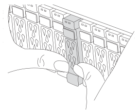

= 移動並更換硬體 - AFF A70 、 AFF A90
:allow-uri-read: 
:icons: font
:imagesdir: ../media/

[role="lead"]
將電源供應器、硬碟機和控制器模組從損壞的機箱移至新機箱、然後將損壞的機箱換成與損壞的機箱相同機型的新機箱。

== 步驟1：移除控制器模組

更換控制器模組或更換控制器模組內部的元件時、您必須從機箱中移除控制器模組。

. 在機箱正面、用您的拇指將每個磁碟機穩固推入、直到您感覺到有正面的停止為止。如此可確保磁碟機穩固地安裝在機箱中板上。
+

. 檢查故障控制器模組背面插槽 4/5 中的琥珀色 NVRAM 狀態 LED 是否熄滅。尋找 NV 圖示。
+
image::../media/drw_a1K-70-90_nvram-led_ieops-1463.svg[NVRAM 注意與狀態 LED 位置圖]

+
[cols="1,4"]
|===

 a| 
image:../media/legend_icon_01.svg["編號 1 、寬度 = 30px"]
 a| 
NVRAM 狀態 LED

 a| 
image:../media/legend_icon_02.svg["編號 1 、寬度 = 30px"]
 a| 
NVRAM 注意 LED

|===
+

NOTE: 如果 NVRAM 狀態 LED 閃爍、可能表示控制器模組未正確接管或停止（未認可的資料）。如果合作夥伴控制器模組未成功接管受損的控制器模組、請先聯絡 https://mysupport.netapp.com/site/global/dashboard["NetApp支援"] 、再繼續執行此程序。

+
故障控制器模組上 NVRAM 狀態 LED 的一般行為如下：

+
** 從控制器模組拔下電源、儲存系統處於「等待恢復」狀態、或控制器模組未正確接管或停止（未認可的資料）時、 NVRAM 狀態 LED 會閃爍。
** 從機箱中移除控制器模組時、 NVRAM 狀態 LED 會閃爍、表示控制器模組未正確接管或停止（未認可的資料）。確認已由合作夥伴控制器模組完全接管控制器模組、或顯示受損控制器模組 `waiting for giveback`。然後、閃爍的 LED 會被忽略（控制器模組可從機箱中移除）。

. 如果您尚未接地、請正確接地。
. 從控制器模組電源供應器（ PSU ）拔下控制器模組電源供應器纜線。
+

NOTE: 如果您的系統有直流電源、請從 PSU 拔下電源區塊。

. 從控制器模組拔下系統纜線、 SFP 和 QSFP 模組（如有需要）、並追蹤纜線的連接位置。
+
將纜線留在纜線管理裝置中、以便在重新安裝纜線管理裝置時、整理好纜線。

. 從控制器模組中取出纜線管理裝置。
. 向下按兩個鎖定栓、然後同時向下轉動兩個鎖條。
+
控制器模組會稍微移出機箱。

+
image::../media/drw_a70-90_pcm_remove_replace_ieops-1365.svg[控制器移除圖形]

+
[cols="1,4"]
|===

 a| 
image:../media/legend_icon_01.svg["編號 1 、寬度 = 30px"]
| A 鎖定閂鎖 

 a| 
image:../media/legend_icon_02.svg["編號 2 、寬度 =30px"]
 a| 
鎖定銷

|===
. 將控制器模組滑出機箱、然後放在平穩的表面上。
+
將控制器模組滑出機箱時、請確定您支援控制器模組的底部。

. 對機箱中的其他控制器模組重複這些步驟。

== 步驟2：將磁碟機移至新機箱

您需要將磁碟機從舊機箱中的每個機箱插槽孔移至新機箱中的同一個機箱插槽孔。

. 從系統正面輕移擋板。
. 移除磁碟機：
+
.. 按下LED下方托架正面頂端的釋放按鈕。
.. 將CAM握把拉到完全開啟的位置、以從中間板中取出磁碟機、然後將磁碟機從機箱中輕推。
+
磁碟機應從機箱中鬆脫、使其可從機箱中滑出。

+

NOTE: 移除磁碟機時、請務必用兩隻手支撐其重量。

+

NOTE: 磁碟機很脆弱。請儘量少處理這些問題、以避免對其造成損害。

. 請追蹤每個磁碟機的磁碟機支架、並將磁碟機放在一旁的無靜電推車或桌子上。

== 步驟 3 ：從設備機架或系統機櫃內更換機箱

您必須先從設備機架或系統機櫃中移除現有機箱、才能安裝替換機箱。

. 從機箱安裝點卸下螺絲。
. 兩人一起將舊機箱從系統機櫃或設備機架的機架軌道滑出、然後放在一旁。
. 請由兩個人將替換機箱裝入設備機架或系統機櫃、方法是將機箱引導至系統機櫃或設備機架的機架軌道。
. 將機箱完全滑入設備機架或系統機櫃。
. 使用您從舊機箱中取出的螺絲、將機箱正面固定在設備機架或系統機櫃上。
. 將舊機箱中的磁碟機安裝到替換機箱中：
+
.. 將舊機箱中的磁碟機與新機箱中的相同支架孔對齊。

. 將磁碟機輕推入機箱、使其儘可能遠。
+
CAM握把會接合並開始向上旋轉。

+
.. 將磁碟機的其餘部分穩固地推入機箱、然後將 CAM 把手向上推並推到磁碟機承載器上、以鎖定它。
+
請務必緩慢關閉CAM握把、使其與磁碟機承載器正面正確對齊。安全無虞時就會發出卡響。

.. 對系統中的其餘磁碟機重複此程序。

. 如果您尚未安裝擋板、請安裝擋板。

== 步驟 4 ：重新安裝控制器模組

重新安裝控制器模組、然後重新啟動。

. 將通風管往下轉動、以確保通風管完全關閉。
+
它必須與控制器模組金屬板齊平。

. 將控制器模組的一端與機箱的開口對齊、然後將控制器模組輕推至系統的一半。
+

NOTE: 在指示之前、請勿將控制器模組完全插入機箱。

. 視需要重新安裝系統。
+
如果您移除收發器（ QSFP 或 SFP ）、請記得在使用光纖纜線時重新安裝。

. 完成控制器模組的重新安裝：
+
.. 將控制器模組穩固地推入機箱、直到它與中間板完全接入。
+
控制器模組完全就位時、鎖定鎖條會上升。

+

NOTE: 將控制器模組滑入機箱時、請勿過度施力、以免損壞連接器。

+
.. 將鎖定閂向上旋轉至鎖定位置。

. 將電源線插入電源供應器。
+

NOTE: 如果您有直流電源、請在控制器模組完全插入機箱後、將電源區塊重新連接至電源供應器。

+
控制器模組會在電源恢復時開機。如果引導至加載器提示符，請使用命令重新引導控制器 `boot_ontap` 。

. 如果您使用「儲存容錯移轉修改節點本機-自動恢復true」命令停用自動恢復。
. 如果啟用 AutoSupport 、請使用命令還原 / 恢復自動建立個案 `system node autosupport invoke -node * -type all -message MAINT=END` 。
. 重複上述步驟、將第二個控制器安裝到新機箱中。

