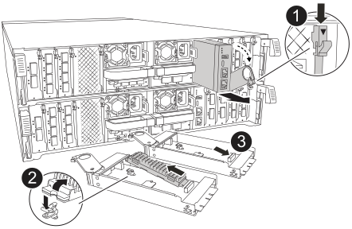

= 更換控制器模組 - AFF A70 、 AFF A90
:allow-uri-read: 
:icons: font
:imagesdir: ../media/

[role="lead"]
若要更換控制器、您必須取下受損的控制器、將 FRU 元件從受損的控制器模組移至更換的控制器模組、在機箱中安裝更換的控制器模組、然後將系統開機至維護模式。

== 步驟1：移除控制器模組

更換控制器模組或更換控制器模組內部的元件時、您必須從機箱中移除控制器模組。

. 在機箱正面、用您的拇指將每個磁碟機穩固推入、直到您感覺到有正面的停止為止。如此可確保磁碟機穩固地安裝在機箱中板上。
+
image::../media/drw_a800_drive_seated_IEOPS-960.svg[DRw a800磁碟機就位在IOPS 960上]

. 檢查故障控制器模組背面插槽 4/5 中的琥珀色 NVRAM 狀態 LED 是否熄滅。尋找 NV 圖示。
+
image::../media/drw_a1K-70-90_nvram-led_ieops-1463.svg[NVRAM 注意與狀態 LED 位置圖]

+
[cols="1,4"]
|===

 a| 
image:../media/legend_icon_01.svg["編號 1 、寬度 = 30px"]
 a| 
NVRAM 狀態 LED

 a| 
image:../media/legend_icon_02.svg["編號 1 、寬度 = 30px"]
 a| 
NVRAM 注意 LED

|===
+

NOTE: 如果 NVRAM 狀態 LED 閃爍、可能表示控制器模組未正確接管或停止（未認可的資料）。如果合作夥伴控制器模組未成功接管受損的控制器模組、請先聯絡 https://mysupport.netapp.com/site/global/dashboard["NetApp支援"] 、再繼續執行此程序。

+
故障控制器模組上 NVRAM 狀態 LED 的一般行為如下：

+
** 從控制器模組拔下電源、儲存系統處於「等待恢復」狀態、或控制器模組未正確接管或停止（未認可的資料）時、 NVRAM 狀態 LED 會閃爍。
** 從機箱中移除控制器模組時、 NVRAM 狀態 LED 會閃爍、表示控制器模組未正確接管或停止（未認可的資料）。確認已由合作夥伴控制器模組完全接管控制器模組、或顯示受損控制器模組 `waiting for giveback`。然後、閃爍的 LED 會被忽略（控制器模組可從機箱中移除）。

. 如果您尚未接地、請正確接地。
. 從控制器模組電源供應器（ PSU ）拔下控制器模組電源供應器纜線。
+

NOTE: 如果您的系統有直流電源、請從 PSU 拔下電源區塊。

. 從控制器模組拔下系統纜線、 SFP 和 QSFP 模組（如有需要）、並追蹤纜線的連接位置。
+
將纜線留在纜線管理裝置中、以便在重新安裝纜線管理裝置時、整理好纜線。

. 從控制器模組中取出纜線管理裝置。
. 向下按兩個鎖定栓、然後同時向下轉動兩個鎖條。
+
控制器模組會稍微移出機箱。

+
image::../media/drw_a70-90_pcm_remove_replace_ieops-1365.svg[控制器移除圖形]

+
[cols="1,4"]
|===

 a| 
image:../media/legend_icon_01.svg["編號 1 、寬度 = 30px"]
| A 鎖定閂鎖 

 a| 
image:../media/legend_icon_02.svg["編號 2 、寬度 =30px"]
 a| 
鎖定銷

|===
. 將控制器模組滑出機箱、然後放在平穩的表面上。
+
將控制器模組滑出機箱時、請確定您支援控制器模組的底部。

== 步驟2：搬移電源供應器

將電源供應器移至更換控制器。

. 旋轉CAM握把、以便在按下鎖定彈片的同時、將電源供應器從控制器模組中拉出。
+

CAUTION: 電源供應器不足。從控制器模組中取出時、請務必用兩隻手支撐、以免突然從控制器模組中迴轉而造成傷害。

+
image::../media/drw_a70-90_psu_remove_replace_ieops-1368.svg[PSU 移除]

+
[cols="1,4"]
|===

 a| 
image::../media/legend_icon_01.svg[編號 1]
| Terracotta PSU 鎖定標籤 

 a| 
image::../media/legend_icon_02.svg[編號 2]
 a| 
電源供應器

|===
. 將電源供應器移至新的控制器模組、然後安裝。
. 用兩隻手支撐電源供應器的邊緣、並將其與控制器模組的開口對齊、然後將電源供應器輕推入控制器模組、直到鎖定彈片卡入定位。
+
電源供應器只能與內部連接器正確接合、並以一種方式鎖定到位。

+

NOTE: 為避免損壞內部連接器、請勿在將電源供應器滑入系統時過度施力。

== 步驟3：移動風扇

將風扇模組移至更換的控制器模組。

. 將風扇模組側邊的鎖定彈片夾住、然後將風扇模組從控制器模組中直接提出、以移除風扇模組。
+
image::../media/drw_a70-90_fan_remove_replace_ieops-1366.svg[移除風扇]

+
[cols="1,4"]
|===

 a| 
image::../media/legend_icon_01.svg[編號 1]
 a| 
風扇鎖定彈片

 a| 
image::../media/legend_icon_02.svg[編號 2]
 a| 
風扇模組

|===
. 將風扇模組移至更換的控制器模組、然後將其邊緣對齊控制器模組的開孔、將風扇模組滑入控制器模組、直到鎖定的栓鎖卡入定位。
. 對其餘的風扇模組重複這些步驟。

== 步驟4：搬移內華達州電池

將NV電池移至更換的控制器模組。

. 打開控制器模組中間的通風管蓋、找到 NV 電池。
+
image::../media/drw_a70-90_remove_replace_nvmembat_ieops-1369.svg[移動 NV 電池]

+
[cols="1,4"]
|===

 a| 
image::../media/legend_icon_01.svg[編號 1]
| NV 電池通風管 

 a| 
image::../media/legend_icon_02.svg[編號 2]
 a| 
NV 電池組插頭

|===
+
* 注意： * 當您停止系統時、 NV 模組 LED 會閃爍、同時將內容降級至快閃記憶體。完成轉出後、LED會關閉。

. 將電池向上提、以取用電池插頭。
. 擠壓電池插頭正面的固定夾、將插頭從插槽中拔下、然後從插槽拔下電池纜線。
. 將電池從通風管和控制器模組中取出。
. 將電池組移至更換控制器模組、然後將其安裝在更換的控制器模組中：
+
.. 打開更換控制器模組中的 NV 電池通風管。
.. 將電池插頭插入插槽、並確定插頭已鎖定到位。
.. 將電池套件插入插槽、然後穩固地向下按電池套件、以確保其鎖定到位。
.. 關閉 NV 電池通風管。

== 步驟5：移動系統DIMM

將 DIMM 移至更換的控制器模組。

. 打開控制器頂端的控制器通風管。
+
.. 將手指插入通風管遠端的凹處。
.. 提起通風管、並將其向上旋轉至最遠的位置。

. 找到主機板上的系統 DIMM 。
+
image::../media/drw_a70_90_dimm_ieops-1513.svg[DIMM 對應]

+
[cols="1,4"]
|===

 a| 
image::../media/legend_icon_01.svg[編號 1]
| 系統DIMM 
|===
. 請注意插槽中的DIMM方向、以便您以適當的方向將DIMM插入更換的控制器模組。
. 緩慢地將DIMM兩側的兩個DIMM彈出彈片分開、然後將DIMM從插槽中滑出、藉此將DIMM從插槽中退出。
+

NOTE: 小心拿住DIMM的邊緣、避免對DIMM電路板上的元件施加壓力。

. 找到要安裝 DIMM 的替換控制器模組上的插槽。
. 將DIMM正面插入插槽。
+
DIMM可緊密插入插槽、但應該很容易就能裝入。如果沒有、請重新將DIMM與插槽對齊、然後重新插入。

+

NOTE: 目視檢查DIMM、確認其對齊並完全插入插槽。

. 在DIMM頂端邊緣小心地推入、但穩固地推入、直到彈出彈出彈片卡入DIMM兩端的槽口。
. 對其餘的DIMM重複這些步驟。
. 關閉控制器通風管。

== 步驟 6 ：移動 I/O 模組

將 I/O 模組移至更換的控制器模組。

image::../media/drw_a70_90_io_remove_replace_ieops-1532.svg[移除 I/O 模組]

[cols="1,4"]
|===

 a| 
image::../media/legend_icon_01.svg[編號 1]
| I/O 模組 CAM 控制桿 
|===
. 拔下目標I/O模組上的任何纜線。
+
請務必貼上纜線的標籤、以便知道纜線的來源。

. 向下拉纜線管理 ARM 內部的按鈕、然後向下旋轉纜線管理、即可向下旋轉纜線管理 ARM 。
. 從控制器模組中移除 I/O 模組：
+
.. 按下目標 I/O 模組 CAM 鎖定按鈕。
+
CAM 控制桿會離開控制器模組。

.. 向下轉動凸輪栓鎖、直到卡入定位為止。對於水平模組、請將 CAM 儘量遠離模組。
.. 將手指連入凸輪桿開口處、然後將模組拉出控制器模組、即可將模組從控制器模組中移除。
+
請務必追蹤I/O模組所在的插槽。

.. 將替換 I/O 模組安裝至替換控制器模組中、方法是將 I/O 模組輕輕滑入插槽、直到 I/O 凸輪閂鎖開始與 I/O 凸輪銷接合、然後將 I/O 凸輪閂鎖完全推入、以將模組鎖定到位。

. 重複這些步驟、將插槽 6 和 7 中的模組以外的其他 I/O 模組移至替換控制器模組。
+

NOTE: 若要將 I/O 模組從插槽 6 和 7 中移出、您必須將包含這些 I/O 模組的承載器從受損的控制器模組移至更換的控制器模組。

. 將插槽 6 和 7 中包含 I/O 模組的承載器移至替換控制器模組：
+
.. 按下托架把手最右側的按鈕。將托架滑出受損的控制器模組、將其插入替換控制器模組、其位置與受損控制器模組相同。
.. 將托架輕輕推入更換的控制器模組、直到卡入定位。

== 步驟 7 ：移動系統管理模組

將系統管理模組移至更換的控制器模組。

[cols="1,4"]
|===

 a| 
image::../media/legend_icon_01.svg[編號 1]
 a| 
系統管理模組 CAM 栓鎖

 a| 
image::../media/legend_icon_02.svg[編號 2]
 a| 
開機媒體鎖定按鈕

 a| 
image::../media/legend_icon_03.svg[編號 3]
 a| 
替換系統管理模組

|===
. 從受損的控制器模組中移除系統管理模組：
+
.. 按下系統管理 CAM 按鈕。CAM 控制桿會從機箱移出。
.. 向下轉動凸輪桿。
.. 將手指環入 CAM 槓桿、然後將模組直接從系統中拉出。

. 將系統管理模組安裝到更換控制器模組中、其插槽與受損控制器模組的插槽相同：
+
.. 將系統管理模組的邊緣與系統開口對齊、然後將其輕輕推入控制器模組。
.. 將模組輕輕滑入插槽、直到凸輪閂鎖開始與 I/O 凸輪銷接合、然後將凸輪閂鎖完全向上旋轉、將模組鎖定到位。

== 步驟 8 ：移動 NVRAM 模組

將 NVRAM 模組移至更換的控制器模組。

image::../media/drw_a70-90_nvram12_remove_replace_ieops-1370.svg[取下 NVRAM12 模組和 DIMM]

[cols="1,4"]
|===

 a| 
image:../media/legend_icon_01.svg["編號 1 、寬度 = 30 像素"]
| CAM 鎖定按鈕 

 a| 
image:../media/legend_icon_02.svg["編號 2 、寬度 = 30 像素"]
 a| 
DIMM 鎖定彈片

|===
. 從受損的控制器模組中移除 NVRAM 模組：
+
.. 按下 CAM LATCH 按鈕。
+
CAM按鈕會從機箱移出。

.. 轉動凸輪栓鎖至最遠位置。
.. 將手指插入 CAM 拉桿開口、然後將模組從機箱中拉出、即可從機箱中移除 NVRAM 模組。

. 將 NVRAM 模組安裝到替換控制器模組的插槽 4/5 中：
+
.. 將模組與插槽 4/5 中機箱開口的邊緣對齊。
.. 將模組一路輕輕滑入插槽、然後將 CAM 栓鎖往上推、將模組鎖定到位。

== 步驟9：安裝控制器模組

重新安裝控制器模組、然後重新啟動。

. 將通風管往下轉動、以確保通風管完全關閉。
+
它必須與控制器模組金屬板齊平。

. 將控制器模組的一端與機箱的開口對齊、然後將控制器模組輕推至系統的一半。
+

NOTE: 在指示之前、請勿將控制器模組完全插入機箱。

. 視需要重新安裝系統。
+
如果您移除收發器（ QSFP 或 SFP ）、請記得在使用光纖纜線時重新安裝。

. 完成控制器模組的重新安裝：
+
.. 將控制器模組穩固地推入機箱、直到它與中間板完全接入。
+
控制器模組完全就位時、鎖定鎖條會上升。

+

NOTE: 將控制器模組滑入機箱時、請勿過度施力、以免損壞連接器。

+
.. 將鎖定閂向上旋轉至鎖定位置。

. 將電源線插入電源供應器。
+

NOTE: 如果您有直流電源、請在控制器模組完全插入機箱後、將電源區塊重新連接至電源供應器。

+
控制器模組會在電源恢復時開機。如果引導至加載器提示符，請使用命令重新引導控制器 `boot_ontap` 。

. 如果您使用「儲存容錯移轉修改節點本機-自動恢復true」命令停用自動恢復。
. 如果啟用 AutoSupport 、請使用命令還原 / 恢復自動建立個案 `system node autosupport invoke -node * -type all -message MAINT=END` 。
. 如果您尚未重新安裝纜線管理裝置、請重新安裝控制器。

