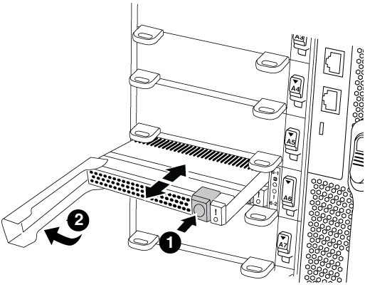

= 更換 NVRAM 模組或 NVRAM DIMM - AFF A700
:allow-uri-read: 
:icons: font
:imagesdir: ../media/

[role="lead"]
NVRAM模組包含NVRAM10和DIMM、每個NVRAM模組最多可有兩個NVMe SSD Flash Cache模組（FlashCache或快取模組）。您可以更換故障的NVRAM模組或NVRAM模組內的DIMM。

若要更換故障的NVRAM模組、您必須將其從機箱中移除、從NVRAM模組中移除FlashCache模組或模組、將DIMM移至更換模組、重新安裝FlashCache模組或模組、然後將替換的NVRAM模組安裝到機箱中。

由於系統ID是從NVRAM模組衍生而來、因此如果更換模組、則屬於系統的磁碟會重新指派至新的系統ID。

.開始之前
* 所有磁碟櫃都必須正常運作。
* 如果您的系統是HA配對、則合作夥伴節點必須能夠接管與要更換的NVRAM模組相關的節點。
* 本程序使用下列術語：
+
** _減損_節點是您要執行維護的節點。
** 「_Healthy_」節點是受損節點的HA合作夥伴。

* 此程序包括自動或手動將磁碟重新指派給與新NVRAM模組相關聯的控制器模組的步驟。您必須依照程序中的指示重新指派磁碟。在恢復之前完成磁碟重新指派可能會造成問題。
* 您必須使用從供應商處收到的替換FRU元件來更換故障元件。
* 在此程序中、您無法變更任何磁碟或磁碟櫃。

== 步驟1：關閉受損的控制器

使用下列其中一個選項來關閉或接管受損的控制器。

[role="tabbed-block"]
====
.選項1：大多數系統
--
若要關閉受損的控制器、您必須判斷控制器的狀態、並在必要時接管控制器、以便健全的控制器繼續從受損的控制器儲存設備提供資料。

.關於這項工作
* 如果您有 SAN 系統，則必須檢查故障控制器 SCSI 刀鋒的事件訊息  `cluster kernel-service show`。 `cluster kernel-service show`命令（從 priv 進階模式）會顯示節點名稱、該節點的仲裁狀態、該節點的可用性狀態、以及該節點的作業狀態。
+
每個SCSI刀鋒處理序都應與叢集中的其他節點處於仲裁狀態。任何問題都必須先解決、才能繼續進行更換。

* 如果叢集有兩個以上的節點、則叢集必須處於仲裁狀態。如果叢集未達到法定人數、或健全的控制器顯示為「假」、表示符合資格和健全狀況、則您必須在關閉受損的控制器之前修正問題；請參閱 link:https://docs.netapp.com/us-en/ontap/system-admin/synchronize-node-cluster-task.html?q=Quorum["將節點與叢集同步"^]。

.步驟
. 如果啟用 AutoSupport 、請叫用 AutoSupport 訊息來隱藏自動建立個案： `system node autosupport invoke -node * -type all -message MAINT=<# of hours>h`
+
下列AutoSupport 資訊不顯示自動建立案例兩小時： `cluster1:> system node autosupport invoke -node * -type all -message MAINT=2h`

. 停用健全控制器主控台的自動恢復功能：「torage容錯移轉修改–節點本機-自動恢復錯誤」
+

NOTE: 當您看到_是否要停用自動恢復？_時、請輸入「y」。

. 將受損的控制器移至載入器提示：
+
[cols="1,2"]
|===
| 如果受損的控制器正在顯示... | 然後... 

 a| 
載入程式提示
 a| 
前往下一步。

 a| 
正在等待恢復...
 a| 
按Ctrl-C、然後在出現提示時回應「y」。

 a| 
系統提示或密碼提示
 a| 
從正常控制器接管或停止受損的控制器：「torage容錯移轉接管-節點_受損節點_節點名稱_」

當受損的控制器顯示正在等待恢復...時、請按Ctrl-C、然後回應「y」。

|===

--
.選項2：控制器位於雙節點MetroCluster 的不二
--
若要關閉受損的控制器、您必須判斷控制器的狀態、並在必要時切換控制器、使健全的控制器繼續從受損的控制器儲存設備提供資料。

.關於這項工作
* 您必須在本程序結束時保持電源供應器開啟、才能為健全的控制器提供電力。

.步驟
. 檢查MetroCluster 「不正常」狀態、判斷受損的控制器是否已自動切換至「正常」控制器MetroCluster ：「不正常」
. 視是否發生自動切換而定、請根據下表繼續進行：
+
[cols="1,2"]
|===
| 如果控制器受損... | 然後... 

 a| 
已自動切換
 a| 
繼續下一步。

 a| 
尚未自動切換
 a| 
從健全的控制器執行計畫性的切換作業MetroCluster ：「『交換切換’」

 a| 
尚未自動切換、您嘗試使用MetroCluster 「還原切換」命令進行切換、切換遭到否決
 a| 
請檢閱否決訊息、如有可能、請解決此問題、然後再試一次。如果您無法解決問題、請聯絡技術支援部門。

|===
. 從MetroCluster 存續的叢集執行「f恢復 階段Aggregate」命令、以重新同步資料集合體。
+
[listing]
----
controller_A_1::> metrocluster heal -phase aggregates
[Job 130] Job succeeded: Heal Aggregates is successful.
----
+
如果治療被否決、您可以選擇MetroCluster 使用「-overre-etoes」參數重新發出「還原」命令。如果您使用此選用參數、系統將會置換任何軟質否決、以防止修復作業。

. 使用MetroCluster flexoperationshow命令確認作業已完成。
+
[listing]
----
controller_A_1::> metrocluster operation show
    Operation: heal-aggregates
      State: successful
Start Time: 7/25/2016 18:45:55
   End Time: 7/25/2016 18:45:56
     Errors: -
----
. 使用「shorage Aggregate show」命令來檢查集合體的狀態。
+
[listing]
----
controller_A_1::> storage aggregate show
Aggregate     Size Available Used% State   #Vols  Nodes            RAID Status
--------- -------- --------- ----- ------- ------ ---------------- ------------
...
aggr_b2    227.1GB   227.1GB    0% online       0 mcc1-a2          raid_dp, mirrored, normal...
----
. 使用「MetroCluster f恢復 階段根集合體」命令來修復根集合體。
+
[listing]
----
mcc1A::> metrocluster heal -phase root-aggregates
[Job 137] Job succeeded: Heal Root Aggregates is successful
----
+
如果修復被否決、您可以選擇使用MetroCluster -overrover-etoes參數重新發出「還原」命令。如果您使用此選用參數、系統將會置換任何軟質否決、以防止修復作業。

. 在MetroCluster 目的地叢集上使用「停止作業show」命令、確認修復作業已完成：
+
[listing]
----

mcc1A::> metrocluster operation show
  Operation: heal-root-aggregates
      State: successful
 Start Time: 7/29/2016 20:54:41
   End Time: 7/29/2016 20:54:42
     Errors: -
----
. 在受損的控制器模組上、拔下電源供應器。

--
====

== 步驟2：更換NVRAM模組

若要裝回NVRAM模組、請將其置於機箱的插槽6中、然後依照特定的步驟順序進行。

.步驟
. 如果您尚未接地、請正確接地。
. 將FlashCache模組從舊的NVRAM模組移至新的NVRAM模組：
+

+
[cols="1,4"]
|===

 a| 
image:../media/legend_icon_01.png["編號 1"]
 a| 
橘色釋放按鈕（空白FlashCache模組為灰色）

 a| 
image:../media/legend_icon_02.png["編號 2"]
 a| 
FlashCache CAM處理

|===
+
.. 按下FlashCache模組正面的橘色按鈕。
+

NOTE: 空白FlashCache模組上的釋放按鈕為灰色。

.. 將CAM握把向外旋轉、直到模組開始滑出舊的NVRAM模組。
.. 抓住模組CAM把手上、將其從NVRAM模組中滑出、然後將其插入新的NVRAM模組正面。
.. 將FlashCache模組一路輕推入NVRAM模組、然後將CAM握把旋開、直到鎖定模組到位。

. 從機箱中移除目標NVRAM模組：
+
.. 按下帶有字母和編號的CAM按鈕。
+
CAM按鈕會從機箱移出。

.. 向下轉動CAM栓鎖、直到其處於水平位置。
+
NVRAM模組會從機箱中鬆脫、然後移出幾英吋。

.. 拉動模組面兩側的拉片、將NVRAM模組從機箱中取出。
+
image::../media/drw_9000_move_remove_nvram_module.png[卸下NVRAM模組]

+
[cols="1,4"]
|===

 a| 
image:../media/legend_icon_01.png["編號 1"]
 a| 
I/O CAM栓鎖有編號和編號

 a| 
image:../media/legend_icon_02.png["編號 2"]
 a| 
I/O鎖定完全解除鎖定

|===

. 將NVRAM模組設定在穩固的表面上、向下按護蓋上的藍色鎖定按鈕、將護蓋從NVRAM模組中取出、然後按住藍色按鈕、將護蓋從NVRAM模組中滑出。
+
image::../media/drw_9000_remove_nvram_module_contents.png[卸下 NVRAM 模組內容]

+
[cols="1,4"]
|===

 a| 
image:../media/legend_icon_01.png["編號 1"]
 a| 
護蓋鎖定按鈕

 a| 
image:../media/legend_icon_02.png["編號 2"]
 a| 
DIMM和DIMM彈出卡舌

|===
. 從舊的NVRAM模組中一次移除一個DIMM、然後將其安裝到替換的NVRAM模組中。
. 合上模組的護蓋。
. 將替換的NVRAM模組安裝到機箱：
+
.. 將模組對齊插槽6中機箱開孔的邊緣。
.. 將模組輕推入插槽、直到帶有字母和編號的I/O CAM栓開始與I/O CAM銷接合、然後將I/O CAM栓完全推入、將模組鎖定到位。

== 步驟3：更換NVRAM DIMM

若要更換NVRAM模組中的NVRAM DIMM、您必須移除NVRAM模組、開啟模組、然後更換目標DIMM。

.步驟
. 如果您尚未接地、請正確接地。
. 從機箱中移除目標NVRAM模組：
+
.. 按下帶有字母和編號的CAM按鈕。
+
CAM按鈕會從機箱移出。

.. 向下轉動CAM栓鎖、直到其處於水平位置。
+
NVRAM模組會從機箱中鬆脫、然後移出幾英吋。

.. 拉動模組面兩側的拉片、將NVRAM模組從機箱中取出。
+
image::../media/drw_9000_move_remove_nvram_module.png[卸下NVRAM模組]

+
[cols="1,4"]
|===

 a| 
image:../media/legend_icon_01.png["編號 1"]
 a| 
I/O CAM栓鎖有編號和編號

 a| 
image:../media/legend_icon_02.png["編號 2"]
 a| 
I/O鎖定完全解除鎖定

|===

. 將NVRAM模組設定在穩固的表面上、向下按護蓋上的藍色鎖定按鈕、將護蓋從NVRAM模組中取出、然後按住藍色按鈕、將護蓋從NVRAM模組中滑出。
+
image::../media/drw_9000_remove_nvram_module_contents.png[卸下 NVRAM 模組內容]

+
[cols="1,4"]
|===

 a| 
image:../media/legend_icon_01.png["編號 1"]
 a| 
護蓋鎖定按鈕

 a| 
image:../media/legend_icon_02.png["編號 2"]
 a| 
DIMM和DIMM彈出卡舌

|===
. 找到NVRAM模組內要更換的DIMM、然後按下DIMM鎖定彈片並將DIMM從插槽中提出來將其卸下。
. 將DIMM對齊插槽、然後將DIMM輕推入插槽、直到鎖定彈片鎖定到位、即可安裝替換DIMM。
. 合上模組的護蓋。
. 將替換的NVRAM模組安裝到機箱：
+
.. 將模組對齊插槽6中機箱開孔的邊緣。
.. 將模組輕推入插槽、直到帶有字母和編號的I/O CAM栓開始與I/O CAM銷接合、然後將I/O CAM栓完全推入、將模組鎖定到位。

== 步驟4：更換FRU後重新啟動控制器

更換FRU之後、您必須重新啟動控制器模組。

.步驟
. 若要ONTAP 從載入程式提示字元開機、請輸入「bye」。

== 步驟5：重新指派磁碟

視您是否有HA配對或雙節點MetroCluster 的功能表組態而定、您必須驗證磁碟是否重新指派至新的控制器模組、或手動重新指派磁碟。

請選取下列其中一個選項、以取得如何將磁碟重新指派給新控制器的指示。

[role="tabbed-block"]
====
.選項1：驗證ID（HA配對）
--
.驗證HA系統上的系統ID變更
您必須在開機_replaced_節點時確認系統ID變更、然後驗證變更是否已實作。

CAUTION: 只有在更換 NVRAM 模組時才需要重新指派磁碟、而且不適用於 NVRAM DIMM 更換。

.步驟
. 如果替換節點處於維護模式（顯示「*」>提示、請結束維護模式、然後前往載入程式提示：「halt」
. 從替換節點的載入器提示中、啟動節點、如果系統ID不相符、系統提示您覆寫系統ID、請輸入「y」。
+
'boot_ONTAP bye'

+
如果已設定自動開機、節點將會重新開機。

. 請等待、直到畫面上的「waiting for org食品 傳回...」（正在等待恢復...）訊息顯示在_replace_節點主控台、然後從正常節點驗證是否已自動指派新的合作夥伴系統ID：「torage容錯移轉顯示」（torage容錯移轉顯示）
+
在命令輸出中、您應該會看到一則訊息、指出受損節點上的系統ID已變更、顯示正確的舊ID和新ID。在下列範例中、node2已完成更換、新的系統ID為151759706。

+
[listing]
----
node1> `storage failover show`
                                    Takeover
Node              Partner           Possible     State Description
------------      ------------      --------     -------------------------------------
node1             node2             false        System ID changed on partner (Old:
                                                  151759755, New: 151759706), In takeover
node2             node1             -            Waiting for giveback (HA mailboxes)
----
. 從健全節點、確認已儲存任何核心傾印：
+
.. 變更為進階權限等級：「et -priv榮幸 進階」
+
當系統提示您繼續進入進階模式時、您可以回應「Y」。出現進階模式提示（*>）。

.. 儲存任何核心傾印：「系統節點執行節點_nocal-node-name_合作夥伴儲存資源」
.. 在發出恢復之前、請等待「命令」完成。
+
您可以輸入下列命令來監控savecore命令的進度：「ystem節點run -node-node-name_合作夥伴savecore -ss」

.. 返回管理員權限等級：「et -priv. admin」

. 回饋節點：
+
.. 從健全的節點、歸還替換節點的儲存設備：「儲存容錯移轉恢復-節點_replace_node_name_」
+
_replacy_nodes將恢復其儲存設備並完成開機。

+
如果系統ID不相符、系統提示您覆寫系統ID、請輸入「y」。

+

NOTE: 如果被否決、您可以考慮覆寫否決。

+
http://mysupport.netapp.com/documentation/productlibrary/index.html?productID=62286["尋找ONTAP 適用於您的版本的《高可用度組態指南》（High Availability Configuration Guide）"]

.. 完成恢復後、請確認HA配對正常、而且可以接管：「顯示容錯移轉」
+
從「儲存容錯移轉show」命令輸出的內容、不應包含「系統ID已在合作夥伴上變更」訊息。

. 驗證是否已正確分配磁碟：「torage disk show -所有權」
+
屬於_replaced_節點的磁碟應顯示新的系統ID。在下列範例中、node1擁有的磁碟現在顯示新的系統ID：1873775277：

+
[listing]
----
node1> `storage disk show -ownership`

Disk  Aggregate Home  Owner  DR Home  Home ID    Owner ID  DR Home ID Reserver  Pool
----- ------    ----- ------ -------- -------    -------    -------  ---------  ---
1.0.0  aggr0_1  node1 node1  -        1873775277 1873775277  -       1873775277 Pool0
1.0.1  aggr0_1  node1 node1           1873775277 1873775277  -       1873775277 Pool0
.
.
.
----
. 如果系統採用MetroCluster 的是一套不全功能的組態、請監控節點的狀態：MetroCluster 「不只是顯示節點」
+
更換後、需要幾分鐘時間才能恢復正常狀態、此時每個節點都會顯示已設定的狀態、並啟用DR鏡射和正常模式。MetroCluster「停止節點show -Fields node-SystemID」命令輸出會顯示舊的系統ID、直到該組態恢復正常狀態為止。MetroCluster MetroCluster

. 如果節點是MetroCluster 以支援功能為基礎的組態、請MetroCluster 視支援狀況而定、確認如果原始擁有者是災難站台上的節點、則DR主ID欄位會顯示磁碟的原始擁有者。
+
如果下列兩項條件均為真、則必須執行此動作：

+
** 此功能組態處於切換狀態。MetroCluster
** _replacement節點是災難站台上磁碟的目前擁有者。
+
https://docs.netapp.com/us-en/ontap-metrocluster/manage/concept_understanding_mcc_data_protection_and_disaster_recovery.html#disk-ownership-changes-during-ha-takeover-and-metrocluster-switchover-in-a-four-node-metrocluster-configuration["在HA接管期間、磁碟擁有權會有所變更、MetroCluster 而在四節點MetroCluster 的功能組態中、也會進行不全的功能切換"]

. 如果您的系統使用MetroCluster 的是E驗 證組態、請確認每個節點都已設定：「MetroCluster E節點 顯示-欄位組態狀態」
+
[listing]
----
node1_siteA::> metrocluster node show -fields configuration-state

dr-group-id            cluster node           configuration-state
-----------            ---------------------- -------------- -------------------
1 node1_siteA          node1mcc-001           configured
1 node1_siteA          node1mcc-002           configured
1 node1_siteB          node1mcc-003           configured
1 node1_siteB          node1mcc-004           configured

4 entries were displayed.
----
. 驗證每個節點是否存在預期的磁碟區：「vol show -node-name」
. 如果您在重新開機時停用自動接管、請從正常節點「torage容錯移轉修改節點置換節點名稱-onreboottrue」啟用

--
.選項2：重新指派ID MetroCluster （資訊組態）
--
.在雙節點MetroCluster 的不全功能組態中重新指派系統ID
在執行支援功能的雙節點MetroCluster 版的支援功能組態ONTAP 中、您必須手動將磁碟重新指派給新的控制器系統ID、才能將系統恢復正常運作。

.關於這項工作
此程序僅適用於MetroCluster 執行ONTAP 下列項目的雙節點系統：

您必須確定在正確的節點上發出此程序中的命令：

* _減損_節點是您要執行維護的節點。
* _replaced_節點是新的節點、在本程序中會取代受損節點。
* 「_Healthy_」節點是受損節點的DR合作夥伴。

.步驟
. 如果您尚未重新啟動_replaced_節點、請輸入「Ctrl-C」來中斷開機程序、然後從顯示的功能表中選取開機至維護模式的選項。
+
由於系統ID不相符、當系統提示您置換系統ID時、您必須輸入「Y」。

. 從正常節點上檢視舊的系統ID：「MetroCluster 『節點show -Fields node-SystemID、dr-Partner SystemID」
+
在此範例中、Node_B_1是舊節點、舊系統ID為118673209：

+
[listing]
----
dr-group-id cluster         node                 node-systemid dr-partner-systemid
 ----------- --------------------- -------------------- ------------- -------------------
 1           Cluster_A             Node_A_1             536872914     118073209
 1           Cluster_B             Node_B_1             118073209     536872914
 2 entries were displayed.
----
. 在「受損」節點上的「維護」模式提示字元中檢視新的系統ID：「顯示」
+
在此範例中、新的系統ID為118065481：

+
[listing]
----
Local System ID: 118065481
    ...
    ...
----
. 使用FAS 從disk show命令「磁碟重新指派舊系統ID」取得的系統ID資訊、重新指派磁碟擁有權（適用於整個系統）或LUN擁有權（FlexArray 適用於整個系統）
+
在上述範例中、命令為：「磁碟重新指派-s 118673209」

+
系統提示您繼續時、您可以回應「Y」。

. 確認磁碟（或FlexArray 稱「LUN」）已正確指派：「磁碟show -A」
+
確認屬於_replaced_節點的磁碟顯示_replaced_節點的新系統ID。在下列範例中、system-1擁有的磁碟現在顯示新的系統ID 118065481：

+
[listing]
----
*> disk show -a
Local System ID: 118065481

  DISK     OWNER                 POOL   SERIAL NUMBER  HOME
-------    -------------         -----  -------------  -------------
disk_name   system-1  (118065481) Pool0  J8Y0TDZC       system-1  (118065481)
disk_name   system-1  (118065481) Pool0  J8Y09DXC       system-1  (118065481)
.
.
.
----
. 從健全節點、確認已儲存任何核心傾印：
+
.. 變更為進階權限等級：「et -priv榮幸 進階」
+
當系統提示您繼續進入進階模式時、您可以回應「Y」。出現進階模式提示（*>）。

.. 驗證是否已儲存核心傾印：「System Node run -node-node-name_合作夥伴savecore」（系統節點執行節點_local-node-name_合作夥伴savecore）
+
如果命令輸出顯示Savecore正在進行中、請先等待Savecore完成、再發出恢復。您可以使用「系統節點執行-node-local-node-name_合作夥伴儲存資源-s命令」來監控儲存資源的進度。</info>。

.. 返回管理員權限等級：「et -priv. admin」

. 如果_replaced_節點處於維護模式（顯示*>提示）、請結束維護模式、然後前往載入程式提示：「halt（停止）」
. 開機_replace_節點：「boot_ontap」
. 在_replacement節點完全開機之後、執行切換：MetroCluster 「還原」
. 驗證MetroCluster 不實的組態：MetroCluster 「不實節點顯示-欄位組態狀態」
+
[listing]
----
node1_siteA::> metrocluster node show -fields configuration-state

dr-group-id            cluster node           configuration-state
-----------            ---------------------- -------------- -------------------
1 node1_siteA          node1mcc-001           configured
1 node1_siteA          node1mcc-002           configured
1 node1_siteB          node1mcc-003           configured
1 node1_siteB          node1mcc-004           configured

4 entries were displayed.
----
. 驗證MetroCluster 下列項目中的功能：Data ONTAP
+
.. 檢查兩個叢集上是否有任何健全狀況警示：「System health alerts show」（系統健全狀況警示顯示）
.. 確認MetroCluster 已設定好此功能、並處於正常模式：MetroCluster 「show」
.. 執行MetroCluster 功能不全的檢查：MetroCluster 「執行功能不全」
.. 顯示MetroCluster 「不MetroCluster 實檢查」的結果：「不實檢查顯示」
.. 執行Config Advisor請前往 NetApp 支援網站上的 Config Advisor 頁面： https://mysupport.netapp.com/site/tools/tool-eula/activeiq-configadvisor/["support.netapp.com/NOW/download/tools/config_advisor/"]。
+
執行Config Advisor 完功能後、請檢閱工具的輸出結果、並依照輸出中的建議來解決發現的任何問題。

. 模擬切換作業：
+
.. 從任何節點的提示字元、變更為進階權限層級：「et -priv榮幸advanc進 階」
+
當系統提示您繼續進入進階模式時、您需要用「y」回應、並看到進階模式提示（*>）。

.. 使用-Simulate參數「MetroCluster 還原切換模擬」來執行切換作業
.. 返回管理員權限等級：「et -priv. admin」

--
====

== 步驟6：將故障零件歸還給NetApp

如套件隨附的RMA指示所述、將故障零件退回NetApp。如 https://mysupport.netapp.com/site/info/rma["零件退貨與更換"]需詳細資訊、請參閱頁面。
