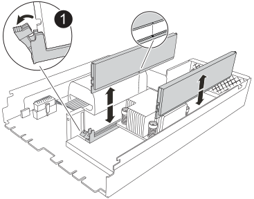

= 更換 NVRAM12-EX - AFX 2K
:allow-uri-read: 
:icons: font
:imagesdir: ../media/

[role="lead"]
當您的 AFX 2K 儲存系統中的非揮發性記憶體故障或需要升級時，請更換 NVRAM12-EX。更換過程包括關閉故障控制器，更換 NVRAM12-EX 模組、NVRAM DIMM 或 NVRAM 電池，然後將故障零件退回 NetApp。

NVRAM12-EX 模組由 NVRAM12 硬體和可現場更換的 DIMM 記憶體條組成。您可以更換故障的 NVRAM12-EX 模組、DIMM 記憶體條或 NVRAM12-EX 模組內部的 NVRAM 電池。

.開始之前
* 請確定您有可用的替換零件。您必須使用從 NetApp 收到的替換元件來更換故障的元件。
* 確保儲存系統中的所有其他元件正常運作；如果沒有，請聯絡 https://support.netapp.com["NetApp支援"]。
+

NOTE: 在更換 NVRAM12-EX 模組之前，請確保先關閉受損控制器的電源，再繼續進行更換。

== 步驟1：關閉受損的控制器

關閉或接管受損的控制器。

接管並停止故障控制器，以便正常控制器繼續從故障控制器的儲存提供資料。為此，您需要在 AutoSupport 中停用自動建立案例功能、停用自動復原功能，並將故障控制器置於 LOADER 提示字元。LOADER 提示字元是安全的停止狀態，您可以從中更換 FRU。

.關於這項工作
* 如果您的叢集具有四個以上的節點，則它必須達到法定人數。要查看有關節點的叢集信息，請使用 `cluster show`命令。有關 `cluster show`命令，請參閱link:https://docs.netapp.com/us-en/ontap/system-admin/display-nodes-cluster-task.html["查看ONTAP叢集中的節點級詳細信息"^]。
* 如果叢集不處於法定人數，或任何控制器（受損控制器除外）的健康狀況或資格顯示為錯誤，則必須在關閉受損控制器之前修正該問題。看link:https://docs.netapp.com/us-en/ontap/system-admin/synchronize-node-cluster-task.html?q=Quorum["將節點與叢集同步"^] 。

.步驟
. 如果啟用了「支援」功能、請叫用下列消息來禁止自動建立個案AutoSupport AutoSupport ：
+
`system node autosupport invoke -node * -type all -message MAINT=<# of hours>h`

+
下列AutoSupport 資訊不顯示自動建立案例兩小時：

+
`cluster1:> system node autosupport invoke -node * -type all -message MAINT=2h`

. 從受損控制器的控制台停用自動交還：
+
`storage failover modify -node impaired-node -auto-giveback-of false`

+

NOTE: 當您看到「您想要停用自動回饋嗎？」時，請輸入 `y`。

. 將受損的控制器移至載入器提示：
+
[cols="1,2"]
|===
| 如果受損的控制器正在顯示... | 然後... 

 a| 
載入程式提示
 a| 
前往下一步。

 a| 
系統提示或密碼提示
 a| 
從健康控制器接管或停止受損控制器：
`storage failover takeover -ofnode _impaired_node_name_ -halt _true_`

_-halt true_ 參數將受損節點帶入 LOADER 提示符。

|===

== 步驟 2：更換 NVRAM12-EX 模組、NVRAM DIMM 或 NVRAM 電池

使用下列選項更換 NVRAM12-EX 模組、NVRAM DIMM 或 NVRAM 電池。

更換控制器模組或更換控制器模組內的元件時、您必須從機箱中移除控制器模組。

[role="tabbed-block"]
====
.方案一：更換 NVRAM12-EX 模組
--
若要更換 NVRAM12-EX 模組，請在機箱的 6/7 號插槽中找到該模組，然後按照特定的步驟順序進行操作。

. 檢查系統插槽 4/5 中的 NVRAM 狀態指示燈和插槽 6/7 中的 NVRAM12-EX 狀態指示燈。控制器模組前面板上也有一個 NVRAM 指示燈。請尋找 NV 圖示：
+
image::../media/drw_a1K-70-90_nvram-led_ieops-1463.svg[NVRAM 注意與狀態 LED 位置圖]

+
[cols="1,4"]
|===

2+| *NVRAM* 

 a| 
image:../media/icon_round_1.png["編號 1"]
 a| 
NVRAM 狀態 LED

 a| 
image:../media/icon_round_2.png["編號 2"]
 a| 
NVRAM 注意 LED

|===
+
image::../media/drw_afx_emr_nvram-led_ieops-2962.svg[NVRAM12-EX 注意與狀態 LED 位置圖]

+
[cols="1,4"]
|===

2+| *NVRAM12-EX* 

 a| 
image:../media/icon_round_1.png["編號 1"]
 a| 
NVRAM12-EX 狀態指示燈

 a| 
image:../media/icon_round_2.png["編號 2"]
 a| 
NVRAM12-EX 注意 LED

|===
+
** 如果 NV LED 熄滅、請前往下一步。
** 如果 NV LED 閃爍、請等待閃爍停止。如果持續閃爍超過 5 分鐘、請聯絡技術支援部門尋求協助。

. 如果您尚未接地、請正確接地。
. 從控制器上拔下 PSU 的電源線。
. 輕輕拉動托盤兩端的插針、然後向下旋轉托盤、將纜線管理托盤向下旋轉。
. 從機殼中取出故障的 NVRAM12-EX 模組：
+
.. 按下鎖定凸輪按鈕。
.. 將損壞的 NVRAM12-EX 模組從機殼中取出，方法是將模組從機殼中拉出。
+
image::../media/drw_afx_emr_nv12l_remove_replace_ieops-2879.svg[移除 NVRAM12-EX 模組]

+
[cols="1,4"]
|===

 a| 
image:../media/icon_round_1.png["編號 1"]
| CAM 鎖定按鈕 
|===

. 將 NVRAM12-EX 模組放置在穩定的表面上。
. 用手指或螺絲起子鬆開 NVRAM12-EX 模組蓋上的單一蝶形螺絲，然後將蓋子從模組上取下，打開模組蓋。
+
image::../media/drw_afx_emr_nv12l_remove_cover_ieops-2929.svg[移除 NVRAM12-EX 蓋板]

+
[cols="1,4"]
|===

 a| 
image:../media/icon_round_1.png["編號 1"]
| NVRAM12-EX 蓋板的指旋螺絲 
|===
. 將損壞的 NVRAM12-EX 模組中的 DIMM 逐一取出，然後安裝到替換的 NVRAM12-EX 模組中。
+

+
[cols="1,4"]
|===

 a| 
image:../media/icon_round_1.png["編號 1"]
| DIMM 鎖定彈片 
|===
. 斷開 NVRAM12-EX 模組的電池連接：
+
.. 捏住電池插頭表面的卡扣，將插頭從插座中拔出。
.. 從插槽拔下電池纜線。

. 向上提起電池，將其從模組中取出，即可拆下斷開連接的電池。
+
image::../media/drw_afx_emr_nv12l_remove_battery_ieops-2919.svg[取出 NVRAM12-EX 電池]

+
[cols="1,4"]
|===

 a| 
image:../media/icon_round_1.png["編號 1"]
| NVRAM12-EX 電池連接夾 
|===
. 將電池安裝到替換的 NVRAM12-EX 模組中：
+
.. 將電池連接夾插入插座，並確保插頭鎖定到位。
.. 將電池套件插入插槽、然後穩固地向下按電池套件、以確保其鎖定到位。

. 將 NVRAM12-EX 模組的蓋子對準螺絲孔，然後用指旋螺絲固定蓋子，即可安裝此模組的蓋子。
. 將替換的 NVRAM12-EX 模組安裝到機殼中：
+
.. 將模組與機箱開口邊緣對齊，放入插槽 6/7。
.. 輕輕地將模組滑入插槽，直到完全鎖定到位。

. 將纜線管理承載器向上旋轉至關閉位置。

--
.選項 2 ：更換 NVRAM DIMM
--
若要更換 NVRAM12-EX 模組中的 NVRAM DIMM，必須先移除 NVRAM12-EX 模組，然後再更換目標 DIMM。

. 檢查系統插槽 4/5 中的 NVRAM 狀態指示燈和插槽 6/7 中的 NVRAM12-EX 狀態指示燈。控制器模組前面板上也有一個 NVRAM 指示燈。請尋找 NV 圖示：
+
image::../media/drw_a1K-70-90_nvram-led_ieops-1463.svg[NVRAM 注意與狀態 LED 位置圖]

+
[cols="1,4"]
|===

2+| *NVRAM* 

 a| 
image:../media/icon_round_1.png["編號 1"]
 a| 
NVRAM 狀態 LED

 a| 
image:../media/icon_round_2.png["編號 2"]
 a| 
NVRAM 注意 LED

|===
+
image::../media/drw_afx_emr_nvram-led_ieops-2962.svg[NVRAM12-EX 注意與狀態 LED 位置圖]

+
[cols="1,4"]
|===

2+| *NVRAM12-EX* 

 a| 
image:../media/icon_round_1.png["編號 1"]
 a| 
NVRAM12-EX 狀態指示燈

 a| 
image:../media/icon_round_2.png["編號 2"]
 a| 
NVRAM12-EX 注意 LED

|===
+
** 如果 NV LED 熄滅、請前往下一步。
** 如果 NV LED 閃爍、請等待閃爍停止。如果持續閃爍超過 5 分鐘、請聯絡技術支援部門尋求協助。

. 如果您尚未接地、請正確接地。
. 從 PSU 上拔下電源線。
. 輕輕拉動托盤兩端的插針、然後向下旋轉托盤、將纜線管理托盤向下旋轉。
. 從機殼中取出目標 NVRAM12-EX 模組：
+
.. 按下鎖定凸輪按鈕。
.. 將損壞的 NVRAM12-EX 模組從機殼中取出，方法是將模組從機殼中拉出。
+
image::../media/drw_afx_emr_nv12l_remove_replace_ieops-2879.svg[移除 NVRAM12-EX 模組]

+
[cols="1,4"]
|===

 a| 
image:../media/icon_round_1.png["編號 1"]
| CAM 鎖定按鈕 
|===

. 將 NVRAM12-EX 模組放置在穩定的表面上。
. 用手指或螺絲起子鬆開 NVRAM12-EX 模組蓋上的單一蝶形螺絲，然後將蓋子從模組上取下，打開模組蓋。
+
image::../media/drw_afx_emr_nv12l_remove_cover_ieops-2929.svg[移除 NVRAM12-EX 蓋板]

+
[cols="1,4"]
|===

 a| 
image:../media/icon_round_1.png["編號 1"]
| NVRAM12-EX 蓋板的指旋螺絲 
|===
. 找到 NVRAM12-EX 模組內需要更換的 DIMM。
+

NOTE: 請參考 NVRAM12-EX 模組側面的 FRU 地圖標籤，確定 DIMM 插槽 1 和 2 的位置。

. 按下 DIMM 鎖定彈片並將 DIMM 從插槽中取出、以卸下 DIMM 。
+

+
[cols="1,4"]
|===

 a| 
image:../media/icon_round_1.png["編號 1"]
| DIMM 鎖定彈片 
|===
. 將DIMM對齊插槽、然後將DIMM輕推入插槽、直到鎖定彈片鎖定到位、即可安裝替換DIMM。
. 將 NVRAM12-EX 模組的蓋子對準螺絲孔，然後用指旋螺絲固定蓋子，即可安裝此模組的蓋子。
. 將 NVRAM12-EX 模組安裝到機殼中：
+
.. 輕輕地將模組滑入插槽，直到完全鎖定到位。

. 將纜線管理承載器向上旋轉至關閉位置。

--
.方案三：更換 NVRAM 電池
--
若要更換 NVRAM12-EX 模組中的 NVRAM DIMM，必須先移除 NVRAM12-EX 模組，然後再更換電池。

. 檢查系統插槽 4/5 中的 NVRAM 狀態指示燈和插槽 6/7 中的 NVRAM12-EX 狀態指示燈。控制器模組前面板上也有一個 NVRAM 指示燈。請尋找 NV 圖示：
+
image::../media/drw_a1K-70-90_nvram-led_ieops-1463.svg[NVRAM 注意與狀態 LED 位置圖]

+
[cols="1,4"]
|===

2+| *NVRAM* 

 a| 
image:../media/icon_round_1.png["編號 1"]
 a| 
NVRAM 狀態 LED

 a| 
image:../media/icon_round_2.png["編號 2"]
 a| 
NVRAM 注意 LED

|===
+
image::../media/drw_afx_emr_nvram-led_ieops-2962.svg[NVRAM12-EX 注意與狀態 LED 位置圖]

+
[cols="1,4"]
|===

2+| *NVRAM12-EX* 

 a| 
image:../media/icon_round_1.png["編號 1"]
 a| 
NVRAM12-EX 狀態指示燈

 a| 
image:../media/icon_round_2.png["編號 2"]
 a| 
NVRAM12-EX 注意 LED

|===
+
** 如果 NV LED 熄滅、請前往下一步。
** 如果 NV LED 閃爍、請等待閃爍停止。如果持續閃爍超過 5 分鐘、請聯絡技術支援部門尋求協助。

. 如果您尚未接地、請正確接地。
. 從 PSU 上拔下電源線。
. 輕輕拉動托盤兩端的插針、然後向下旋轉托盤、將纜線管理托盤向下旋轉。
. 從機殼中取出目標 NVRAM12-EX 模組：
+
.. 按下鎖定凸輪按鈕。
.. 將損壞的 NVRAM12-EX 模組從機殼中取出，方法是將模組從機殼中拉出。
+
image::../media/drw_afx_emr_nv12l_remove_replace_ieops-2879.svg[移除 NVRAM12-EX 模組]

+
[cols="1,4"]
|===

 a| 
image:../media/icon_round_1.png["編號 1"]
| CAM 鎖定按鈕 
|===

. 將 NVRAM12-EX 模組放置在穩定的表面上。
. 用手指或螺絲起子鬆開 NVRAM12-EX 模組蓋上的單一蝶形螺絲，然後將蓋子從模組上取下，打開模組蓋。
+
image::../media/drw_afx_emr_nv12l_remove_cover_ieops-2929.svg[移除 NVRAM12-EX 蓋板]

+
[cols="1,4"]
|===

 a| 
image:../media/icon_round_1.png["編號 1"]
| NVRAM12-EX 蓋板的指旋螺絲 
|===
. 斷開 NVRAM12-EX 模組的電池連接：
+
.. 捏住電池插頭表面的卡扣，將插頭從插座中拔出。
.. 從插槽拔下電池纜線。

. 向上提起電池，將其從模組中取出，即可拆下斷開連接的電池。
+
image::../media/drw_afx_emr_nv12l_remove_battery_ieops-2919.svg[取出 NVRAM12-EX 電池]

+
[cols="1,4"]
|===

 a| 
image:../media/icon_round_1.png["編號 1"]
| NVRAM12-EX 電池連接夾 
|===
. 從包裝中取出替換電池。
. 將替換電池組安裝到 NVRAM12-EX 模組中：
+
.. 將電池連接夾插入插座，並確保插頭鎖定到位。
.. 將電池套件插入插槽、然後穩固地向下按電池套件、以確保其鎖定到位。

. 將 NVRAM12-EX 模組的蓋子對準螺絲孔，然後用指旋螺絲固定蓋子，即可安裝此模組的蓋子。
. 將 NVRAM12-EX 模組安裝到機殼中：
+
.. 輕輕地將模組滑入插槽，直到完全鎖定到位。

. 將纜線管理承載器向上旋轉至關閉位置。

--
====

== 步驟 3 ：重新啟動控制器

更換FRU之後、您必須重新啟動控制器模組。

. 將電源線重新插入 PSU。
+
系統將開始重新開機、通常會進入載入程式提示。

. 進入 `bye`在 LOADER 提示符號下。

== 步驟 4：完成 NVRAM12-EX 更換

請依照以下步驟完成 NVRAM12-EX 更換。

.步驟
. 從健康的控制器，驗證新的合作夥伴系統 ID 是否已自動分配：
`_storage failover show_`
+
在命令輸出中，您應該會看到一條訊息，顯示儲存替換的當前狀態。在以下範例中， `node2`已完成替換，目前狀態顯示為 `In takeover`。

+
[listing]
----
node1:> storage failover show
                                    Takeover
Node              Partner           Possible     State Description
------------      ------------      --------     -------------------------------------
node1             node2             false        In takeover
node2             node1             -            Waiting for giveback
----
. 退回控制器：
+
.. 從健康的控制器，將儲存空間歸還給已更換的控制器： `_storage failover giveback -ofnode impaired_node_name_`
+
控制器會恢復其儲存設備並完成開機。

+

NOTE: 如果被否決、您可以考慮覆寫否決。

+
如需詳細資訊、請參閱 https://docs.netapp.com/us-en/ontap/high-availability/ha_manual_giveback.html#if-giveback-is-interrupted["手動恢復命令"^] 取代否決的主題。

.. 完成恢復後、確認 HA 配對是否正常、而且可以接管： _storage 容錯移轉 show_
+
「儲存容錯移轉show」命令的輸出不應包含在合作夥伴訊息中變更的系統ID。

. 驗證每個控制器是否存在預期的磁碟區：
+
`vol show -node node-name`

. 主控台訊息停止時、按 <enter> 。
+
** 如果您看到_login_提示，請前往下一個步驟。
** 如果您沒有看到登入提示，請登入合作夥伴節點。

. 在恢復報告完成後等待 5 分鐘，並檢查容錯移轉狀態和恢復狀態：
+
`storage failover show`和 `storage failover show-giveback`

+

NOTE: 以下命令僅在診斷模式權限等級下可用。

. 如果自動恢復已停用、請重新啟用：
+
`storage failover modify -node local -auto-giveback-of true`

. 如果啟用 AutoSupport ，則還原 / 恢復自動建立個案：
+
`system node autosupport invoke -node * -type all -message MAINT=END`

== 步驟5：將故障零件歸還給NetApp

如套件隨附的RMA指示所述、將故障零件退回NetApp。如 https://mysupport.netapp.com/site/info/rma["零件退貨與更換"]需詳細資訊、請參閱頁面。
