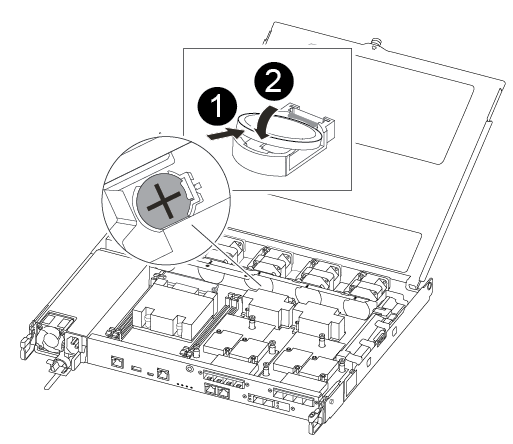

= 更換即時時鐘電池 - ASA C250
:allow-uri-read: 
:icons: font
:imagesdir: ../media/

[role="lead"]
您可以更換控制器模組中的即時時鐘（RTc）電池、讓系統的服務和應用程式繼續運作、而這些服務和應用程式必須仰賴精確的時間同步。

* 您可以將此程序用於ONTAP 系統支援的所有版本的功能
* 系統中的所有其他元件都必須正常運作；否則、您必須聯絡技術支援部門。

== 步驟1：關閉受損的控制器

若要關閉受損的控制器、您必須判斷控制器的狀態、並在必要時接管控制器、以便健全的控制器繼續從受損的控制器儲存設備提供資料。

.關於這項工作
* 如果您有 SAN 系統，則必須檢查故障控制器 SCSI 刀鋒的事件訊息  `cluster kernel-service show`。 `cluster kernel-service show`命令（從 priv 進階模式）會顯示節點名稱、link:https://docs.netapp.com/us-en/ontap/system-admin/display-nodes-cluster-task.html["仲裁狀態"]該節點的可用度狀態、以及該節點的作業狀態。
+
每個SCSI刀鋒處理序都應與叢集中的其他節點處於仲裁狀態。任何問題都必須先解決、才能繼續進行更換。

* 如果叢集有兩個以上的節點、則叢集必須處於仲裁狀態。如果叢集未達到法定人數、或健全的控制器顯示為「假」、表示符合資格和健全狀況、則您必須在關閉受損的控制器之前修正問題；請參閱 link:https://docs.netapp.com/us-en/ontap/system-admin/synchronize-node-cluster-task.html?q=Quorum["將節點與叢集同步"^]。

.步驟
. 如果啟用了「支援」功能、請叫用下列消息來禁止自動建立個案AutoSupport AutoSupport ：
+
`system node autosupport invoke -node * -type all -message MAINT=<# of hours>h`

+
下列AutoSupport 資訊不顯示自動建立案例兩小時：

+
`cluster1:> system node autosupport invoke -node * -type all -message MAINT=2h`

. 停用自動交還：
+
.. 從健康控制器的控制台輸入以下命令：
+
`storage failover modify -node local -auto-giveback false`

.. 進入 `y`當您看到提示「您是否要停用自動回饋？」時

. 將受損的控制器移至載入器提示：
+
[cols="1,2"]
|===
| 如果受損的控制器正在顯示... | 然後... 

 a| 
載入程式提示
 a| 
前往下一步。

 a| 
正在等待恢復...
 a| 
按Ctrl-C、然後在出現提示時回應「y」。

 a| 
系統提示或密碼提示
 a| 
從健全的控制器接管或停止受損的控制器：

`storage failover takeover -ofnode _impaired_node_name_ -halt _true_`

--halt true_ 參數會帶您進入 Loader 提示字元。

|===

== 步驟2：移除控制器模組

更換控制器模組內部的元件時、您必須從機箱中移除控制器模組。

請務必貼上纜線的標籤、以便知道纜線的來源。

. 如果您尚未接地、請正確接地。
. 從來源拔下控制器模組電源供應器。
. 釋放電源線固定器、然後從電源供應器拔下纜線。
. 將您的手指插入控制器模組兩側的鎖定機制、用姆指按下拉桿、然後將控制器從機箱中輕拉幾英吋。
+

NOTE: 如果您在移除控制器模組時遇到困難、請將指標手指從內側穿過指孔（手臂交叉）。

+
image::../media/drw_a250_pcm_remove_install.png[打開鎖定機制]

+
[cols="1,4"]
|===

 a| 
image:../media/icon_round_1.png["編號 1"]
 a| 
槓桿

 a| 
image:../media/icon_round_2.png["編號 2"]
 a| 
閉鎖機制

|===
. 用兩隻手抓住控制器模組的兩側、將其從機箱中輕拉出、然後放在平穩的表面上。
. 逆時鐘轉動控制器模組正面的指旋螺絲、然後打開控制器模組護蓋。
+
image::../media/drw_a250_open_controller_module_cover.png[打開控制器模組護蓋]

+
[cols="1,4"]
|===

 a| 
image:../media/icon_round_1.png["編號 1"]
 a| 
指旋螺絲

 a| 
image::../media/icon_round_2.png[編號 2]
 a| 
控制器模組護蓋。

|===
. 取出通風管蓋。
+
image::../media/drw_a250_remove_airduct_cover.png[提起通風管蓋]

== 步驟3：更換RTC電池

若要更換RTC電池、請將其放在控制器內、然後依照特定的步驟順序進行。

請使用下列視訊或表格步驟來更換RTC電池：

.動畫-更換RTC電池
video::6ed27f71-d3a7-4cee-8d9f-ac5b016c982d[panopto]
. 找出散熱片與中間板之間的RTC電池、並依照圖示將其取出。
+
image::../media/drw_a250_remove_rtc_batt.png[取出 RTC 電池]

+
[cols="1,4"]
|===

 a| 
image:../media/icon_round_1.png["編號 1"]
 a| 
輕拉電池外殼的彈片。*注意：*積極地拉出此標籤可能會使標籤消失。

 a| 
image:../media/icon_round_2.png["編號 2"]
 a| 
將電池抬起。*附註：*記下電池的極性。

 a| 
image:../media/icon_round_3.png["編號 3"]
 a| 
電池應該會退出。

|===
. 從防靜電包裝袋中取出替換電池。
. 找到散熱片與中間板之間的RTC電池座、並將其完全插入如圖所示的位置。
+

+
[cols="1,4"]
|===

 a| 
image:../media/icon_round_1.png["編號 1"]
 a| 
正極性面朝上、將電池滑到電池外殼的彈片下。

 a| 
image:../media/icon_round_2.png["編號 2"]
 a| 
將電池輕推入定位、並確定彈片將其固定在外殼上。

CAUTION: 若將電池推入較積極的位置、可能會導致電池再次退出。

|===
. 目視檢查電池、確定電池已完全裝入電池座、且極性正確。

== 步驟4：重新安裝控制器模組、並設定更換RTC電池後的時間/日期

更換控制器模組中的元件之後、您必須在系統機箱中重新安裝控制器模組、重設控制器上的時間和日期、然後將其開機。

. 如果您尚未這麼做、請關閉通風管或控制器模組護蓋。
. 將控制器模組的一端與機箱的開口對齊、然後將控制器模組輕推至系統的一半。
+
在指示之前、請勿將控制器模組完全插入機箱。

. 視需要重新安裝系統。
+
如果您移除媒體轉換器（QSFP或SFP）、請記得在使用光纖纜線時重新安裝。

. 將控制器模組插入機箱：
+
.. 確保鎖定機制臂鎖定在完全延伸位置。
.. 用兩隻手將控制器模組對齊並輕推入鎖定機制臂、直到它停止為止。
.. 將指標手指放在鎖定機制內側的指孔中。
.. 向下壓鎖定機制頂端的橘色彈片、然後將控制器模組輕推到停止點上。
.. 從鎖定機制頂端釋放您的指稱、然後繼續推動、直到鎖定機制卡入定位為止。+ 控制器模組應完全插入，並與機箱邊緣齊平。
.. 將電源線插入電源供應器，重新安裝電源線鎖環，然後將電源供應器連接至電源。
+
控制器模組會在電源恢復後立即開始開機。準備好中斷開機程序。

.. 在載入程式提示下停止控制器。

. 重設控制器上的時間和日期：
+
.. 使用「show date」命令檢查健全控制器上的日期和時間。
.. 在目標控制器的載入器提示下、檢查時間和日期。
.. 如有必要、請使用「設置日期mm/dd/ymm/西元年」命令來修改日期。
.. 如有必要、請使用「Set Time hh：mm：sss」命令、以GMT0設定時間。
.. 確認目標控制器上的日期和時間。

. 在載入程式提示下、輸入「bye」重新初始化PCIe卡和其他元件、然後讓控制器重新開機。
. 將控制器恢復正常運作、方法是歸還儲存設備：「torage容錯移轉恢復-ofnode_disapped_node_name_」
. 如果停用自動還原、請重新啟用：「儲存容錯移轉修改節點本機-自動恢復true」

== 步驟5：將故障零件歸還給NetApp

如套件隨附的RMA指示所述、將故障零件退回NetApp。如 https://mysupport.netapp.com/site/info/rma["零件退貨與更換"]需詳細資訊、請參閱頁面。
