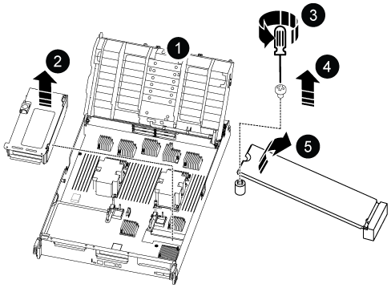

= 更換控制器模組硬體 - ASA C800
:allow-uri-read: 
:icons: font
:imagesdir: ../media/

[role="lead"]
當硬體故障需要更換時，請更換ASA C800系統中的控制器。更換過程包括移除受損的控制器、將組件移至更換的控制器、安裝更換的控制器以及重新啟動它。

== 步驟1：移除控制器模組

更換控制器模組或更換控制器模組內部的元件時、您必須從機箱中移除控制器模組。

.步驟
. 如果您尚未接地、請正確接地。
. 請用拇指推動每個磁碟機，直到您感覺到正向停止為止，以確保機箱中的所有磁碟機都穩固地安裝在中間背板上。
+
.影片 - 確認駕駛座椅
video::2c46e4af-2c21-4f12-b065-b38b003d0ea2[panopto]
+
image::../media/drw_a800_drive_seated_IEOPS-960.svg[將驅動器安裝到位]

. 根據系統狀態檢查控制器驅動器：
+
.. 在運作正常的控制器上，檢查是否有任何處於降級狀態、故障狀態或兩者兼具的狀態：
+
[source, cli]
----
storage aggregate show -raidstatus !*normal*
----
+
*** 如果命令返回 `There are no entries matching your query.`繼續<<Check-missing-drives,進入下一個子步驟，檢查是否有缺少的驅動器。>>。
*** 如果該命令返回任何其他結果，請從兩個控制器收集AutoSupport數據，並聯絡NetApp支援部門以取得進一步協助。
+
[source, cli]
----
system node autosupport invoke -node * -type all -message '<message_name>'
----

.. [[檢查缺少磁碟機]]檢查檔案系統或備用磁碟機是否有缺失磁碟機問題：
+
[source, cli]
----
event log show -severity * -node * -message-name *disk.missing*
----
+
*** 如果命令返回 `There are no entries matching your query.`繼續<<remove-power-cables,進入下一步>>。
*** 如果該命令返回任何其他結果，請從兩個控制器收集AutoSupport數據，並聯絡NetApp支援部門以取得進一步協助。
+
[source, cli]
----
system node autosupport invoke -node * -type all -message '<message_name>'
----

. [[移除電源線]]移除電源線固定器，然後從電源上拔下電源線。
. 鬆開線纜管理裝置上的魔鬼氈綁帶。從控制器模組上拔下系統電纜和 SFP/QSFP 模組（如果需要）。記下每條電纜的位置。
+
將纜線留在纜線管理裝置中、以便在重新安裝纜線管理裝置時、整理好纜線。

. 從控制器模組中取出纜線管理裝置、然後將其放在一旁。
. 向下按兩個鎖定栓、然後同時向下轉動兩個鎖條。
+
控制器模組會稍微移出機箱。

+
image::../media/drw_a800_pcm_remove.png[卸下控制器模組]

+
[cols="1,4"]
|===

 a| 
image:../media/icon_round_1.png["編號 1"]
 a| 
鎖定鎖定

 a| 
image:../media/icon_round_2.png["編號 2"]
 a| 
鎖定銷

|===
. 將控制器模組滑出機箱、然後放在穩固的平面上。
+
托住控制器模組的底部，將其從機箱中滑出。

== 步驟2：搬移電源供應器

將電源移至替換控制器模組。

.步驟
. 旋轉CAM握把、以便在按下鎖定彈片的同時、將電源供應器從控制器模組中拉出。
+

CAUTION: 電源供應器不足。從控制器模組中取出時、請務必用兩隻手支撐、以免突然從控制器模組中迴轉而造成傷害。

+
image::../media/drw_a800_replace_psu.svg[移除或更換電源供應器]

+
[cols="1,4"]
|===

 a| 
image:../media/icon_round_1.png["編號 1"]
 a| 
藍色電源供應器鎖定彈片

 a| 
image:../media/icon_round_2.png["編號 2"]
 a| 
電源供應器

|===
. 將電源供應器移至新的控制器模組、然後安裝。
. 用兩隻手支撐電源供應器的邊緣、並將其與控制器模組的開口對齊、然後將電源供應器輕推入控制器模組、直到鎖定彈片卡入定位。
+
電源供應器只能與內部連接器正確接合、並以一種方式鎖定到位。

+

NOTE: 為避免損壞內部連接器、請勿在將電源供應器滑入系統時過度施力。

== 步驟3：移動風扇

將風扇模組移至替換控制器模組。

.步驟
. 將風扇模組側邊的鎖定彈片夾住、然後將風扇模組從控制器模組中直接提出、以移除風扇模組。
+
image::../media/drw_a800_replace_fan.png[卸下風扇]

+
[cols="1,4"]
|===

 a| 
image:../media/icon_round_1.png["編號 1"]
 a| 
風扇鎖定彈片

 a| 
image:../media/icon_round_2.png["編號 2"]
 a| 
風扇模組

|===
. 將風扇模組移至更換的控制器模組、然後將其邊緣對齊控制器模組的開孔、將風扇模組滑入控制器模組、直到鎖定的栓鎖卡入定位。
. 對其餘的風扇模組重複這些步驟。

== 步驟4：移動NVDIMM電池

將NVDIMM電池移至替換控制器模組。

.步驟
. 打開通風管蓋、並將NVDIMM電池放入擴充卡中。
+
image::../media/drw_a800_nvdimm_battery_replace.png[更換 NVDIMM 電池]

+
[cols="1,4"]
|===

 a| 
image:../media/icon_round_1.png["編號 1"]
 a| 
通風管提升板

 a| 
image:../media/icon_round_2.png["編號 2"]
 a| 
NVDIMM電池插塞

 a| 
image:../media/icon_round_3.png["編號 3"]
 a| 
NVDIMM電池套件

|===
+
*注意：*當您停止系統時、NVDIMM電池控制板LED會在將內容降解至快閃記憶體時閃爍。完成轉出後、LED會關閉。

. 找到電池插塞、並將電池插塞正面的固定夾壓下、以從插槽釋放插塞、然後從插槽拔下電池纜線。
. 抓住電池、將電池從通風管和控制器模組中取出。
. 將電池套件移至更換的控制器模組、然後將其安裝在NVDIMM通風管中：
+
.. 將電池套件插入插槽、然後穩固地向下按電池套件、以確保其鎖定到位。
.. 將電池插頭插入擴充卡插槽、並確定插塞鎖定到位。

== 步驟5：移除PCIe擴充卡

從故障控制器模組上移除 PCIe 轉接卡。

.步驟
. 從控制器模組中移除PCIe擴充卡：
+
.. 移除PCIe卡中的任何SFP或QSFP模組。
.. 向上轉動提升板左側的提升板鎖定栓、並朝風扇模組方向轉動。
+
提升板會從控制器模組稍微向上提升。

.. 向上提起提升板、將其移向風扇、使提升板上的金屬片邊緣脫離控制器模組邊緣、將提升板從控制器模組中提出、然後將其放置在穩固的平面上。
+
image::../media/drw_a800_riser_2_3_remove.png[卸下提升板 2 和 3]

+
[cols="1,4"]
|===

 a| 
image:../media/icon_round_1.png["編號 1"]
 a| 
通風管

 a| 
image:../media/icon_round_2.png["編號 2"]
 a| 
提升板1（左提升板）、提升板2（中間提升板）和3（右提升板）鎖定鎖定鎖條

|===

. 對受損控制器模組中的其餘擴充卡重複上述步驟。
. 在更換控制器中使用空的擴充卡重複上述步驟、然後將其移除。

== 步驟6：移動系統DIMM

將系統 DIMM 移至替換控制器模組。

.步驟
. 請注意插槽中的DIMM方向、以便您以適當的方向將DIMM插入更換的控制器模組。
. 緩慢地將DIMM兩側的兩個DIMM彈出彈片分開、然後將DIMM從插槽中滑出、藉此將DIMM從插槽中退出。
+

NOTE: 小心拿住DIMM的邊緣、避免對DIMM電路板上的元件施加壓力。

. 找到要安裝DIMM的插槽。
. 將DIMM正面插入插槽。
+
DIMM可緊密插入插槽、但應該很容易就能裝入。如果沒有、請重新將DIMM與插槽對齊、然後重新插入。

+

NOTE: 目視檢查DIMM、確認其對齊並完全插入插槽。

. 在DIMM頂端邊緣小心地推入、但穩固地推入、直到彈出彈出彈片卡入DIMM兩端的槽口。
. 對其餘的DIMM重複這些步驟。

== 步驟7：移動NVDIMM

將 NVDIMMS 移至替換控制器模組。

.步驟
. 找到控制器模組上的NVDIMM。
+
image::../media/drw_a800_no_risers_nvdimm_move.svg[移動 NVDIMM]

+
[cols="1,4"]
|===

 a| 
image:../media/icon_round_1.png["編號 1"]
 a| 
通風管

 a| 
image:../media/icon_round_2.png["編號 2"]
 a| 
NVDIMM

|===
. 請注意NVDIMM在插槽中的方向、以便將NVDIMM以適當的方向插入替換控制器模組。
. 將NVDIMM從插槽中退出、方法是緩慢地將NVDIMM兩側的兩個NVDIMM彈出彈片分開、然後將NVDIMM從插槽中滑出並放在一邊。
+

NOTE: 小心拿住NVDIMM的邊緣、避免對NVDIMM電路板上的元件施加壓力。

. 找到要安裝NVDIMM的插槽。
. 將NVDIMM正面插入插槽。
+
NVDIMM可緊密裝入插槽、但應能輕鬆放入。如果沒有、請重新將NVDIMM與插槽對齊、然後重新插入。

+

NOTE: 目視檢查NVDIMM、確認其已平均對齊並完全插入插槽。

. 小心但穩固地推入NVDIMM頂端邊緣、直到彈出彈片卡入NVDIMM末端的槽口。
. 重複上述步驟以移動其他NVDIMM。

== 步驟8：移動開機媒體

將啟動媒體移至替換後的控制器模組。

.步驟
. 找到 Riser 3 下方的啟動介質。
+

+
[cols="1,4"]
|===

 a| 
image:../media/icon_round_1.png["編號 1"]
 a| 
通風管

 a| 
image:../media/icon_round_2.png["編號 2"]
 a| 
擴充卡3

 a| 
image:../media/icon_round_3.png["編號 3"]
 a| 
1號十字螺絲起子

 a| 
image:../media/icon_round_4.png["編號 4."]
 a| 
開機媒體螺絲

 a| 
image:../media/icon_round_5.png["編號 5."]
 a| 
開機媒體

|===
. 從控制器模組移除開機媒體：
+
.. 使用1號十字螺絲起子、取出固定開機媒體的螺絲、並將螺絲放在安全的地方。
.. 抓住開機媒體的兩側、輕轉開機媒體、然後將開機媒體直接從插槽拉出、放在一旁。

. 將開機媒體移至新的控制器模組並安裝：
+
.. 將開機媒體的邊緣對齊插槽外殼、然後將其輕推入插槽。
.. 將開機媒體向下旋轉至主機板。
.. 使用開機媒體螺絲將開機媒體固定至主機板。
+
請勿過度鎖緊螺絲、否則可能會損壞開機媒體。

== 步驟9：安裝PCIe擴充卡

將立管安裝到替換控制器模組中。

.步驟
. 將擴充卡安裝至更換的控制器模組：
+
.. 將擴充卡的邊緣對齊控制器模組的底部金屬板。
.. 沿控制器模組的插腳引導擴充卡、然後將擴充卡降低至控制器模組。
.. 向下轉動鎖定栓、然後將其卡入鎖定位置。
+
鎖定時、鎖定栓會與擴充卡的頂端齊平、而擴充卡則會正面置於控制器模組中。

.. 重新插入從PCIe卡中移除的任何SFP或QSFP模組。

. 針對其餘的PCIe擴充卡重複上述步驟。

== 步驟10：安裝控制器模組

重新安裝控制器模組、然後重新啟動。

.步驟
. 將控制器模組的一端與機箱的開口對齊、然後將控制器模組輕推至系統的一半。
+

NOTE: 在指示之前、請勿將控制器模組完全插入機箱。

. 視需要重新安裝系統。
+
如果您移除媒體轉換器（QSFP或SFP）、請記得在使用光纖纜線時重新安裝。

. 完成控制器模組的重新安裝：
+
.. 將控制器模組穩固地推入機箱、直到它與中間板完全接入。
+
控制器模組完全就位時、鎖定鎖條會上升。

+

NOTE: 將控制器模組滑入機箱時、請勿過度施力、以免損壞連接器。

.. 向上轉動鎖定栓、將其傾斜、使其從鎖定銷中取出、然後將其放低至鎖定位置。
.. 將電源線插入電源供應器，重新安裝電源線鎖環，然後將電源供應器連接至電源。
+
控制器模組會在電源恢復後立即開始開機。準備好中斷開機程序。

.. 如果您尚未重新安裝纜線管理裝置、請重新安裝。

. 將受損的控制器歸還其儲存設備、使其恢復正常運作：
+
`storage failover giveback -ofnode _impaired_node_name_`。

. 如果自動恢復已停用、請重新啟用：
+
`storage failover modify -node local -auto-giveback true`。

. 如果啟用 AutoSupport ，則還原 / 恢復自動建立個案：
+
`system node autosupport invoke -node * -type all -message MAINT=END`。

.接下來呢？
更換故障的ASA C800控制器後，您需要：link:controller-replace-system-config-restore-and-verify.html["還原系統組態"]
