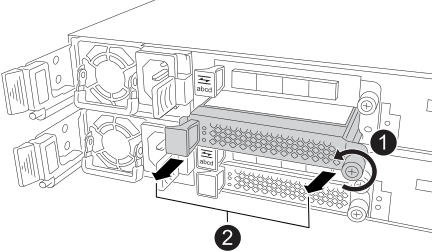

= 新增 I/O 模組： ASA A20 ， ASA A30 和 ASA A50
:allow-uri-read: 
:icons: font
:imagesdir: ../media/

[role="lead"]
將 I/O 模組新增至 ASA A20 ， ASA A30 或 ASA A50 系統，以增強網路連線能力，並擴充系統處理資料流量的能力。

當有可用插槽或所有插槽均已完全插滿時，您可以將 I/O 模組新增至 ASA A20 ， ASA A30 和 ASA A50 儲存系統。

.關於這項工作
如有需要，您可以開啟儲存系統位置（藍色） LED ，以協助實體定位所選的儲存系統。使用 SSH 登入 BMC ，然後輸入 `system location-led _on_`命令。

儲存系統有三個位置 LED ：一個在操作員顯示面板上，一個在每個控制器上。位置LED會持續亮起30分鐘。

您可以輸入命令將其關閉 `system location-led _off_`。如果您不確定 LED 是否亮起或熄滅，可以輸入命令來檢查其狀態 `system location-led show`。

== 步驟 1 ：關閉受損的控制器模組

若要關閉受損的控制器、您必須判斷控制器的狀態、並在必要時接管控制器、以便健全的控制器繼續從受損的控制器儲存設備提供資料。

.開始之前
如果叢集有兩個以上的節點、則叢集必須處於仲裁狀態。如果叢集未達到法定人數、或健全的控制器顯示為「假」、表示符合資格和健全狀況、則您必須在關閉受損的控制器之前修正問題；請參閱 link:https://docs.netapp.com/us-en/ontap/system-admin/synchronize-node-cluster-task.html?q=Quorum["將節點與叢集同步"^]。

.步驟
. 如果啟用 AutoSupport 、請叫用 AutoSupport 訊息命令來抑制自動建立個案： `system node autosupport invoke -node * -type all -message MAINT=number_of_hours_downh`
+
下列 AutoSupport 命令會禁止自動建立案例兩小時： `cluster1:*> system node autosupport invoke -node * -type all -message MAINT=2h`

. 停用健全控制器主控台的自動恢復功能：「torage容錯移轉修改–節點本機-自動恢復錯誤」
. 將受損的控制器移至載入器提示：
+
[cols="1,2"]
|===
| 如果受損的控制器正在顯示... | 然後... 

 a| 
載入程式提示
 a| 
前往下一步。

 a| 
《等待贈品……》
 a| 
按Ctrl-C、然後在出現提示時回應「y」。

 a| 
系統提示或密碼提示（輸入系統密碼）
 a| 
從健全的控制器停止或接管受損的控制器： `storage failover takeover -ofnode _impaired_node_name_`

當受損的控制器顯示正在等待恢復...時、請按Ctrl-C、然後回應「y」。

|===

== 步驟 2 ：新增 I/O 模組

如果儲存系統有可用的插槽，請將新的 I/O 模組安裝到其中一個可用的插槽中。如果所有插槽都已佔用，請移除現有的 I/O 模組以騰出空間，然後安裝新的 I/O 模組。

.開始之前
* 檢查 https://hwu.netapp.com/["NetApp Hardware Universe"^] 以確定新的 I/O 模組與您執行的儲存系統和 ONTAP 版本相容。
* 如果有多個插槽可用、請檢查中的插槽優先順序 https://hwu.netapp.com/["NetApp Hardware Universe"^] 並使用適用於您I/O模組的最佳工具。
* 儲存系統中的所有其他元件都必須正常運作；否則，請先聯絡， https://mysupport.netapp.com/site/global/dashboard["NetApp支援"]再繼續執行此程序。

[role="tabbed-block"]
====
.將 I/O 模組新增至可用的插槽
--
您可以在具有可用插槽的儲存系統中新增 I/O 模組。

.步驟
. 如果您尚未接地、請正確接地。
. 在受損的控制器上，從目標插槽中移除 I/O 遮蔽模組。
+
未使用的 I/O 插槽應安裝消隱模組，以避免可能的散熱問題。

+

+
[cols="1,4"]
|===

 a| 
image:../media/icon_round_1.png["編號 1"]
 a| 
在 I/O 消隱模組上，逆時針旋轉指旋螺絲以鬆開。

 a| 
image:../media/icon_round_2.png["編號 2"]
 a| 
使用左側的卡舌和指旋螺絲將 I/O 擋板模組從控制器中拉出。

|===
. 安裝新的 I/O 模組：
+
.. 將 I/O 模組與控制器插槽開口的邊緣對齊。
.. 輕輕地將 I/O 模組完全推入插槽，確保將模組正確插入連接器。
+
您可以使用左側的標籤和指旋螺絲推入 I/O 模組。

.. 順時針旋轉指旋螺絲以旋緊。

. 將 I/O 模組連接至指定的裝置。
+
如果您安裝了儲存 I/O 模組、請依照中所述、安裝 NS224 機櫃並連接纜線 https://docs.netapp.com/us-en/ontap-systems/ns224/hot-add-shelf-overview.html["熱新增工作流程"^]。

. 從 Loader 提示重新啟動受損的控制器： `bye`
+
重新啟動功能受損的控制器時，也會重新初始化 I/O 模組和其他元件。

. 將受損的控制器交回合作夥伴控制器： `storage failover giveback -ofnode _impaired_node_name_`
. 重複這些步驟，將 I/O 模組新增至其他控制器。
. 從健全控制器的主控台還原自動恢復： `storage failover modify -node local -auto-giveback _true_`
. 如果啟用 AutoSupport ，則還原（恢復抑制）自動建立個案： `system node autosupport invoke -node * -type all -message MAINT=END`

--
.將 I/O 模組新增至完全填入的系統
--
您可以移除現有的 I/O 模組，並在其所在位置安裝新的 I/O 模組，將 I/O 模組新增至完全安裝的系統。

.關於這項工作
請確定您瞭解下列案例，以便將新的 I/O 模組新增至完全填入的系統：

[cols="1,2"]
|===
| 案例 | 需要採取行動 

 a| 
NIC 對 NIC （相同數量的連接埠）
 a| 
當控制器模組關閉時、LIF會自動移轉。

 a| 
NIC 對 NIC （不同的連接埠數量）
 a| 
將選取的生命由永久重新指派至不同的主連接埠。如需詳細資訊、請參閱 https://docs.netapp.com/ontap-9/topic/com.netapp.doc.onc-sm-help-960/GUID-208BB0B8-3F84-466D-9F4F-6E1542A2BE7D.html["移轉LIF"^] 。

 a| 
NIC 至儲存 I/O 模組
 a| 
使用System Manager將lifs永久移轉至不同的主連接埠、如所述 https://docs.netapp.com/ontap-9/topic/com.netapp.doc.onc-sm-help-960/GUID-208BB0B8-3F84-466D-9F4F-6E1542A2BE7D.html["移轉LIF"^]。

|===
.步驟
. 如果您尚未接地、請正確接地。
. 在受損的控制器上，拔下目標 I/O 模組上的任何纜線。
. 從控制器中移除目標 I/O 模組：
+
image::../media/drw_g_io_module_replace_ieops-1900.svg[卸下 I/O 模組]

+
[cols="1,4"]
|===

 a| 
image:../media/icon_round_1.png["編號 1"]
 a| 
逆時針旋轉 I/O 模組指旋螺絲以鬆開。

 a| 
image:../media/icon_round_2.png["編號 2"]
 a| 
使用左側的連接埠標籤和指旋螺絲，將 I/O 模組拉出控制器。

|===
. 將新的 I/O 模組安裝至目標插槽：
+
.. 將I/O模組與插槽邊緣對齊。
.. 輕輕地將 I/O 模組完全推入插槽，確保將模組正確插入連接器。
+
您可以使用左側的標籤和指旋螺絲推入 I/O 模組。

.. 順時針旋轉指旋螺絲以旋緊。

. 將 I/O 模組連接至指定的裝置。
+
如果您安裝了儲存 I/O 模組、請依照中所述、安裝 NS224 機櫃並連接纜線 https://docs.netapp.com/us-en/ontap-systems/ns224/hot-add-shelf-overview.html["熱新增工作流程"^]。

. 重複 I/O 模組的移除和安裝步驟，在控制器中新增任何其他 I/O 模組。
. 從 Loader 提示重新啟動受損的控制器： `bye`
+
重新啟動功能受損的控制器時，也會重新初始化 I/O 模組和其他元件。

. 將受損的控制器交回合作夥伴控制器： `storage failover giveback -ofnode _impaired_node_name_`
. 從健全控制器的主控台還原自動恢復： `storage failover modify -node local -auto-giveback _true_`
. 如果啟用 AutoSupport ，則還原（恢復抑制）自動建立個案：系統節點 AutoSupport 叫用 -node* -type all -message MAINT = end
. 如果您安裝了 NIC 模組，請將每個連接埠的使用模式指定為 _network_ ： `storage port modify -node *_<node name>_ -port *_<port name>_ -mode network`
. 對另一個控制器重複這些步驟。

--
====