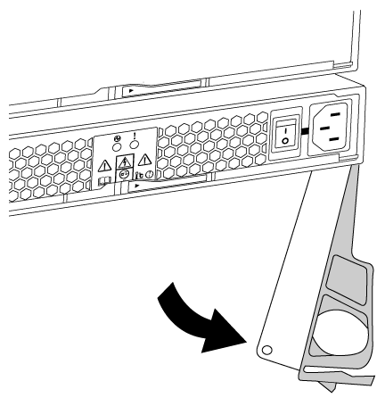

= 交換電源供應器 - ASA A150
:allow-uri-read: 
:icons: font
:imagesdir: ../media/

[role="lead"]
交換電源供應器包括關閉、拔下及移除舊的電源供應器、以及安裝、連接及開啟更換的電源供應器。

系統中的所有其他元件都必須正常運作；否則、您必須聯絡技術支援部門。

* 電源供應器備援且可熱交換。
* 本程序是針對一次更換一個電源供應器而撰寫。
+

NOTE: 冷卻功能已與電源供應器整合、因此您必須在移除後兩分鐘內更換電源供應器、以免因氣流減少而過熱。由於機箱提供兩個HA節點的共享冷卻組態、因此延遲超過兩分鐘將會關閉機箱中的所有控制器模組。如果兩個控制器模組都確實關機、請確定兩個電源供應器都已插入、關閉兩個電源供應器30秒、然後開啟兩個電源供應器。

* 電源供應器為自動調整範圍。

.步驟
. 根據主控台錯誤訊息或電源供應器上的LED、識別您要更換的電源供應器。
. 如果您尚未接地、請正確接地。
. 關閉電源供應器並拔下電源線：
+
.. 關閉電源供應器上的電源開關。
.. 打開電源線固定器、然後從電源供應器拔下電源線。
.. 從電源拔下電源線。

. 擠壓電源供應器CAM握把上的栓鎖、然後打開CAM握把、從中間面完全釋放電源供應器。
+

. 使用CAM握把將電源供應器滑出系統。
+

CAUTION: 移除電源供應器時、請務必用兩隻手支撐其重量。

. 確定新電源供應器的開關位於「關閉」位置。
. 用兩隻手支撐電源供應器邊緣、並將其與系統機箱的開孔對齊、然後使用CAM握把將電源供應器輕推入機箱。
+
電源供應器採用鎖定式設計、只能以單一方式安裝。

+

NOTE: 將電源供應器滑入系統時、請勿過度施力。您可能會損壞連接器。

. 關閉CAM握把、使栓鎖卡入鎖定位置、且電源供應器已完全就位。
. 重新連接電源供應器纜線：
+
.. 將電源線重新連接至電源供應器和電源。
.. 使用電源線固定器將電源線固定至電源供應器。

+
電源恢復後、狀態LED應為綠色。

. 開啟新電源供應器的電源、然後確認電源供應器活動LED的運作。
+
電源供應器上線時、電源供應器LED會亮起。

. 如套件隨附的RMA指示所述、將故障零件退回NetApp。如 https://mysupport.netapp.com/site/info/rma["零件退貨與更換"^]需詳細資訊、請參閱頁面。

