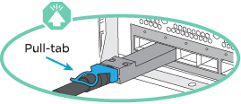
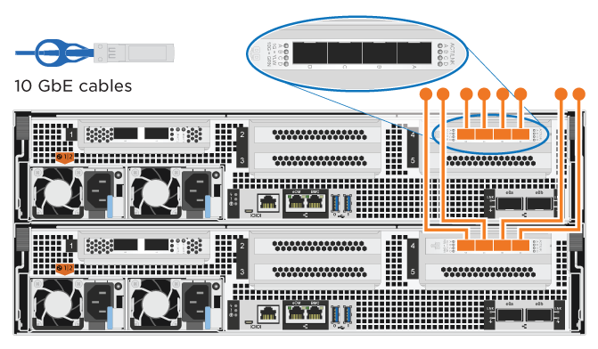

= 詳細步驟 - ASA A800
:allow-uri-read: 
:icons: font
:imagesdir: ../media/

[role="lead"]
本頁提供安裝 ASA A800 系統的詳細逐步指示。

== 步驟1：準備安裝

若要安裝系統、您需要建立帳戶並註冊系統。您也需要為系統庫存適當數量和類型的纜線、並收集特定的網路資訊。

您必須能夠存取 link:https://hwu.netapp.com["NetApp Hardware Universe"^] （HWU）以取得站台需求的相關資訊、以及設定系統的其他資訊。您可能也想要存取 link:http://mysupport.netapp.com/documentation/productlibrary/index.html?productID=62286["版本的發行說明ONTAP"^] 以取得此系統的詳細資訊。

.您需要的一切
您必須在網站上提供下列資訊：

* 儲存系統的機架空間
* 2號十字螺絲起子
* 其他網路纜線、可將系統連接至網路交換器、筆記型電腦或主控台、並使用網路瀏覽器
+
.. 打開所有包裝箱的內容物。
.. 從控制器記錄系統序號。
+
image::../media/drw_ssn_label.png[顯示號碼位置的系統序號範例]

.步驟
. 設定您的帳戶：
+
.. 登入現有帳戶或建立帳戶。
.. 註冊（link:https://mysupport.netapp.com/eservice/registerSNoAction.do?moduleName=RegisterMyProduct["NetApp產品註冊"^]）您的系統。

. 下載並安裝 link:https://mysupport.netapp.com/site/tools/tool-eula/activeiq-configadvisor["NetApp下載Config Advisor"^] 在筆記型電腦上。
. 清點並記下您收到的纜線數量和類型。
+
下表列出您可能會收到的纜線類型。如果您收到的纜線未列於表中、請參閱 link:https://hwu.netapp.com["NetApp Hardware Universe"^] 找出纜線並識別其用途。

+
[cols="1,2,1,2"]
|===
| 連接器類型 | 產品編號與長度 | 纜線類型... | 適用於... 

 a| 
100 GbE纜線
 a| 
X66211A-05（112-00595）、0.5公尺
 a| 

 a| 
HA互連

 a| 
X66211A-05（112-00595）、0.5公尺；

X66211-1（112-00573）、1公尺
 a| 
叢集互連網路

 a| 
X66211-2（112-00576）、2公尺；

X66211-5（112-00576）、5公尺
 a| 
儲存、資料

 a| 
10 GbE纜線
 a| 
X6566B-3-R6（112-00300）、3公尺；

X6566B-5-R6（112-00301）、5公尺
 a| 
資料

 a| 
25 GbE纜線
 a| 
X66240A-2（112-00598）、2公尺；

X66240A-5（112-00600）、5公尺
 a| 
資料

 a| 
RJ-45（訂單相依）
 a| 
不適用
 a| 
image:../media/oie_cable_rj45.png["RJ-45 纜線連接器"]
 a| 
管理

 a| 
Fibre Channel
 a| 
X66250-2（112-003442）2公尺；

X66250-5（112-003444）5公尺；

X66250-15（112-00346）15公尺；

X66250-30（112-003473）30公尺
 a| 
image:../media/oie_cable_fc_optical.png["OIE 光纖通道光纖纜線"]
 a| 

 a| 
micro-USB主控台纜線
 a| 
不適用
 a| 
image:../media/oie_cable_micro_usb.png["顯示 Micro USB 接頭的圖例"]
 a| 
軟體設定期間的主控台連線

 a| 
電源線
 a| 
不適用
 a| 
image:../media/oie_cable_power.png["電源線"]
 a| 
開啟系統電源

|===
. 下載並完成 link:https://library.netapp.com/ecm/ecm_download_file/ECMLP2839002["叢集組態工作表"^]。

== 步驟2：安裝硬體

您需要在4柱機架或NetApp系統機櫃中（視情況而定）安裝系統。

.步驟
. 視需要安裝軌道套件。
+
link:../platform-supplemental/superrail-install.html["將超級滑軌安裝到四柱式機架中"]

. 請依照軌道套件隨附的指示來安裝及固定系統。
+

NOTE: 您必須瞭解與系統重量相關的安全顧慮。

+
image::../media/drw_affa800_weight_caution.png[四人舉升注意事項]

. 連接纜線管理裝置（如圖所示）。
+
image::../media/drw_affa800_install_cable_mgmt.png[連接纜線管理裝置]

. 將擋板放在系統正面。

== 步驟3：纜線控制器

使用雙節點無交換式叢集方法或叢集互連網路方法、您的平台叢集需要佈線。光纖通道或iSCSI主機網路或直接附加儲存設備可選用纜線。這種纜線並非獨家、您可以使用纜線連接主機網路和儲存設備。

=== 必要的纜線連接：將纜線控制器連接至叢集

使用雙節點無交換式叢集方法或使用叢集互連網路、將控制器連接至叢集。

==== 選項1：連接雙節點無交換式叢集

控制器上的管理網路連接埠連接至交換器。兩個控制器上的HA互連和叢集互連連接埠均已連接好纜線。

.開始之前
如需將系統連接至交換器的相關資訊、請聯絡您的網路管理員。

請務必檢查圖示箭頭、以瞭解纜線連接器的拉式彈片方向是否正確。

NOTE: 插入連接器時、您應該會感覺到它卡入到位；如果您沒有感覺到它卡入定位、請將其移除、將其翻轉、然後再試一次。

.步驟
. 使用動畫或表格步驟完成控制器與交換器之間的佈線：
+
.動畫-連接雙節點無交換器叢集
video::edc42447-f721-4cbe-b080-ab0c0123a139[panopto]
+
[cols="10,90"]
|===
| 步驟 | 在每個控制器模組上執行 

 a| 

 a| 
連接HA互連連接埠：

** e0b至e0b
** e1b 至 e1b
image:../media/drw_affa800_ha_pair_cabling.png["HA 配對纜線"]

 a| 

 a| 
連接叢集互連連接埠：

** e0a至e0a
** e1a 至 e1a
image:../media/drw_affa800_tnsc_clust_cabling.png["雙節點無交換器叢集中的叢集互連纜線"]

 a| 
image:../media/oie_legend_icon_3_lp.png["步驟 3"]
 a| 
將管理連接埠連接至管理網路交換器    image:../media/drw_affa800_mgmt_cabling.png["顯示系統背面管理連接埠位置的圖例"]

 a| 
image:../media/oie_legend_icon_attn_symbol.png["注意符號"]
 a| 
此時請勿插入電源線。

|===
. 若要執行選購的纜線、請參閱：
+
** <<選項1：連接至光纖通道主機網路的纜線>>
** <<選項2：連接10GbE主機網路的纜線>>
** <<選項3：將控制器連接至單一磁碟機櫃>>
** <<選項4：將控制器連接至兩個磁碟機櫃>>

. 若要完成系統設定、請參閱 link:install-detailed-guide.html#step-4-complete-system-setup-and-configuration["步驟4：完成系統設定與組態設定"]。

==== 選項2：連接交換式叢集

控制器上的叢集互連和管理網路連接埠會連接至交換器、而HA互連連接埠則連接至兩個控制器。

.開始之前
如需將系統連接至交換器的相關資訊、請聯絡您的網路管理員。

請務必檢查圖示箭頭、以瞭解纜線連接器的拉式彈片方向是否正確。

NOTE: 插入連接器時、您應該會感覺到它卡入到位；如果您沒有感覺到它卡入定位、請將其移除、將其翻轉、然後再試一次。

.步驟
. 使用動畫或表格步驟完成控制器與交換器之間的佈線：
+
.動畫-連接交換式叢集
video::49e48140-4c5a-4395-a7d7-ab0c0123a10e[panopto]
+
[cols="10,90"]
|===
| 步驟 | 在每個控制器模組上執行 

 a| 

 a| 
連接HA互連連接埠：

** e0b至e0b
** e1b 至 e1b
image:../media/drw_affa800_ha_pair_cabling.png["HA 配對纜線"]

 a| 

 a| 
將叢集互連連接埠連接至 100 GbE 叢集互連交換器。
** e0a
** e1a.
image:../media/drw_affa800_switched_clust_cabling.png["叢集互連纜線"]

 a| 
image:../media/oie_legend_icon_3_lp.png["步驟 3"]
 a| 
將管理連接埠連接至管理網路交換器    image:../media/drw_affa800_mgmt_cabling.png["顯示系統背面管理連接埠位置的圖例"]

 a| 
image:../media/oie_legend_icon_attn_symbol.png["注意符號"]
 a| 
此時請勿插入電源線。

|===
. 若要執行選購的纜線、請參閱：
+
** <<選項1：連接至光纖通道主機網路的纜線>>
** <<選項2：連接10GbE主機網路的纜線>>
** <<選項3：將控制器連接至單一磁碟機櫃>>
** <<選項4：將控制器連接至兩個磁碟機櫃>>

. 若要完成系統設定、請參閱 link:install-detailed-guide.html#step-4-complete-system-setup-and-configuration["步驟4：完成系統設定與組態設定"]。

=== 可選佈線：纜線組態相依選項

您可以選擇是否要連接至光纖通道或iSCSI主機網路或直接附加儲存設備、以設定為相依。這種佈線並非專屬、您可以使用佈線連接至主機網路和儲存設備。

==== 選項1：連接至光纖通道主機網路的纜線

控制器上的Fibre Channel連接埠連接至Fibre Channel主機網路交換器。

.開始之前
如需將系統連接至交換器的相關資訊、請聯絡您的網路管理員。

請務必檢查圖示箭頭、以瞭解纜線連接器的拉式彈片方向是否正確。

NOTE: 插入連接器時、您應該會感覺到它卡入到位；如果您沒有感覺到它卡入定位、請將其移除、將其翻轉、然後再試一次。

[cols="10,90"]
|===
| 步驟 | 在每個控制器模組上執行 

 a| 
1.
 a| 
將連接埠2a至2D連接至FC主機交換器。image:../media/drw_affa800_fc_host_cabling.png["Fibre Channel 主機網路纜線"]

 a| 
2.
 a| 
若要執行其他選用的纜線、請選擇：

* <<選項3：將控制器連接至單一磁碟機櫃>>
* <<選項4：將控制器連接至兩個磁碟機櫃>>

 a| 
3.
 a| 
若要完成系統設定、請參閱 link:install-detailed-guide.html#step-4-complete-system-setup-and-configuration["步驟4：完成系統設定與組態設定"]。

|===

==== 選項2：連接10GbE主機網路的纜線

控制器上的10GbE連接埠連接至10GbE主機網路交換器。

.開始之前
如需將系統連接至交換器的相關資訊、請聯絡您的網路管理員。

請務必檢查圖示箭頭、以瞭解纜線連接器的拉式彈片方向是否正確。

NOTE: 插入連接器時、您應該會感覺到它卡入到位；如果您沒有感覺到它卡入定位、請將其移除、將其翻轉、然後再試一次。

[cols="10,90"]
|===
| 步驟 | 在每個控制器模組上執行 

 a| 
1.
 a| 
將E4A至e4d纜線連接埠連接至10GbE主機網路交換器。

 a| 
2.
 a| 
若要執行其他選用的纜線、請選擇：

* <<選項3：將控制器連接至單一磁碟機櫃>>
* <<選項4：將控制器連接至兩個磁碟機櫃>>

 a| 
3.
 a| 
若要完成系統設定、請參閱 link:install-detailed-guide.html#step-4-complete-system-setup-and-configuration["步驟4：完成系統設定與組態設定"]。

|===

==== 選項3：將控制器連接至單一磁碟機櫃

您必須將每個控制器纜線連接至NS224磁碟機櫃上的NSM模組。

.開始之前
請務必檢查圖示箭頭、以瞭解纜線連接器的拉式彈片方向是否正確。

NOTE: 插入連接器時、您應該會感覺到它卡入到位；如果您沒有感覺到它卡入定位、請將其移除、將其翻轉、然後再試一次。

使用動畫或表格步驟、將控制器連接至單一機櫃：

.動畫-將控制器連接至單一磁碟機櫃
video::09dade4f-00bd-4d41-97d7-ab0c0123a0b4[panopto]
[cols="10,90"]
|===
| 步驟 | 在每個控制器模組上執行 

 a| 
image:../media/oie_legend_icon_1_mb.png["編號 1"]
 a| 
將控制器A纜線連接至機櫃：    image:../media/drw_affa800_1shelf_cabling_a.png["將控制器佈線至單一機櫃"]

 a| 
image:../media/oie_legend_icon_2_lo.png["編號 2"]
 a| 
將控制器B纜線連接至機櫃：    image:../media/drw_affa800_1shelf_cabling_b.png["將控制器 B 連接至單一機櫃"]

|===
若要完成系統設定、請參閱 link:install-detailed-guide.html#step-4-complete-system-setup-and-configuration["步驟4：完成系統設定與組態設定"]。

==== 選項4：將控制器連接至兩個磁碟機櫃

您必須將每個控制器連接至兩個NS224磁碟機櫃上的NSM模組。

.開始之前
請務必檢查圖示箭頭、以瞭解纜線連接器的拉式彈片方向是否正確。

NOTE: 插入連接器時、您應該會感覺到它卡入到位；如果您沒有感覺到它卡入定位、請將其移除、將其翻轉、然後再試一次。

使用動畫或表格步驟、將控制器連接至兩個磁碟機櫃：

.動畫-將控制器連接至兩個磁碟機櫃
video::fe50ac38-9375-4e6b-85af-ab0c0123a0e0[panopto]
[cols="10,90"]
|===
| 步驟 | 在每個控制器模組上執行 

 a| 
image:../media/oie_legend_icon_1_mb.png["編號 1"]
 a| 
將控制器A纜線連接至磁碟櫃：    image:../media/drw_affa800_2shelf_cabling_a.png["將控制器 A 連接至兩個機櫃"]

 a| 
image:../media/oie_legend_icon_2_lo.png["編號 2"]
 a| 
將控制器B纜線連接至磁碟櫃：    image:../media/drw_affa800_2shelf_cabling_b.png["將控制器 B 連接至兩個機櫃"]

|===
若要完成系統設定、請參閱 link:install-detailed-guide.html#step-4-complete-system-setup-and-configuration["步驟4：完成系統設定與組態設定"]。

== 步驟4：完成系統設定與組態設定

只要連線到交換器和筆記型電腦、或直接連線到系統中的控制器、然後連線到管理交換器、就能使用叢集探索來完成系統設定和組態。

=== 選項1：啟用網路探索時、請完成系統設定與組態設定

如果您的筆記型電腦已啟用網路探索功能、您可以使用自動叢集探索來完成系統設定與組態。

.步驟
. 將電源線插入控制器電源供應器、然後將電源線連接至不同電路上的電源。
+
系統開始開機。初始開機最多可能需要八分鐘。

. 請確定您的筆記型電腦已啟用網路探索功能。
+
如需詳細資訊、請參閱筆記型電腦的線上說明。

. 使用動畫將筆記型電腦連接至管理交換器：
+
.動畫-將筆記型電腦連接到管理交換器
video::d61f983e-f911-4b76-8b3a-ab1b0066909b[panopto]
. 選取ONTAP 列出的功能表圖示以探索：
+
image::../media/drw_autodiscovery_controler_select.png[選取 ONTAP 圖示]

+
.. 開啟檔案總管。
.. 按一下左窗格中的*網路*。
.. 按一下滑鼠右鍵並選取*重新整理*。
.. 按兩下ONTAP 任一個「資訊」圖示、並接受畫面上顯示的任何憑證。
+

NOTE: XXXXX是目標節點的系統序號。

+
系統管理程式隨即開啟。

. 使用System Manager引導式設定、使用您在中收集的資料來設定系統 link:https://library.netapp.com/ecm/ecm_download_file/ECMLP2862613["《組態指南》ONTAP"^]。
. 執行Config Advisor 下列項目來驗證系統的健全狀況：
. 完成初始組態之後、請前往 link:https://www.netapp.com/data-management/oncommand-system-documentation/["S- ONTAP"^] 頁面、以取得有關設定ONTAP 其他功能的資訊。

=== 選項2：如果未啟用網路探索、請完成系統設定與組態設定

如果您的筆記型電腦未啟用網路探索、您必須使用此工作完成組態設定。

.步驟
. 連接纜線並設定筆記型電腦或主控台：
+
.. 使用N-8-1將筆記型電腦或主控台的主控台連接埠設為115200鮑。
+

NOTE: 請參閱筆記型電腦或主控台的線上說明、瞭解如何設定主控台連接埠。

.. 將主控台纜線連接至筆記型電腦或主控台、然後使用系統隨附的主控台纜線連接控制器上的主控台連接埠。
+
image::../media/drw_console_connect_affa800.png[連線至主控台連接埠]

.. 將筆記型電腦或主控台連接至管理子網路上的交換器。
+
image::../media/drw_client_mgmt_subnet_affa800.png[將筆記型電腦或主控台連接至管理子網路上的交換器]

.. 使用管理子網路上的TCP/IP位址指派給筆記型電腦或主控台。

. 將電源線插入控制器電源供應器、然後將電源線連接至不同電路上的電源。
+
系統開始開機。初始開機最多可能需要八分鐘。

. 將初始節點管理IP位址指派給其中一個節點。
+
[cols="1,2"]
|===
| 如果管理網路有DHCP ... | 然後... 

 a| 
已設定
 a| 
記錄指派給新控制器的IP位址。

 a| 
未設定
 a| 
.. 使用Putty、終端機伺服器或您環境的等效產品來開啟主控台工作階段。
+

NOTE: 如果您不知道如何設定Putty、請查看筆記型電腦或主控台的線上說明。

.. 在指令碼提示時輸入管理IP位址。

|===
. 使用筆記型電腦或主控台上的System Manager來設定叢集：
+
.. 將瀏覽器指向節點管理IP位址。
+

NOTE: 地址格式為+https://x.x.x.x+。

.. 使用您在中收集的資料來設定系統 link:https://library.netapp.com/ecm/ecm_download_file/ECMLP2862613["《組態指南》ONTAP"^]。

. 執行Config Advisor 下列項目來驗證系統的健全狀況：
. 完成初始組態之後、請前往 link:https://www.netapp.com/data-management/oncommand-system-documentation/["S- ONTAP"^] 頁面、以取得有關設定ONTAP 其他功能的資訊。

