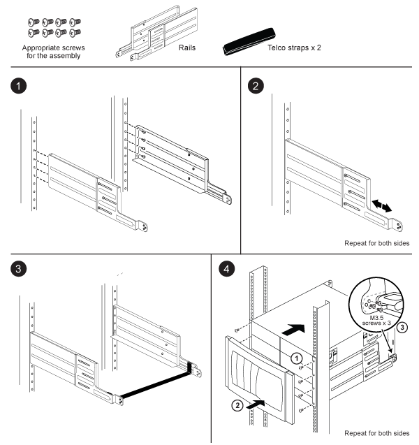

= 2柱支援軌道套件安裝說明- AFF 《非洲》（英文）、《非洲》（英文）、《非洲》（英文）
:allow-uri-read: 
:icons: font
:imagesdir: ../media/

[role="lead"]
FAS9000與AFF 整套系統可搭配使用兩套支援軌道套件。其中一個套件可讓您將系統齊面安裝在兩柱式機架中、另一個套件則可讓您將系統置於兩柱式機架中。

== 安裝兩柱中置軌道套件

image::../media/drw_telco_mid_mount_1.gif[Drw telco中型底座1]

== 安裝兩柱齊面安裝軌道套件

